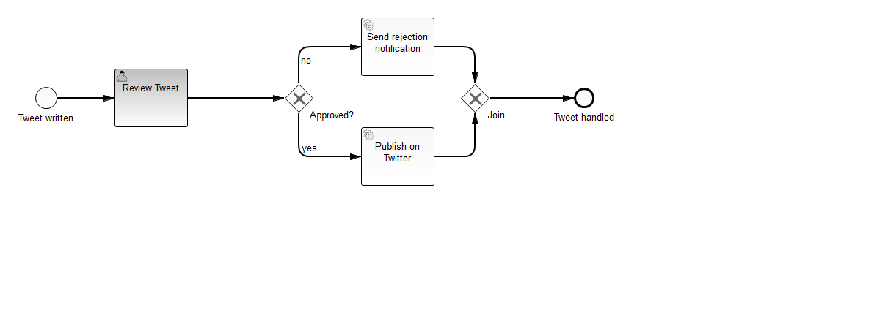
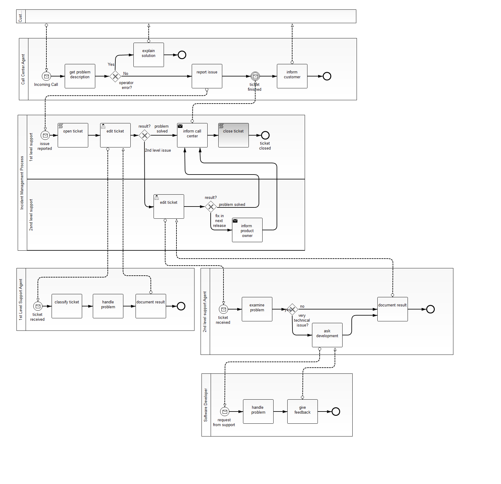
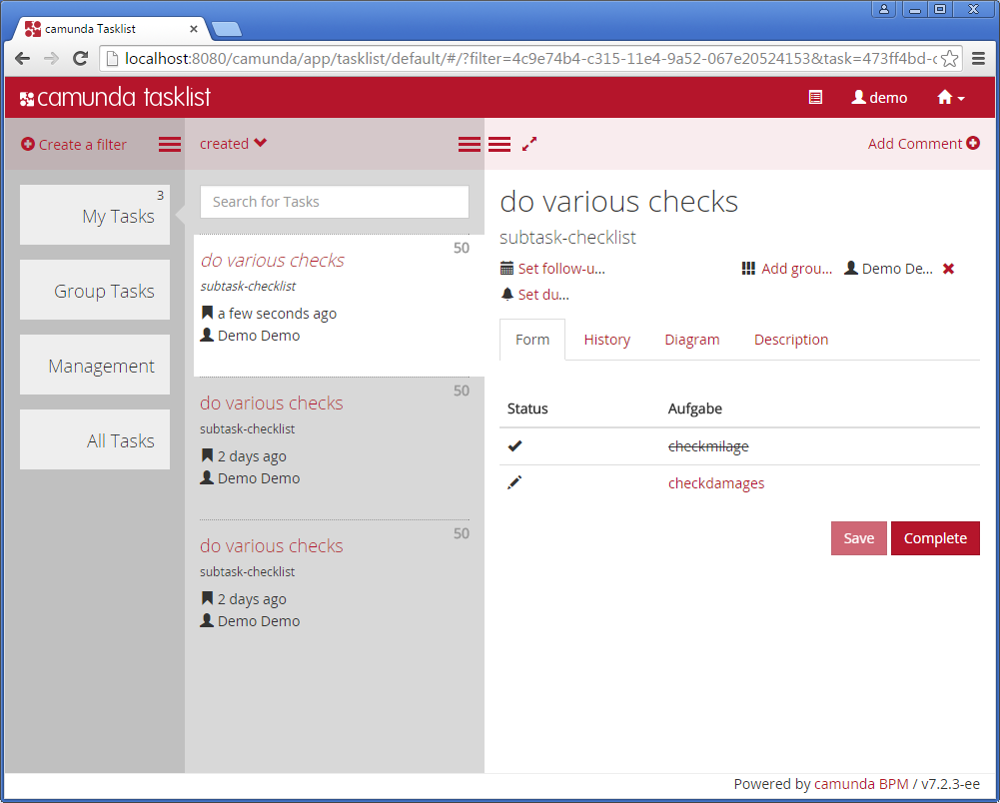
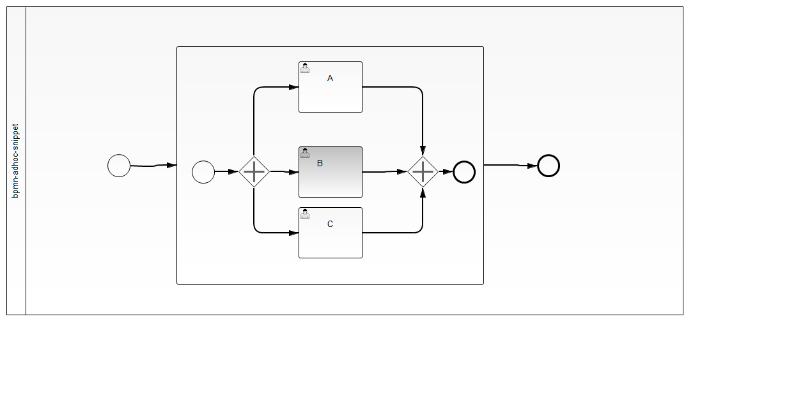
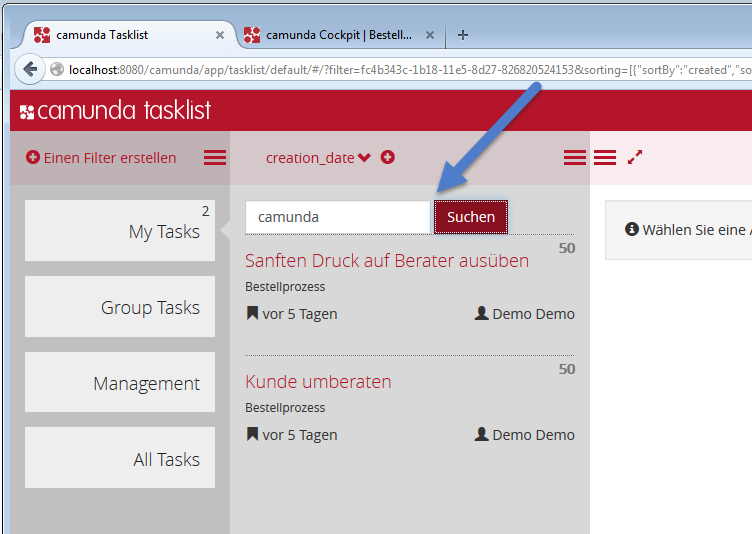
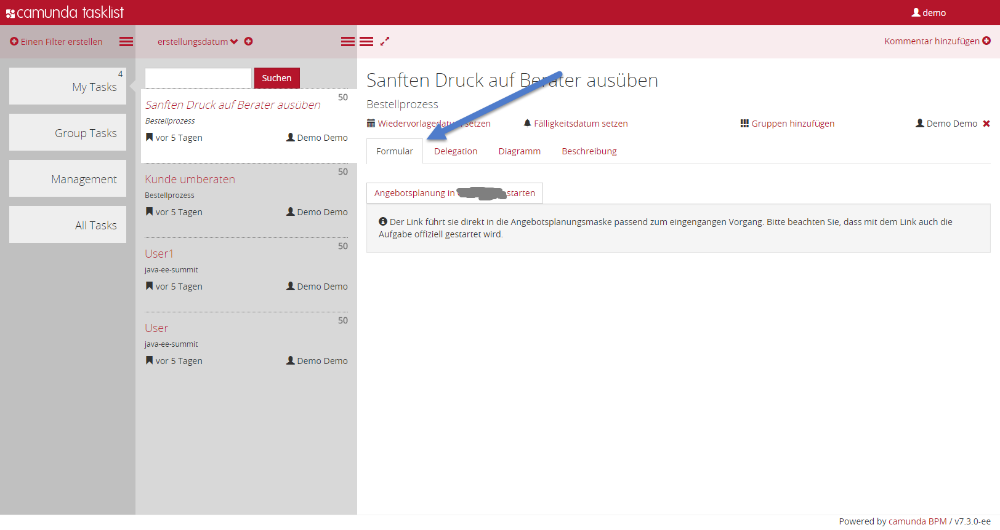
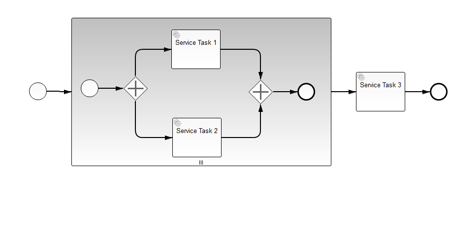
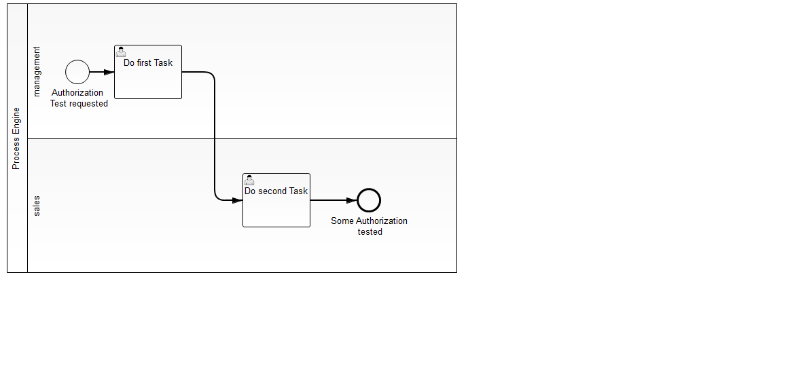
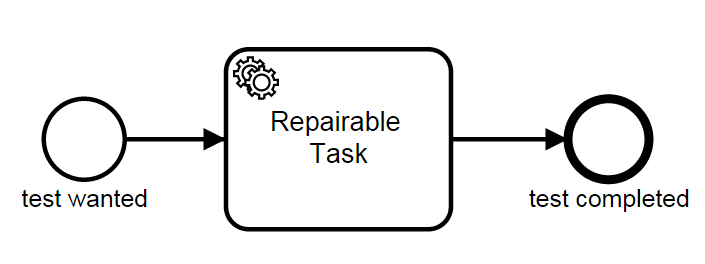

Camunda Consulting Examples
===========================

This repository contains examples, code snippets and demo applications build by the Camunda Consulting Team
or contributors. Note: All examples are only tested manually and there is no guarantee that they are actively maintained. If you search for officially maintained examples go to <a href="https://github.com/camunda/camunda-bpm-examples">https://github.com/camunda/camunda-bpm-examples</a>.

<table>
  <tr>
    <th>Type of Example</th>
    <th>Description</th>
  </tr>
  <tr>
    <td><a href="https://github.com/camunda/camunda-consulting/tree/master/showcases">Show Cases</a></td>
    <td>Complete demo applications showing more complex scenarios</td>
  </tr>
  <tr>
    <td><a href="https://github.com/camunda/camunda-consulting/tree/master/snippets">Snippets</a></td>
    <td>Code snippets for particular technical issues</td>
  </tr>
  <tr>
    <td><a href="https://github.com/camunda/camunda-consulting/tree/master/one-time-examples">One-time Examples</a></td>
    <td>Examples created once for a specific event (like a conference or a magazine article). <b>The code is not maintained and might be out-of-date.</b></td>
  </tr>
</table>

Showcases
-----------------------

<table>
  <tr>
    <td>
      <a href="https://github.com/camunda/camunda-consulting/tree/master/showcases/twitter">Review Process for new Tweets</a>  

    </td>
    <td>
       Key Features showcased:
       <ul>
<li> Complete Process Application </li>
<li> HTML or JSF task forms </li>
<li> Testing with camunda-bpm-assert and PowerMock + Mockito </li>
<li> [todo] Cycle with Collaboration </li>
<li> [todo] Retries and Incident Handling </li>
      </ul>
    </td>
  </tr>
  <tr>
    <td>
      <a href="https://github.com/camunda/camunda-consulting/tree/master/showcases/camel-use-cases">Camel Use Cases</a>  

    </td>
    <td>
       Key Features showcased:
       <ul>
        <li>Features of Camel Component, especially including messaging</li>
      </ul>
    </td>
  </tr>
 <tr>
    <td>
      <a href="https://github.com/camunda/camunda-consulting/tree/master/showcases/underwriting">Insurance Underwriting</a>  

    </td>
    <td>
       Key Features showcased:
       <ul>
          <li>CMMN</li>
          <li>Case UI in JSF</li>
          <li>Combination of BPMN, CMMN and Rules</li>
      </ul>
    </td>
  </tr>  
 <tr>
    <td>
      <a href="https://github.com/camunda/camunda-consulting/tree/master/showcases/incident-management">Incident Handling</a>  

    </td>
    <td>
       Key Features showcased:
       <ul>
          <li>Working process from official OMG by example paper</li>
          <li>BPMN Collaboration</li>
      </ul>
    </td>
  </tr>    
</table>

Snippets
-----------------------

### Human Task Management

<table>
  <tr>
    <th>Preview</th>
    <th>Name</th>
    <th>Description</th>
  </tr>
  <tr>
    <td></td>
    <td><a href="https://github.com/camunda/camunda-consulting/tree/master/snippets/subtask-checklist">Subtask Checklist</a></td>
    <td>BPMN process with sub tasks configured on a User Task using BPMN Extension Elements. The Subtasks are shown in the HTML task form using the Camunda Forms SDK (JavaScript). A User Task can only be completed if all subtasks are completed beforehand.</td>
  </tr>
  <tr>
    <td></td>
    <td><a href="snippets/jsf-simple-tasklist">Simple tasklist build with JSF</a></td>
    <td>A tasklist to show how to use the engine api inside a JSF application. It calls forms, completes tasks and shows the detail process diagram with bpmn.io</td>
  </tr>
</table>

### BPMN

<table>
  <tr>
    <th>Preview</th>
    <th>Name</th>
    <th>Description</th>
  </tr>

  <tr>
    <td></td>
    <td><a href="snippets/bpmn-adhoc-task/">Workaround to realize BPMN AdHoc Subpocess</a></td>
    <td>The BPMN AdHoc Subprocess is not specified to be executable, hence camunda BPM cannot execute it out-of-the-box. This snippet shows a possile workaround.</td>
  </tr>
  
</table>

### Camunda Webapp (Tasklist & Cockpit)

<table>
  <tr>
    <th>Preview</th>
    <th>Name</th>
    <th>Description</th>
  </tr>

  <tr>
    <td></td>
    <td><a href="snippets/camunda-webapp-customized">Webapp Customizing</a></td>
    <td>Shows how to build a customized webapp (own logo, colors, language, plugins, ...) by using Maven Overlay.</td>
  </tr>

  <tr>
    <td></td>
    <td><a href="http://camunda.org/plugins/">Various Cockpit Plugins</a></td>
    <td>The Plugin Store lists various available cockpit plugins, including the consulting snippets.</td>
  </tr>

  <tr>
    <td></td>
    <td><a href="snippets/tasklist-plugin-easy-search">Tasklist Plugin: Easy Search</a></td>
    <td>Plugin that provides a "Google-like" search bar for tasks.</td>
  </tr>
  <tr>
    <td></td>
    <td><a href="snippets/tasklist-plugin-nice-external-forms">Tasklist Plugin: Extended External Forms</a></td>
    <td>Plugin that provides a customized and better looking external forms hook.</td>
  </tr>
  
</table>

### Process Engine Plugins

<table>
  <tr>
    <th>Preview</th>
    <th>Name</th>
    <th>Description</th>
  </tr>

  <tr>
    <td></td>
    <td><a href="snippets/async-joins">Making parallel joins asynchronous</a></td>
    <td>To avoid optimistic lock exceptions on heavy load processes, this plugin makes each joining gateway asynchronous without further configuration in the process diagram.</td>
  </tr>
  
  <tr>
    <td></td>
    <td><a href="snippets/authenticated-async-continuation">authenticatedUserId after Asynchronous Continuation</a></td>
    <td>To use the userId after asynchronous continuation, this plugin puts it from the history on the current thread.</td>
  </tr>
  
  <tr>
    <td></td>
    <td><a href="snippets/authorization-demo">Authorized User Tasks</a></td>
    <td>Only authorized users are able to complete a task. Obsolete since 7.3. Use <a href="http://docs.camunda.org/7.3/guides/user-guide/#process-engine-authorization-service">Authorization-Service</a> instead.</td>
  </tr>
  
  <tr>
    <td></td>
    <td><a href="snippets/change-history-output">History Variable Filter</a></td>
    <td>How to store only one of many variables in the history.</td>
  </tr>

  <tr>
    <td></td>
    <td><a href="snippets/change-job-retry">Change Number of Job Retries</a></td>
    <td>This snippet shows how to change the number of retries for all jobs without touching the process diagrams.</td>
  </tr>
  
</table>

### Runtime Environments

<table>
  <tr>
    <th>Preview</th>
    <th>Name</th>
    <th>Description</th>
  </tr>
  
  <tr>
    <td></td>
    <td><a href="snippets/spring-java-based-config">Java-based Spring container configuration</a></td>
    <td>Run the process application in a Spring container with java-based configuration on a shared process engine.</td>
  </tr>

</table>

### Administration Stuff

<table>
  <tr>
    <th>Preview</th>
    <th>Name</th>
    <th>Description</th>
  </tr>
  
  <tr>
    <td></td>
    <td><a href="snippets/clean-up-history">How to clean up the history tables</a></td>
    <td>Solutions to clean up the history from old completed process instances.</td>
  </tr>

</table>
