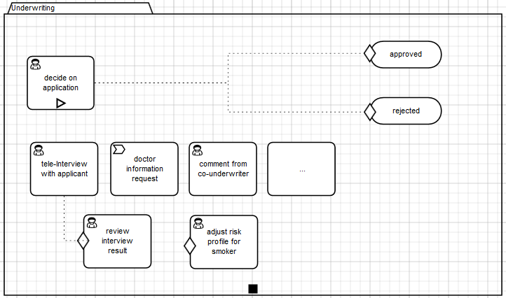
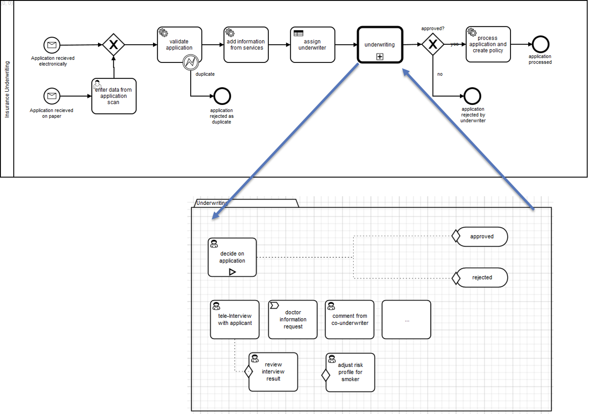
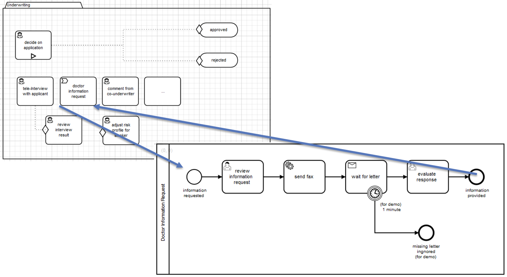
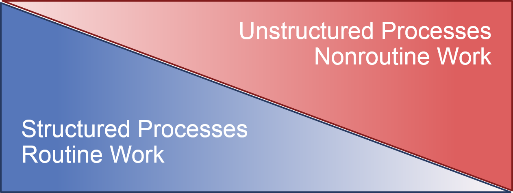

"Underwriting" with BPMN and CMMN
=========================

This project is a sample application using BPMN + CMMN to implement a typical underwriting process of an insurance company
(but is actually pretty generic to serve other industries as well). It was build for the 
[Camunda Hands-On Webinar on CMMN](http://camunda.com/landing/webinars-72-handson/).

It includes a user interface for the knowledge worker implemented in JSF.

Built and tested against Camunda BPM 7.2.0 on JBoss AS 7.2. 

Important note: Requires JSF - does not run on Tomcat! 

Show me the important parts!
----------------------------

The BPMN process starts the underwriting. It implements all structured activities and calls the more CMMN case when the
unstructured phase of the real underwriting from a clerk starts: 

The UI now visualizes all Tasks from Task Management for the case (basically "ACTIVE" activities from CMMN), 
"ENABLED" Activities from CMMN and Historic Tasks from the engine history. Maybe this would be a good time to check out
the [CMMN Lifecycle in our docs](http://docs.camunda.org/latest/api-references/cmmn10/#concepts-plan-item-lifecycles-taskstage-lifecycle):

And as a last remark I want to point out that it is already built-in the CMMN to call processes from a case:

This allows you to use the right tool for the right job - BPMN for structured process parts and CMMN for unstructured ones:

Current Workarounds
-------------------

Currently calling a Case from BPMN is not yet supported (but already implemented in Camunda BPM 7.3 alpha1!) - so you need a small workaround
to start a case instance and wait for its completion:

The "Auto-Complete" attribute of a case is not implemented in camunda BPM 7.2 (but already implemented in Camunda BPM 7.3 alpha1!) - hence you
need a listener to auto complete the case instance (see listeners in CMMN.xml).

How to use it?
--------------

You can also use `ant` to build and deploy the example to an application server.
For that to work you need to copy the file `build.properties.example` to `build.properties`
and configure the path to your application server inside it.
Alternatively, you can also copy it to `${user.home}/.camunda/build.properties`
to have a central configuration that works with all projects generated by the
[Camunda BPM Maven Archetypes](http://docs.camunda.org/latest/guides/user-guide/#process-applications-maven-project-templates-archetypes).

Once you deployed the application you can access the user interface:
[http://localhost:8080/webinar-cmmn/](http://localhost:8080/webinar-cmmn/)

You might also want to inspect it using 
[Camunda Cockpit](http://docs.camunda.org/latest/guides/user-guide/#cockpit) 
and the [ACM Plugin](https://github.com/camunda/camunda-acm-plugin/tree/master/) 
available via the [Plugin Store](http://camunda.org/plugins/).

Webinar Recording
------------------

This example was presented in a Webinar, the recording is available:
- English: http://vimeo.com/116525703
- German: https://vimeo.com/116330092

Environment Restrictions
------------------------

Built and tested against Camunda BPM version 7.2.0 and JBoss AS 7.2. 

License
-------

[Apache License, Version 2.0](http://www.apache.org/licenses/LICENSE-2.0).
