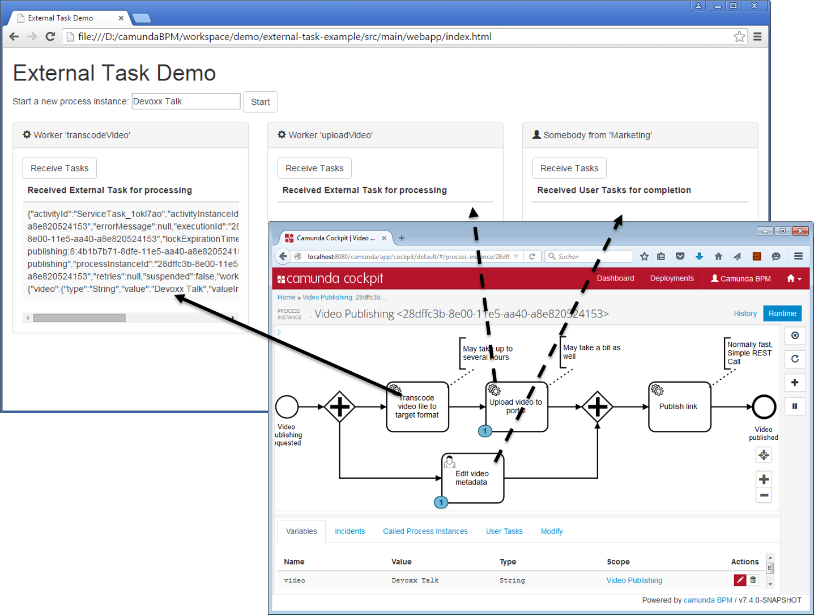

# External Task Demo
A Process Application for [Camunda BPM](http://docs.camunda.org).

## Show me the important parts!

The process consists of:

* Two External Tasks, served by JavaScript "workers" (simulated by the click on a button)
  * Example see [index.html](https://github.com/camunda/camunda-consulting/blob/master/one-time-examples/blog/external-task-example/src/main/webapp/index.html#L106)
* One Human Task, served either via Camunda Tasklist or simulated via another button
* One "normal" Service Task actively calling a REST service

## How to use it?

Deploy the application to a Java EE container (because it includes a REST Ressource).

It is tested on WildFly distribution of Camunda BPM 7.4.0.

Once deployed go to 
[External Task Example](http://localhost:8080/external-task-example/).

Optional you can go to 
[Camunda Tasklist](http://docs.camunda.org/latest/guides/user-guide/#tasklist) in order to start new processes / do user tasks there. 

## Environment Restrictions
Built and tested against Camunda BPM version 7.4.0 (as External Tasks are introduced with 7.4.0)

## License
[Apache License, Version 2.0](http://www.apache.org/licenses/LICENSE-2.0).

<!-- HTML snippet for index page
  <tr>
    <td></td>
    <td><a href="snippets/external-task-example">Camunda BPM Process Application</a></td>
    <td>A Process Application for [Camunda BPM](http://docs.camunda.org).</td>
  </tr>
-->
