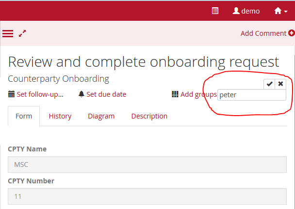
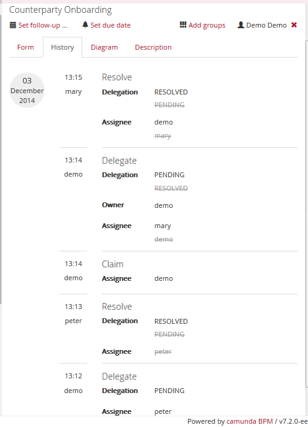
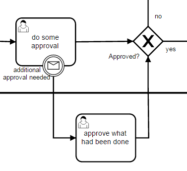
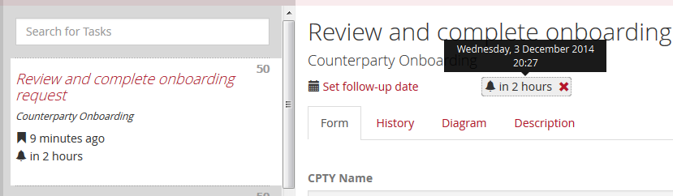
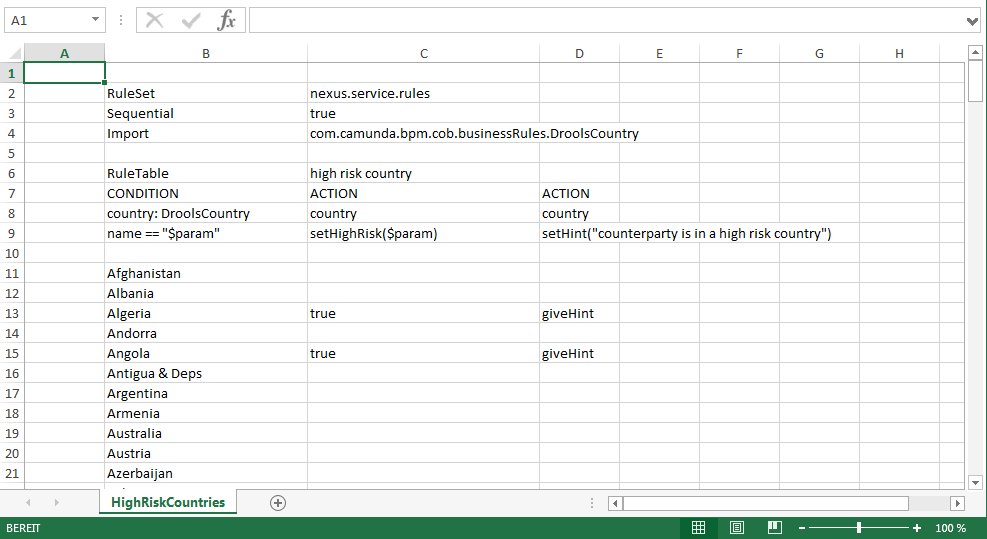
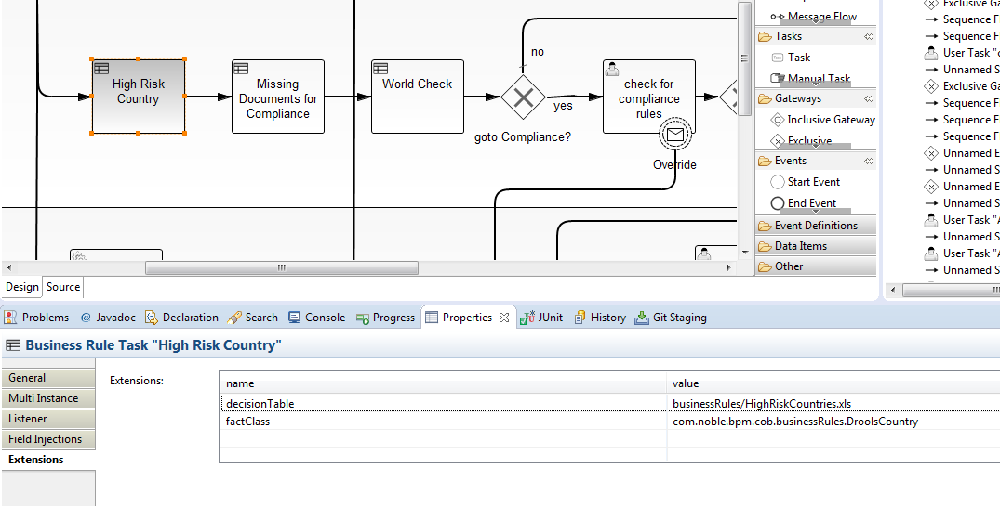
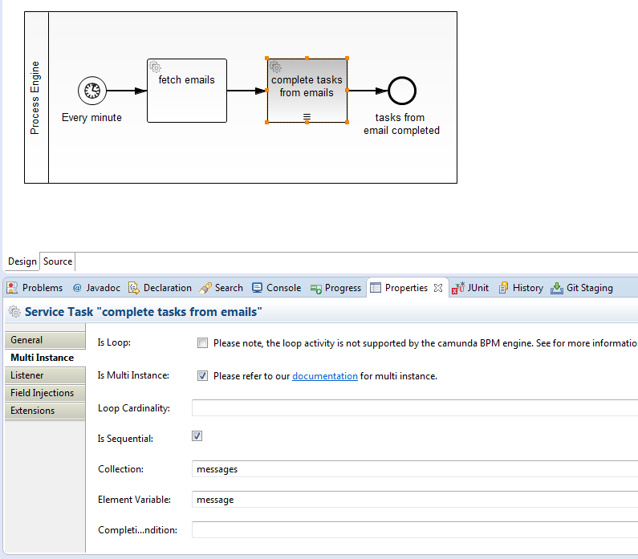

counterparty-onboarding
=========================

This project has been generated by the Maven archetype
[camunda-archetype-servlet-war-7.1.3](http://docs.camunda.org/latest/guides/user-guide/#process-applications-maven-project-templates-archetypes).

Built and tested against Camunda BPM version 7.2.0.

Show me the important parts!
----------------------------
Have a look at the commits of the repository to find the snippet to build the single feature.

Fast Track user task
------------------------
In the process definition, the user tasks have an attached non-canceling message receive event called override. If the process instance receives an override message, it will create an additional task 'Review Override Request' for Management. In this task, the user can approve the Override and the original request and decide to publish the counterparty immediately or reject the override.

If you are interested how to do it with the Java API, check out the `CounterpartyOnboardingTest.java`, method `overrideRequest()`.

To do it with the REST-API, you have to call two rest services to create the message event.

The first one: `POST /execution` with payload

    {
    "processVariables":
    [{"name": "aVariableName", "operator": "eq", "value": aValue}],
    "messageEventSubscriptionName": "theMessageName"}
    }

for example:

    http://localhost:8080/camunda/api/engine/engine/default/execution

with payload:

    {
    "processVariables":
    [{"name":"CPTYNumber", "operator":"eq", "value": 6}],
    "messageEventSubscriptionName": "override"}
    }  

It returns the list of executions that are expecting a message called 'override'. It is a list because there could be possibly more than one task available, if the process instance has tasks in the compliance and tax branch.

    [{"id":"885628f4-792b-11e4-b932-7ce9d3b8f4dd",
    "processInstanceId":"72516907-792b-11e4-b932-7ce9d3b8f4dd",
    "ended":false},
    {"id":"8856c53c-792b-11e4-b932-7ce9d3b8f4dd",
    "processInstanceId":"72516907-792b-11e4-b932-7ce9d3b8f4dd",
    "ended":false}]

Then you can get the first executionId from the list and use it in the second rest call to send this task the message with the payload: `POST /execution/{id}/messageSubscriptions/{messageName}/trigger`

for example:

    http://localhost:8080/camunda/api/engine/engine/default/execution/885628f4-792b-11e4-b932-7ce9d3b8f4dd/messageSubscriptions/override/trigger
    
with payload:

    {"variables":
    {"overrideReason" : {"value": "I want to trade with this counterparty today"}}
    }

After this call the task 'review override request' can be found in the tasklist of management.

Ad Hoc Approval Task
--------------------

To make an other person approve a request instantly, there are several possible ways.

### Approval in the following task

In this process, if the COB-User wants an instant approval by the tax team, he enters the reason on the form, checks the instant approval and the process will go directly to the 'check for tax rules' task. The tax team can enter some comments and can give it back to the COB to amend the request. After amending the process instance will instantiate the tax 'check for tax rules' again to review the amended data.

### Approval by another assignee

In another process the you can do an adhoc approval just assigning the task to somebody else. In the camunda tasklist you enter another userid in the assignee box on the upper right site of the task form.

After changing the assignee the task will immediately appear in the personal task list of the new user.

You have to call `POST /task/{id}/assignee` with the new userId as payload. [see the REST API](http://docs.camunda.org/latest/api-references/rest/#task-set-assignee) 

When the new user completes the task, the process instance will continue with the next task.

### Approval by delegating to another user 

The third possibility to hand the task over to another person is to delegate it to someone else. You can delegate a task with the REST call `POST /task/{id}/delegate` and the userId as payload. [see the REST API](http://docs.camunda.org/latest/api-references/rest/#task-delegate-task) The call will set the delegation state of the task to `PENDING`. 

Delegation in the camunda way can be imagined that a user with higher user authorization hands the task over to a second user with less user authorization to work on it. For instance a manager gives the task to an assistant to do the ground work. The assistant hands it back to manager by resolving the task and the manager now can do his approval and complete the task and push the process instance to the next activity.  

If the task was claimed by a user before, this user is the assignee of the task. While delegating the task, the assignee will get the owner of the task and the user who gets the task delegated is the new assignee. The delegated user will find the task in his personal tasklist. 

A snippet from the task attributes:

    name: "Review and complete onboarding request"
    assignee: "mary"
    delegationState: "PENDING"
    owner: "demo"

If the delegated user completes the task in the camunda tasklist, the delegation gets resolved and the task is handed back to the assignee (if someone had claimed the task before) or into the group list. This is done with the REST call `POST /task/{id}/resolve` with variables in the payload. The variables will reflect the changes, the user had done on the process instance. [see the REST API](http://docs.camunda.org/latest/api-references/rest/#task-resolve-task). The delegation state of the task is set to `RESOLVED`. 

    name: "Review and complete onboarding request"
    assignee: "demo"
    delegationState: "RESOLVED"

If a user claimed the task before delegation, he can now complete the task and perhaps change some data on the form fields before. If the task was delegated from a group-list, a user has to claim the task into his personal task list before completing it.

### Approval by another team

The fourth possibility to give the task to another team to work on it is to change the candidate-groups behind the scene. In the camunda tasklist this can be done by clicking on the groups on the top of the from and add another group and delete the old one. Because there is a one to many relationship between task and groups you always have to add a group and delete the existing to hand over the task to a single group.

 
With the REST-API the two calls will be `POST /task/{id}/identity-links` ([See the REST API](http://docs.camunda.org/latest/api-references/rest/#task-add-identity-link)) and `POST /task/{id}/identity-links/delete` ([See the REST API](http://docs.camunda.org/latest/api-references/rest/#task-delete-identity-link)) with the payload of the new identity link. An identity link can either be a user or a group. An example is

    {"groupId": "accounting", "type": "candidate"}
    
### Approval in a predefined task

If you can foresee that you will sometimes need an additional approval with another form for a single user task in the process definition, you can add the approval user task and connect it with a boundary message event to the user task. 

To send the message with a REST service, call `POST /message` with some process variables as payload to correlate with the process instance. [See the REST API](http://docs.camunda.org/latest/api-references/rest/#message-deliver-a-message)

Example payload may be:

    {"messageName" : "additionalApprovalMessage",
     "correlationKeys" : {
       "workId": {"value": 1, "type" : "Long"}
     }
    }

And check out the `predefinedApproval()` test method. 

### Approval in a new subtask

The most flexible but also the most challenging way to hand the work to another user is to create a new task. Here you have to manually set in the code the name, the parent task and some more attributes. The new task has no connection via sequence flows to other tasks. If you would like to connect it to the process instance, you have to deal in your Java code with the TaskEntity instead of Task to set the processInstanceId. 

The task has no form key, because it is set in process definition and the new sub task doesn't appear in a process diagram. You have to use a task variable to store a form key and handle this variable in your task list application.

And because the new task is no token on the process instance you have to manage the process variables directly on the process instance. You can't pass them in the `taskService.complete(taskId, variables)` method.  

The REST API doesn't support dealing with the process instance. So have a look into the `handleSubTask()` test method for an example.

### Approval with case management

To be done: Approve with a case, called from a process instance

Service Level Agreement
-----------------------

First you have to specify the value of the due date for a task in the property Due Date on the user task. The value can be any period defined in the [ISO 8601 standard](http://en.wikipedia.org/wiki/ISO_8601), for example `P2D` for two days or `PT3H` for three hours of time (T). Or a combination like `P3Y6M4DT12H30M5S` representing a duration of "three years, six months, four days, twelve hours, thirty minutes, and five seconds".

The period begins as the user tasks is created.

The due date is evaluated to the end of the period and is available as an attribute in task, also in the REST-Service.

  

See the [user guide](http://docs.camunda.org/latest/api-references/bpmn20/#tasks-user-task-due-date) for more information. The same can be done with a follow up date. Check the `testDueDate()` method of the test class.

### Escalate on overdue

If you want to escalate your task if it gets over due, first think about what this escalation should be from the organizational point of view. For example, a manager should receive an email the a task in the group list of his team is not finished in time. 

To implement it, you have to register a task listener on the task and start a timer with the due date and a new jobHandlerConfigruation to handle the timer. 

The jobhandler will be called, if the timer fires.

If you complete the task on time, you have to delete the timer from the job list. 

See the jUnit test with the methods `testEscalationJobCreated()`, `deleteTimerWithCompletion()`, `testTaskEscalated()` and the `EscalationTaskListener` and `EscalationJobHandler` classes for more details. 

### Escalate all tasks with due date 

If you want that all tasks in all process definitions with a due date should be escalated on overdue, you have to register the task listener as a preParseListener in the engine configuration. Check out the [example for a detailed description](https://github.com/camunda/camunda-bpm-examples/tree/master/process-engine-plugin/bpmn-parse-listener) on bpmn parse listener.

Have a look at `TaskBpmnParseListener` to register the listener on all user tasks. The class `ProcessEnginePlugin` registers the bpmn parse listener in the engine. The Plugin is configured in `camunda.cfg.xml`.

Now you can delete the task listener on single tasks from the bpmn diagram. 

Add users, groups and memberships
---------------------------------

If you want to add users, groups and memberships with the REST api, check out the `CreateUserGroupMembership` class. It reads a file from the classpath and sends http requests to the http server with the rest api of camunda. You can start it from the command line.

You find the rest calls with methods, resource and payload in `user-group-membership.txt`.

Start independent subprocess
----------------------------

To start an independent sub process, which is a new process instance that access the same counterparty request, you need a service task that calls the engine api to start a new process instance. After starting the process instance id will be saved in a process variable for further access.

The service task is implemented in the class `StartProcessDelegate`.

Cancel independent subprocess
-----------------------------

If you want to cancel the subprocess, because the request was rejected, you need another service task that calls the engine service to delete a process instance. 

This service task is implemented in the class `CancelProcessDelegate`.

And for the reason, that the process can reach the cancel service directly from the complete of the review bypassing the tax and compliance review, you have to make the service call asynchronous. The transaction will be committed so the ssi process will be saved in the database. Then the process can be canceled. 

See the methods `startSsiProcess()`, `cancelSsiProcess()`, `completeSsiProcess()` from the JUnit test.   

Business Rules with Drools
--------------------------

You can implement Business Rules which can be changed by a business user with Drools. [Drools](http://www.drools.org) is a Business Rules Management System (BRMS) solution and provides a core Business Rules Engine (BRE).

To show how it can be integrated with the Counterparty workflow, there is a decision table created as an excel spreadsheet for the high risk country check (HighRiskCountries.xls). The excel sheet contains all countries in the world and the high risk countries are marked in the column C with "true".

The lines 2-9 set up the rules to interact with the drools business rule engine. 
Background information how to build a decision Table can be found in the drools documentation in the [user guide](http://docs.jboss.org/drools/release/6.1.0.Final/drools-docs/html/ch06.html#d0e4509).

The rules itself follow from line 10 to the end.

You will find alternatives to store the decision tables in excel sheets in the drools documentation. With [templates](http://docs.jboss.org/drools/release/6.1.0.Final/drools-docs/html/ch06.html#d0e5185) you may store the data in a database. And they offer some [user interface](http://docs.jboss.org/drools/release/6.1.0.Final/drools-docs/html/drools.AuthoringAssets.html#drools.GuidedDecisionTableEditor) to change the rules from a browser.

But let's concentrate on calling the rules in the business rules task.  

The interaction with the rules engine is done in a java class implementing the `JavaDelegate` interface. If you have several tasks calling several decision tables you will think about generalizing the implementation and fill it with configuration to avoid repetitions in the code. But it is always possible to use a new Delegate implementation for each business rule task and avoid the configuration. This example shows the first approach. 

The test class `HighRiskCountryDroolsTest` shows how to interact with the decision table. You have to create a knowledge base from the decision table and insert the fact as a java pojo (DroolsCountry) into the working memory. Then you can fire all rules and get the result from the working memory. The result will be found in the attributes that are filled be the actions in the decision table.

The test shows how to fill and examine the fact pojo with reflection.

The next step is to get the fact data from the process instance and call the rule engine in a business rule task. The implementation of the task is in the class DroolsDelegate. It will pick up the decision table and the class of the fact from the extensions tab of the process diagram.

You fill in the values in the Extension tab of the properties of a business rules task.

The values from the Extensions tab will be picked up in the delegate class with a call to the model api:

	CamundaProperties camundaProperties = execution
		.getBpmnModelElementInstance()
		.getExtensionElements()
		.getElementsQuery()
		.filterByType(CamundaProperties.class)
		.singleResult();

	Collection<CamundaProperty> properties = camundaProperties.getCamundaProperties();
	for (CamundaProperty property : properties) {
		String propertyName = property.getCamundaName();
		String propertyValue = property.getCamundaValue();
		...
	} 

### ToDo: Mapping process variables to rules fact

Now it has to be worked out, how to model the mapping to the process variables into the fields of the pojo and the results from the pojo back into process variables. A  first hard coded example is in the DroolsDelegate.

### Store the rules fact as typed variable

Get easier generic access to the results of the rules, you can store the complete fact as a process variable, which can be serialized as a JSON object. 

It is described in the [user guide](http://docs.camunda.org/latest/guides/user-guide/#process-engine-process-variables-typed-value-api) how to save the variables in a typed way with a special serialization format, maybe JSON, XML, or JAVA.

To prepare to use it, check the [user guide in the data format section](http://docs.camunda.org/latest/guides/user-guide/#data-formats-xml-json-other-configuring-spin-integration) 

Background information about using JSON formated variables are in the [user guide on the JSON section](http://docs.camunda.org/latest/guides/user-guide/#data-formats-xml-json-other-json).

The default serialization format is set to `application/json` in the `ProcessEnginePlugin`. Now every object saved in a variable will be saved in JSON format. 

The plugin is activated for the JUnit-tests in the camunda.cfg.xml configuration file. In a camunda distribution it is activated by default. See the [installation guide](http://docs.camunda.org/latest/guides/installation-guide/tomcat/#bpm-platform-install-optional-camunda-dependencies-install-camunda-spin) how to activate it for a production system.

In the DroolsDelegate you save the object as a process variable, the value in the database is a JSON object. Because of the default serialization you can access the variable either in the java notation like `droolsCountry.isHighRisk()` or get the type information and deserialize it in your code as described in the user task. 

Refine the candidate group
--------------------------

In the process diagram you define a candidate group for a task on the top level. The groups entered here are APP_COB, APP_TAX or APP_COMPLIANCE. To refine the candidates you have to add a region which you get either from the trader who started a request or from the counterparty that is requested.

This change of the candidate can be done by a task listener that listens to the creation of new tasks. The hook into the system for this listener is the same as for the escalation of service level agreements.

In the real system you will be able to get the region of a user from the active directory. In this test you will get the region from the email-field of the user. See the jUnit-test for details. 

To change the groupId of the identity link (The link from the task to the task lists where the task appears) check out the `AdjustRegionCandidateTaskListener`.

If the task listener is notified for the first task of the process, the startUserId is still in the thread and not in the database. For every other task, which is assigned later, the userId has to be read from the history service. 

Save History in the Elasticsearch
---------------------------------

The Camunda BPM elastic search extension is a community extension which allows you to use Elasticsearch as data store for Camunda history and audit data.

The Camunda process engine produces a continuous event stream of auditing data (Read Userguide: [History](http://docs.camunda.org/latest/guides/user-guide/#process-engine-history-and-audit-event-log)). This event stream contains events about process instances being started, tasks being completed, variables being modified and so forth (check the Camunda BPM Userguide for a complete list of supported events). The Camunda Elasticsearch Extension implements the HistoryEventHandler SPI and stores all history events in Elastic search. Once the history data is stored in Elasticsearch, it can be queried in a flexible way.

You will find it on [GitHub](https://github.com/camunda/camunda-bpm-elasticsearch).

Mail Notification to all users of a group
-----------------------------------------

There is an example how to notify a user by email if a task is assigned to him by email in the [camunda-bpm-example github](https://github.com/camunda/camunda-bpm-examples/tree/master/usertask/task-assignment-email). Here is an example how to notify all users of the group, which has been refined by the region before.

Checkout the method `notifyByEmail()` in the JUnit test.  

The MailNotoficationListener sends an email to all group members with a ddep link into the camunda tasklist.

You can add more information on the email message if you like.

Complete task by email
----------------------

To complete a task by email, you have to send a mail with the task id and the process variables to a designated email adress. A process definition with a timer event runs every minute and the service task checks for new emails in the inbox of this recipient, parse the message bodys for the task id and the variables and call taskService.complete(taskId, variables) to complete the task.

The first service tasks use `FetchEmailsDelegate` as implementation class. It connects to a mail server gets all emails from a designated post box. It puts all mails into a list, which is stored as a process variable named `messages`

The second service task is a multi-instance task. It iterates over the elements of `messages` and puts the actual message in a variable `message`.

This variable is picked in the class `CompleteTaskFromEmailDelegate`. The body is parsed for a task Id and the variable values and the ask gets completed, if its already there. If no task with the id is found, then it saves a message in the variables.  

The process definition is tested by the method `processCompletionEmails` and uses [GreenMail](http://www.icegreen.com/greenmail/) as a local mail server for non-communication. It's configured in the pom.xml.

Known Issues
------------

The Green Mail Server config needs more configuration access. If you run all tests from `CounterpartyOnboardingTest`, the method  `processCompletionEmails` will fail. If you run this method alone, it succeeds.

How to use it?
--------------

There is no web interface to access the application.
To get started refer to the `CounterpartyOnboardingTest.java`.

You can also use `ant` to build and deploy the example to an application server.
For that to work you need to copy the file `build.properties.example` to `build.properties`
and configure the path to your application server inside it.
Alternatively, you can also copy it to `${user.home}/.camunda/build.properties`
to have a central configuration that works with all projects generated by the
[Camunda BPM Maven Archetypes](http://docs.camunda.org/latest/guides/user-guide/#process-applications-maven-project-templates-archetypes).

Once you deployed the application you can run it using
[Camunda Tasklist](http://docs.camunda.org/latest/guides/user-guide/#tasklist)
and inspect it using
[Camunda Cockpit](http://docs.camunda.org/latest/guides/user-guide/#cockpit).

Environment Restrictions
------------------------

Built and tested against Camunda BPM version 7.2.0.

Improvements Backlog
--------------------

