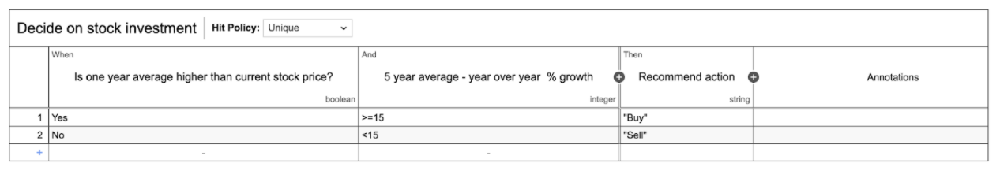
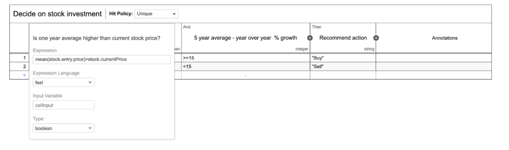

# Name
Decide on stock investment using average

## FEEL operations being used

The FEEL operation being used is called Mean of type list function. The Mean list function will provide an average based on a list of numbers. 

## What it does

In this example, we are getting the average stock price from a list of numbers in a JSON Object. Then, we compare the average stock price to the current stock price. Finally, with some other business rules we decide if the stock is worth purchasing for long term holding.

[DMN example](mean.dmn)

## Screenshots

-----

