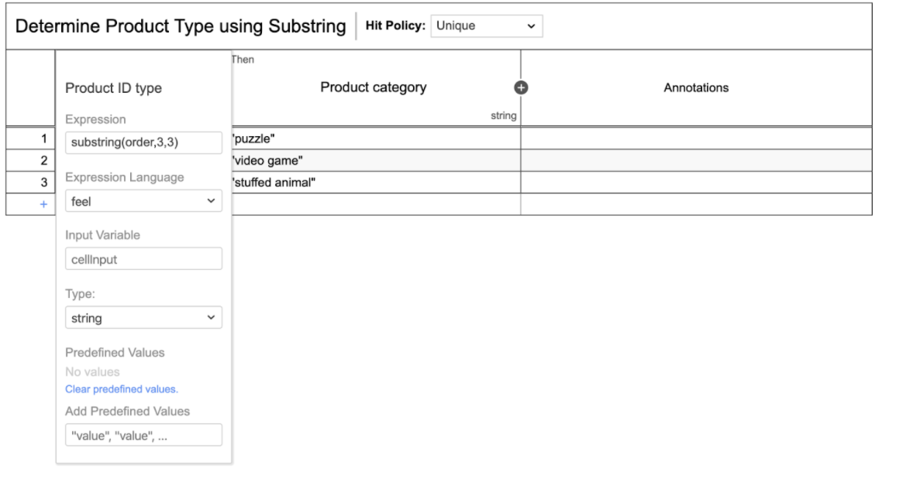

# Name
Determine Product Type  using  Substring  

## FEEL operations being used

The FEEL operation being used is a String function called Substring. Substring helps by extracting specific characters from a String. 

## What it does

In this example, we are extracting the product type from a supplier’s product ID from a JSON Object. Then we use such information to determine the type of product category. 

[BPMN Process](src/main/resources/process.bpmn)

## Screenshots

-----

