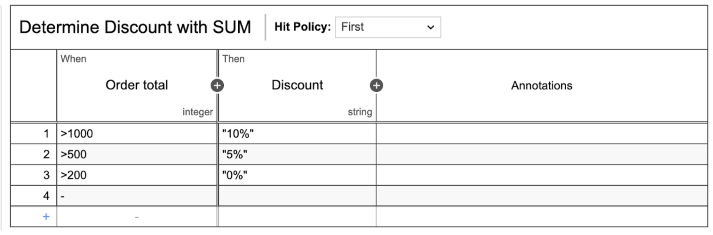
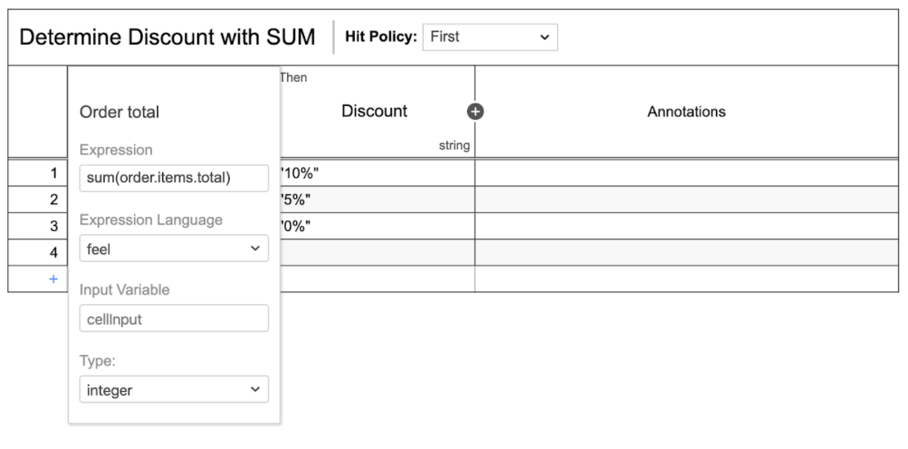

# Name
Determine Discount with SUM 

## FEEL operations being used

The FEEL operation being used is called SUM  and of type list function. SUM returns the sum of numbers based on a list.

## What it does

In this example, we are adding up the total per item from a JSON Object. Then using the total amount and some business rules, a discount is provided.

[DMN example](sumcount.dmn)

## Screenshots

-----

