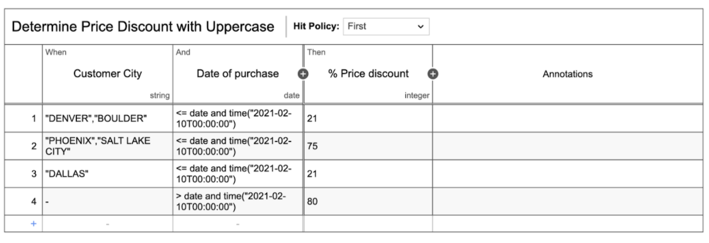
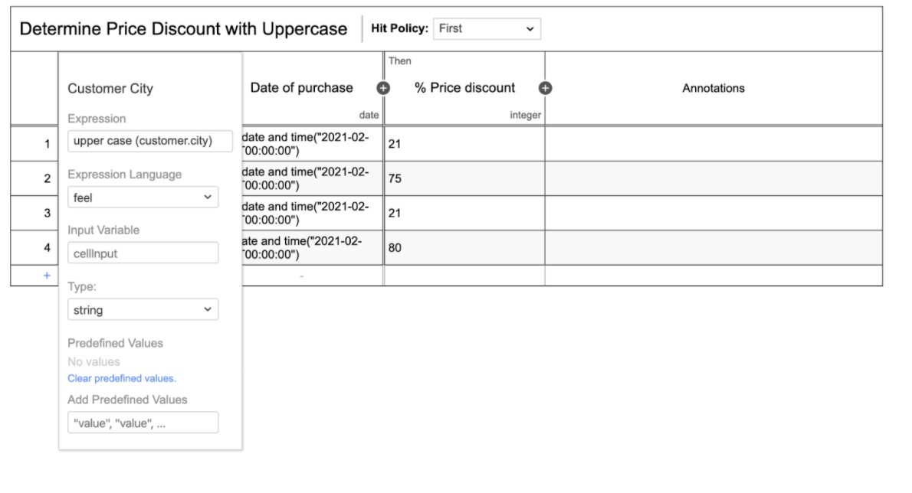

# Name
Determine Price Discount with Uppercase 

## FEEL operations being used

The FEEL operation being used is called Upper case  of type String function. Uppercase function will turn any String value into full Uppercase.

## What it does

In this example, we are converting a String from a JSON Object to Uppercase. Then, given some business rules a discount is provided. 

[DMN example](uppercase.dmn)

## Screenshots

-----

