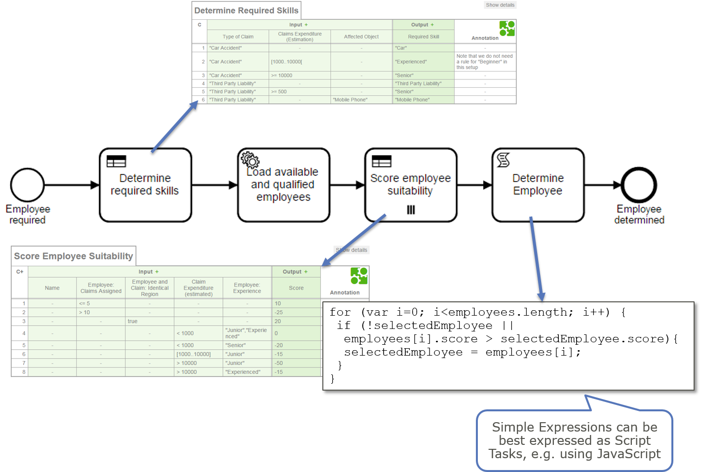
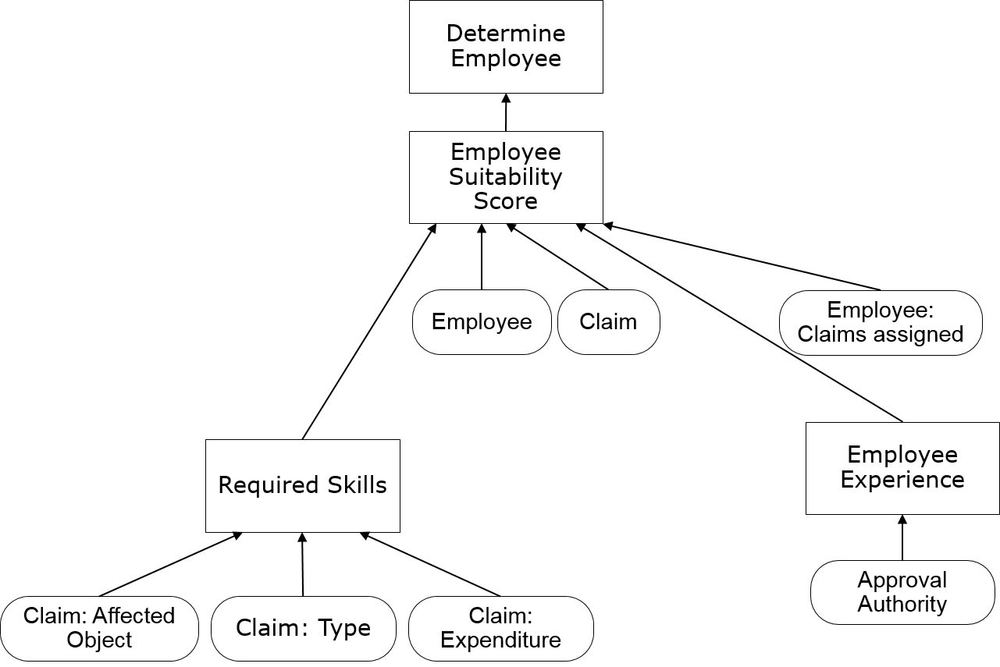

# Skill Based Rotuing using DMN on Camunda BPM
A sample process application for [Camunda BPM](http://www.camunda.org).

## Show me the important parts!

Let's imagine you want to handle an insurance claim. You need to figure out which employee is best suited. In your BPMN process you simply query this employee and assign a task to him:

The best suited employee is a complex decision which can be modeled by the OMG Standard DMN (see [DMN Tutorial](https://camunda.org/dmn/tutorial/)). As this decision involves multiple steps it can be best implemented using a "Decision Flow" orchestrating DMN Decision Tables:

## Running a Claim Handling Process

Build the application using Maven. Afterwards deploy the resulting WAR file to your Container running Camunda BPM with the shared engine (e.g. one of the [pre-packaged distributions](https://camunda.org/download/)).

Once you deployed  you can start a new claim handling process using
[Camunda Tasklist](http://docs.camunda.org/latest/guides/user-guide/#tasklist). After you started a new process instance you should see a task in the tasklist which is assigned to the selected employee.

1. Start a new process:

2. Task was assigned to a certain employee:

3. Check via cockpit the decision flow history (only possible in [Camunda BPM Enterprise Edition](http://camunda.com/bpm/enterprise/)):

And the Decision Tables being executed:

## DRD and Decision Flow

If you know DMN you know Decision Requirement Diagrams (DRD). The above decision can be modeled logically as the following DRD:

This is very helpful during Decision Discovery, Analysis and Design. You can link the decision logic to that DRD in a early stage:

However, when you want to execute the decision non-functional requirements have to taken into account as well as limitations of DRD execution (see [a former blog post](http://www.bpm-guide.de/2015/07/20/dmn-decision-model-and-notation-introduction-by-example/) about the multiplicity limitation of DRDs). Hence we translate the DRD into a BPMN process called Decision Flow which can really execute the decision. 

In this example only the available employees fitting the require skills are scored. Finding these employees is typically handled by the Employee Backend, e.g. using SQL.

## How does it work?

See Source code.

## Environment Restrictions
Built and tested against Camunda BPM version 7.4.1.

## Improvements Backlog

## License
[Apache License, Version 2.0](http://www.apache.org/licenses/LICENSE-2.0).
