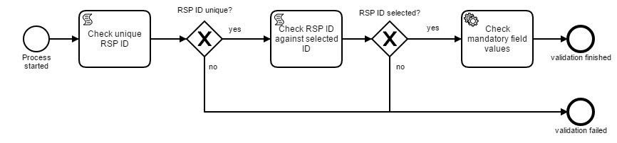

# Process automation without Java classes

This example uses only scripts (all JavaScript for convenience) and http-service-calls to validate claims, that are feeded to it.

The input will be an array of claims as shown [in this small](src/test/resources/claims/claims-rsp-ids-unique.json) or [in this larger example](src/test/resources/claims/six-claims.json)

## Show me the important parts!

## How does it work?

The process runs through a list of validations on the same data. The rules are written either as script tasks, if they don't depend of separate data or as REST services build with express and node.js, if the need access to some master data tables. The process uses the http-connector to call the services.

The input data are stored in a single process variable `claims`. Each check result will be saved in a single process variable, i.e. `resultCheckUniqueRspID`. The result can have a list of errors.

### Using script tasks
As they are all build with Javascript, they are stored as json variables. To save even large error lists you must return them in scripts as Javascript array objects.

The external script:

    var errorList = [];
    errorList.push('my first error');
    // more to follow
    errorList;

### Using connectors
All services are build as POST services, so the connectors need 4 input parameters:
* url
* method
* headers
* payload

The ouput parameter is a single process variable with the error list.

This is an example for a service task:

    <bpmn:serviceTask id="ServiceTask_1dwr4ge" name="Check mandatory field values">
      <bpmn:extensionElements>
        <camunda:connector>
          <camunda:connectorId>http-connector</camunda:connectorId>
          <camunda:inputOutput>
            <camunda:inputParameter name="url">http://localhost:3000/check-mandatory-fields</camunda:inputParameter>
            <camunda:inputParameter name="method">POST</camunda:inputParameter>
            <camunda:inputParameter name="headers">
              <camunda:map>
                <camunda:entry key="Content-Type">application/json</camunda:entry>
              </camunda:map>
            </camunda:inputParameter>
            <camunda:inputParameter name="payload">
              <camunda:script scriptFormat="javascript"><![CDATA[claims.toString();]]></camunda:script>
            </camunda:inputParameter>
            <camunda:outputParameter name="resultCheckMandatoryFields">
              <camunda:script scriptFormat="javaScript">S(response);</camunda:script>
            </camunda:outputParameter>
          </camunda:inputOutput>
        </camunda:connector>
      </bpmn:extensionElements>
    </bpmn:serviceTask>

As the prebuilt connector passes the payload as a String to the underlying http-framework, you have to convert the SPIN-Object to a String by calling `.toString()`.

To save the result from a String into a JSON-Object-Variable, you have to use the SPIN-Expression here to.

### Modeling conditions
As all variables are stored as json object variables, I use script conditions instead of JUEL expressions. The JUEL Expressions use Java-style and I want to avoid Java as much as possible.

 
## How to use it?
There is no web interface to access the application.
To get started refer to the `InMemoryH2Test`.

To run the tests, start the node server first. See the [readme](node-scripts/) in the node-scripts folder for a quick how-to. 

You can also use `ant` to build and deploy the example to an application server.
For that to work you need to copy the file `build.properties.example` to `build.properties`
and configure the path to your application server inside it.
Alternatively, you can also copy it to `${user.home}/.camunda/build.properties`
to have a central configuration that works with all projects generated by the
[Camunda BPM Maven Archetypes](http://docs.camunda.org/latest/guides/user-guide/#process-applications-maven-project-templates-archetypes).

Once you deployed the application you can run it using
[Camunda Tasklist](http://docs.camunda.org/latest/guides/user-guide/#tasklist)
and inspect it using
[Camunda Cockpit](http://docs.camunda.org/latest/guides/user-guide/#cockpit).

## Environment Restrictions
Built and tested against Camunda BPM version 7.5.0.

## Known Limitations

## Improvements Backlog
* error handling with connectors.

## License
[Apache License, Version 2.0](http://www.apache.org/licenses/LICENSE-2.0).

A Process Application for [Camunda BPM](http://docs.camunda.org).

This project has been generated by the Maven archetype
[camunda-archetype-servlet-war-7.5.0](http://docs.camunda.org/latest/guides/user-guide/#process-applications-maven-project-templates-archetypes).

<!-- HTML snippet for index page
  <tr>
    <td></td>
    <td><a href="snippets/validate-claims">Camunda BPM Process Application</a></td>
    <td>A Process Application for [Camunda BPM](http://docs.camunda.org).</td>
  </tr>
-->
<!-- Tweet
New @CamundaBPM example: Camunda BPM Process Application - A Process Application for [Camunda BPM](http://docs.camunda.org). https://github.com/camunda/camunda-consulting/tree/master/snippets/validate-claims
-->