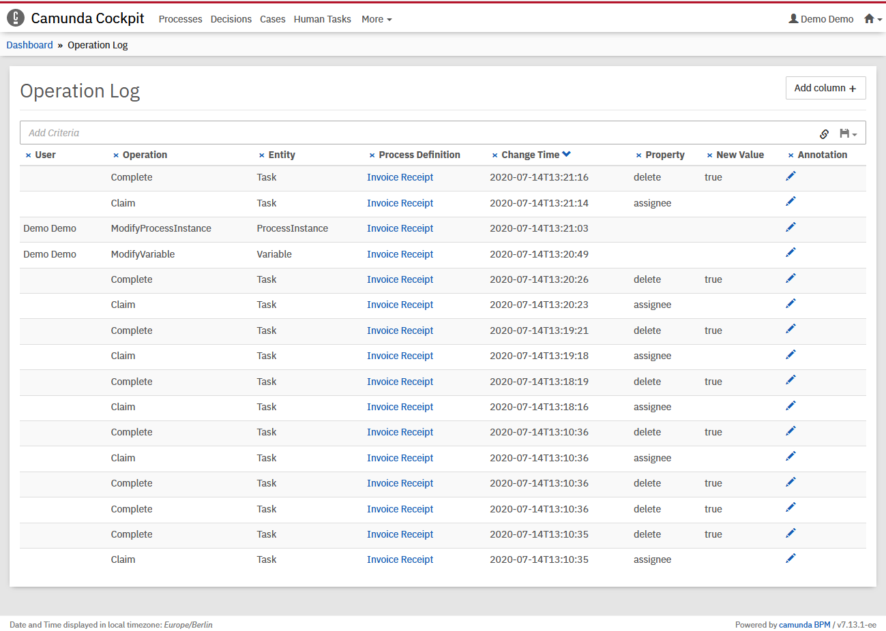

# Anonymize task worker user ids

## The use case
The Camunda engine saves a lot of information about the process execution in the database.
This allows tracking of the progress and reviews, who did what in the Cockpit.

Some companys want to protect their task workers and don't allow to analyze their performance.
The manager should manage all his employees equally and don't get numbers who completes their tasks faster or does the work more thoroughly.

And data protection plays an important part these days.

The best way to implement data protection is to avoid saving unnessary data.

This process engine plugin anonymize all the user ids of task workers doing their regular work, i.e. claiming and completing tasks, 
while keeping the user ids of interactions in the cockpit like process instance modifications or variable changes.


## How to use it?

Build the process engine plugin with `mvn clean install` and copy the `anonymize-user-task-data.jar` into the tomcat lib folder next to the camunda-engine-jar

Configure the process engine plugin in the `bpm-platform.xml` like this example:
```xml
    <plugins>
      <plugin>
        <class>com.camunda.consulting.anonymize_user_task_data.plugin.AnonymizeProcessEnginePlugin</class>
      </plugin>
    </plugins>
```
For other environments, have look into the docs: https://docs.camunda.org/manual/7.11/user-guide/process-engine/process-engine-plugins/#configure-process-engine-plugins

### Unit Test
You can run the JUnit test [ProcessEnginePluginTest](/src/test/java/com/camunda/consulting/anonymize_user_task_data/ProcessEnginePluginTest.java) in your IDE or using:
```bash
mvn clean test
```

## Environment Restrictions
Built and tested against Camunda BPM version 7.11.0.

## Known Limitations

## License
[Apache License, Version 2.0](http://www.apache.org/licenses/LICENSE-2.0).

<!-- HTML snippet for index page
  <tr>
    <td></td>
    <td><a href="snippets/user-task-data-examples">Camunda BPM Process Application</a></td>
    <td>A Process Application for [Camunda BPM](http://docs.camunda.org).</td>
  </tr>
-->
<!-- Tweet
New @Camunda example: Camunda BPM Process Application - A Process Application for [Camunda BPM](http://docs.camunda.org). https://github.com/camunda-consulting/code/tree/master/snippets/user-task-data-examples
-->