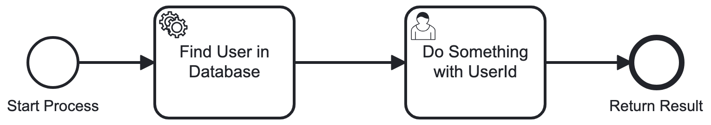

# Camunda Platform Process Application
A Process Application for [Camunda Platform](http://docs.camunda.org).
### Testable process:

This project has been generated by the Maven archetype
[camunda-archetype-ejb-war-7.21.0](https://docs.camunda.org/manual/latest/user-guide/process-applications/maven-archetypes/).

## Show me the important parts!
[BPMN Process](src/main/resources/process.bpmn)
[BPMN Process With User Task](src/main/resources/sample_task.bpmn)

## How does it work?
```xml
<configuration>
    <artifactItems>
        <artifactItem>
            <groupId>org.camunda.bpm.wildfly</groupId>
            <artifactId>camunda-bpm-wildfly</artifactId>
            <version>7.21.0</version>
            <type>zip</type>
            <overWrite>false</overWrite>
            <outputDirectory>${project.build.directory}</outputDirectory>
        </artifactItem>
    </artifactItems>
</configuration>
```
This will download a wildly server with all the camunda configuration you will need.

[Arquillian Manage Wildly](src/test/wildfly-managed/arquillian.xml) contains the test configuration to test the manage wildly server with Arquillian.

To build your testable war, you have to configure everything in your Test Class with `shrinkwrap`. For Example in our case we use following configuration:

```java
// Naming our test war
WebArchive base = ShrinkWrap.create(WebArchive.class, "sample-test.war");
// Adding test dependencies which will be used by arquillian to run assert the tests
var testDependencies = resolveDependencies(
        "org.camunda.bpm:camunda-bpm-assert",
        "org.assertj:assertj-core"
);
// Extract the depedencies, which are used to build the testable artifact 
File[] libs = Maven.resolver()
        .loadPomFromFile("pom.xml")
        .importDependencies(ScopeType.COMPILE)
        .resolve()
        .withTransitivity()
        .asFile();
return base
        .addPackages(true, "com.camunda.consulting") // use the content from our module
        .addAsWebInfResource(EmptyAsset.INSTANCE, "beans.xml")
        .addAsResource("process.bpmn") // adding deployable resources
        .addAsResource("sample_task.bpmn")
        .addAsResource("META-INF/processes.xml")
        .addAsResource("META-INF/persistence.xml")
        .addClass(ProcessUnitTest.class)
        .addAsLibraries(libs)
        .addAsLibraries(testDependencies);
```

## How to use it?

### Arquillian Test
You can run the JUnit test [ProcessTest](src/test/java/com/camunda/consulting/it/ProcessUnitTest.java) in your IDE or using:

##### when you do not have a running wildly, download one and runs in target folder
```bash
mvn clean test -Pwildfly-managed
```
##### when have a running configured wildly

```bash
mvn clean test -Pwildfly-remote
```

### Deployment to an Application Server
You can also build and deploy the process application to an application server.
For an easy start you can download WildFly with a pre-installed Camunda
from our [Download Page](https://downloads.camunda.cloud/release/camunda-bpm/wildfly/).

#### Manually
1. Build the application using:

```bash
mvn clean
```
2. Copy the *.war file from the `target` directory to the deployment directory
of your application server e.g. `wildfly/standalone/deployments`.
For a faster 1-click (re-)deployment see the alternatives below.

#### WildFly (using WildFly Maven Plugin)
1. Build and deploy the process application using:

```bash
mvn clean wildfly:deploy
```


### Run and Inspect with Tasklist and Cockpit
Once you deployed the application you can run it using
[Camunda Tasklist](http://docs.camunda.org/latest/guides/user-guide/#tasklist)
and inspect it using
[Camunda Cockpit](http://docs.camunda.org/latest/guides/user-guide/#cockpit).

## Environment Restrictions
Built and tested against Camunda Platform version 7.21.0 on WildFly 27+ Application Server.

## Known Limitations

## License
[Apache License, Version 2.0](http://www.apache.org/licenses/LICENSE-2.0).

<!-- Tweet
New @Camunda example: Camunda Platform Process Application - A Process Application for [Camunda Platform](http://docs.camunda.org). https://github.com/camunda-consulting/code/tree/master/snippets/arquillianSample
-->
