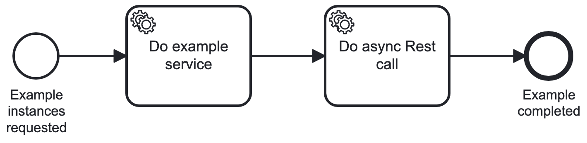

# Asynchronous External Task Handler

This project shows one way to implement an external task to call a REST API in a asynchronous way.

It uses the HttpClient from Java 11 and calls the REST API with `hhtpClient.sendAsync()`.

You will get a `CompletableFuture` of the response and  you can react with all the options the asynchronous framework will allow.

## Example implementation

In the [example implementation](/src/main/java/com/camunda/consulting/AsyncRestCallHandler.java), it sets a timeout of 5 seconds.

If the response arrives in time, the code will check for the HTTP status header to decide if the task is completed or failed.

In case of a timeout, the request will be canceled (To interrupt the completion, if the response arrives some times later) and the task is failed.

## Testing with WireMock

[The WireMock mapping](wireMock_mapping/random_delay.json) contains two endpoints. `random/delayed` delays the result between 4 and 6 seconds. `failed` returns a HTTP status code 500.

You can find more details howto setup a WireMock server in the WireMock documentation in the sections [Running as a standalone Process](https://https://wiremock.org/docs/standalone/java-jar/) and [JSON configuration files](https://wiremock.org/docs/standalone/java-jar/#json-file-configuration)

## Example process

The process model simply calls two services in a row:



## Start process instances

Create an instance calling the failed API:

```
curl --location 'http://localhost:8080/engine-rest/process-definition/key/exampleWithExternalTasksProcess/start' \
--header 'Content-Type: application/json' \
--data '{
  "businessKey": "Worker test 8",
  "variables": {
      "path": {"value": "failed"}
  }
}'
```

Create an instance to call the delayed API:

```
curl --location 'http://localhost:8080/engine-rest/process-definition/key/exampleWithExternalTasksProcess/start' \
--header 'Content-Type: application/json' \
--data '{
  "businessKey": "Worker test 8",
  "variables": {
      "path": {"value": "random/delayed"}
  }
}'
```