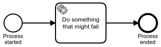

# Async on Error
This project shows how to dynamically switch to Asynchronous Continuation in case of exceptions inside a service task or at the start of a process in [Camunda BPM](http://docs.camunda.org).

This project has been generated by the Maven archetype
[camunda-archetype-ejb-war-7.6.3-SNAPSHOT](http://docs.camunda.org/latest/guides/user-guide/#process-applications-maven-project-templates-archetypes).

It is tested against Camunda 7.10.0.


## How does it work?
### Service Tasks


The example BPMN process contains a Service Task that would normally invoke some business logic using either:

    <bpmn2:serviceTask id="ServiceTask_1" camunda:class="com.camunda.bpm.demo.async_on_error.BusinessLogicDelegate" />

or in case of CDI or Spring:

    <bpmn2:serviceTask id="ServiceTask_1" camunda:delegateExpression="#{businessLogicDelegate}" />

With this approach, if a technical exception occurs during the execution of the business logic, it will be thrown all the way back to the client. However, the client especially if it is user interface of an end user might not be able to deal with technical errors. Thus, the Camunda engine provides a feature called [Asynchronous Continuation](https://docs.camunda.org/manual/latest/user-guide/process-engine/transactions-in-processes/#asynchronous-continuations) to protect end users from technical errors and have operators or administrators deal with them. Asynchronous Continuation works by setting the attribute `camunda:async="true"` on a Service Task. This attribute tells the Camunda engine to not execute a service task directly when the execution arrives there, but rather defer the execution to a active component called JobExecutor. The JobExecutor has standard mechanisms for dealing with technical exceptions like retrying or reporting them and can even be extended to do more.

However, this comes at the price of slowing down the cycle times of the process, because a process instance will be paused until the JobExecutor checks its queue of incoming jobs again, which is by default every five seconds. In situations where short response times must be matched, this might be too slow. That is especially true if a process uses the [UI Mediator Pattern](http://www.bpm-guide.de/2012/04/04/pageflow-vs-process-flow-and-ui-mediator-pattern/) to immediately present new user tasks from the same process instance to the same user that just started the process instance or completed the previous user task.

As an approach to maintain sub-second response times, this example first tries to execute a the service task synchronously. Only if that fails, an Asynchronous Continuation job is created. For reuse and convenience this dynamic behavior is provided as an ActivityBehavior called AsyncOnErrorActivityBehavior, into which the actual business logic can be injected. In case of CDI a bean containing business logic needs to implement the JavaDelegate interface of the Camunda engine. A generic bean called AsyncOnError can then be used to create an instance of the AsyncOnErrorActivityBehavior and inject the business logic bean instance into it. The AsyncOnError bean can be used in a delegateExpression on a service task, e.g.:

    <bpmn2:serviceTask id="ServiceTask_1" camunda:delegateExpression="#{asyncOnError.getAsyncOnErrorActivityBehavior(businessLogicDelegate)}" />

Please note the known limitations described below.

### Start Events
For start events the method `AsyncOnError#startProcessInstance(processEngine, processInstanceBuilder)` is provided.
It assumes the the start event of the process to be started is configured with `asyncBefore="true"`

```text
22:09:48.975 [main] DEBUG org.camunda.bpm.engine.persistence - ENGINE-03009 SQL operation: 'INSERT'; Entity: 'MessageEntity[id=7]'
22:09:48.976 [main] DEBUG o.c.b.e.i.p.e.J.insertMessage - ==>  Preparing: insert into ACT_RU_JOB ( ID_, TYPE_, LOCK_OWNER_, LOCK_EXP_TIME_, EXCLUSIVE_, EXECUTION_ID_, PROCESS_INSTANCE_ID_, PROCESS_DEF_ID_, PROCESS_DEF_KEY_, RETRIES_, EXCEPTION_STACK_ID_, EXCEPTION_MSG_, DUEDATE_, HANDLER_TYPE_, HANDLER_CFG_, DEPLOYMENT_ID_, SUSPENSION_STATE_, JOB_DEF_ID_, PRIORITY_, SEQUENCE_COUNTER_, TENANT_ID_, REV_ ) values (?, 'message', ?, ?, ?, ?, ?, ?, ?, ?, ?, ?, ?, ?, ?, ?, ?, ?, ?, ?, ?, 1 ) 
22:09:48.980 [main] DEBUG o.c.b.e.i.p.e.J.insertMessage - ==> Parameters: 7(String), null, null, true(Boolean), 5(String), 5(String), process-with-async-before-start:1:3(String), process-with-async-before-start(String), 3(Integer), null, null, null, async-continuation(String), process-start(String), 1(String), 1(Integer), 4(String), 0(Long), 1(Long), null
22:09:48.980 [main] DEBUG o.c.b.e.i.p.e.J.insertMessage - <==    Updates: 1
22:09:48.981 [main] DEBUG org.camunda.bpm.engine.persistence - ENGINE-03010 SQL bulk operation: 'UPDATE'; Statement: 'updateJobSuspensionStateByParameters'; Parameter: 'org.camunda.bpm.engine.impl.db.ListQueryParameterObject@5f1483fd'
22:09:48.986 [main] DEBUG o.c.b.e.i.p.e.J.updateJobSuspensionStateByParameters - ==>  Preparing: update ACT_RU_JOB set REV_ = REV_ + 1, SUSPENSION_STATE_ = ? WHERE ID_ = ? 
22:09:48.988 [main] DEBUG o.c.b.e.i.p.e.J.updateJobSuspensionStateByParameters - ==> Parameters: 2(Integer), 7(String)
22:09:48.989 [main] DEBUG o.c.b.e.i.p.e.J.updateJobSuspensionStateByParameters - <==    Updates: 1
22:09:48.989 [main] DEBUG org.camunda.bpm.engine.tx - ENGINE-11002 firing event committing...
22:09:48.990 [main] DEBUG org.camunda.bpm.engine.tx - ENGINE-11002 committing the persistence session...
22:09:48.990 [main] DEBUG org.camunda.bpm.engine.tx - ENGINE-11002 firing event committed...
22:09:48.992 [main] DEBUG org.camunda.bpm.engine.cmd - ENGINE-13006 Finishing command -------------------- StartProcessInstanceAsyncOnErrorCmd ----------------------
```

## How to use it?
There is no web interface to access the application.
To get started refer to the `InMemoryH2Test`.

There is also an `ArquillianTest`, which by default connects to a
Camunda BPM platform running locally on a JBoss Wildfly application server.
You can download a Camunda BPM distribution for JBoss from the
[Camunda BPM download page](http://camunda.org/download/).

## Environment Restrictions
Built and tested against Camunda BPM version 7.10.0.

## Known Limitations
- This approach does not work correctly for service tasks with attached boundary
  events that make the service task become a scope, e.g., timer events. However,
  error boundary events do work.
- The business logic must not mark the transaction for rollback only, because
  otherwise the Asynchronous Continuation job can not be committed to the
  database and the process instance will get stuck. Even if a job could be
  committed, it would most likely start at the wrong activity.

## Improvements Backlog

## License
[Apache License, Version 2.0](http://www.apache.org/licenses/LICENSE-2.0).

<!-- HTML snippet for index page
  <tr>
    <td></td>
    <td><a href="snippets/async-on-error">Async on Error</a></td>
    <td>This project shows how to dynamically switch to Asynchronous Continuation in case of exceptions inside a service task or at the start of a process in [Camunda BPM](http://docs.camunda.org).</td>
  </tr>
-->
<!-- Tweet
New @CamundaBPM example: Async on Error - This project shows how to dynamically switch to Asynchronous Continuation in case of exceptions inside a service task or at the start of a process in [Camunda BPM](http://docs.camunda.org). https://github.com/camunda/camunda-consulting/tree/master/snippets/async-on-error
-->