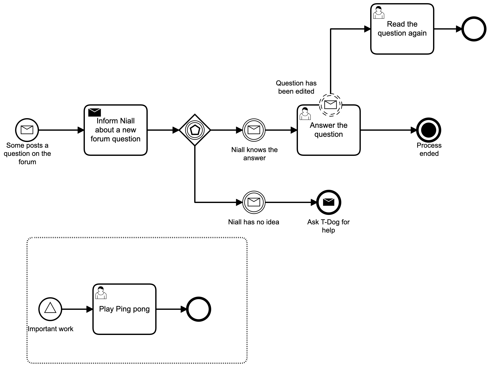

# Camunda BPM Process Application
A Process Application for [Camunda BPM](http://docs.camunda.org).

This project has been generated by the Maven archetype
[camunda-archetype-ejb-war-7.9.2](http://docs.camunda.org/latest/guides/user-guide/#process-applications-maven-project-templates-archetypes).

## Show me the important parts!
[BPMN Process](src/main/resources/process.bpmn)



## How does it work?

## How to use it?

### Unit Test
You can run the JUnit test [InMemoryH2Test](src/main/resources/archetype-resources/src/test/java/InMemoryH2Test.java) in your IDE or using:
```bash
mvn clean test
```

### Deployment to an Application Server
You can also build and deploy the process application to an application server.
For an easy start you can download JBoss Wildfly with a pre-installed Camunda
from our [Download Page](https://camunda.com/download/).

#### Manually
1. Build the application using:
```bash
mvn clean package
```
2. Copy the *.war file from the `target` directory to the deployment directory
of your application server e.g. `wildfly/standalone/deployments`.
For a faster 1-click (re-)deployment see the alternatives below.

#### Wildfly (using Wildfly Maven Plugin)
1. Build and deploy the process application using:
```bash
mvn clean wildfly:deploy
```

#### JBoss AS7 (using JBoss AS Maven Plugin)
1. Build and deploy the process application using:
```bash
mvn clean jboss-as:deploy
```

#### Arquillian Test
There is also an `ArquillianTest`, which by default connects to a
Camunda instance running locally on a Wildfly application server.

1. Build and run the Arquillian test on Wildfly using:
```bash
mvn clean test -Parq-wildfly-remote
```
or on JBoss AS 7 using:
```bash
mvn clean test -Parq-jbossas-remote
```

#### Ant (and Maven)
1. First copy the file `build.properties.example` to `build.properties`
2. Edit the `build.properties` file and put the path to your application server inside it.
3. Build and deploy the process application using:
```bash
ant deploy.jboss
```

Alternatively, you can also copy the `build.properties` file to `${user.home}/.camunda/build.properties`
to have a central configuration that works with all projects generated by the
[Camunda Maven Archetypes](http://docs.camunda.org/latest/guides/user-guide/#process-applications-maven-project-templates-archetypes) e.g. the [examples provided by the Camunda Consulting Team](https://github.com/camunda-consulting/code).

### Run and Inspect with Tasklist and Cockpit
Once you deployed the application you can run it using
[Camunda Tasklist](http://docs.camunda.org/latest/guides/user-guide/#tasklist)
and inspect it using
[Camunda Cockpit](http://docs.camunda.org/latest/guides/user-guide/#cockpit).

## Environment Restrictions
Built and tested against Camunda BPM version 7.9.0.

## Known Limitations

## License
[Apache License, Version 2.0](http://www.apache.org/licenses/LICENSE-2.0).

<!-- HTML snippet for index page
  <tr>
    <td></td>
    <td><a href="snippets/BpmnCommunication">Camunda BPM Process Application</a></td>
    <td>A Process Application for [Camunda BPM](http://docs.camunda.org).</td>
  </tr>
-->
<!-- Tweet
New @Camunda example: Camunda BPM Process Application - A Process Application for [Camunda BPM](http://docs.camunda.org). https://github.com/camunda-consulting/code/tree/master/snippets/BpmnCommunication
-->