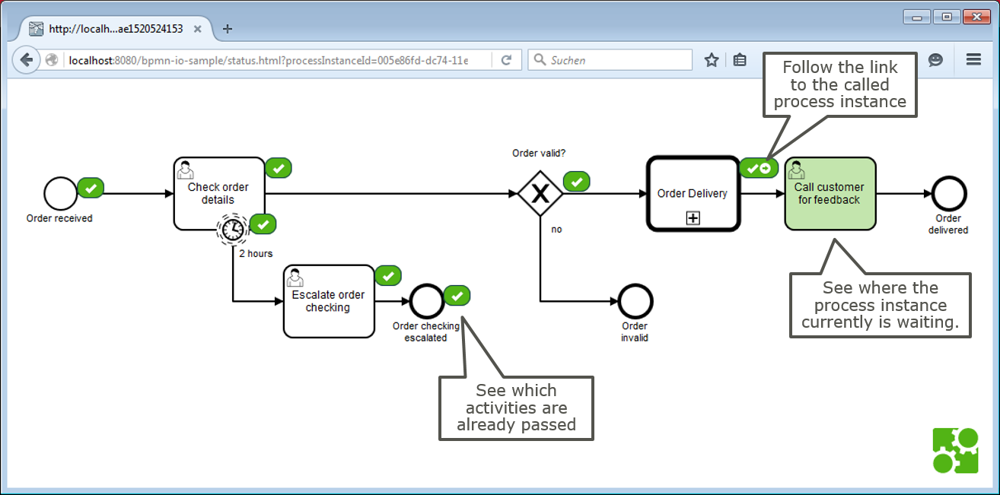
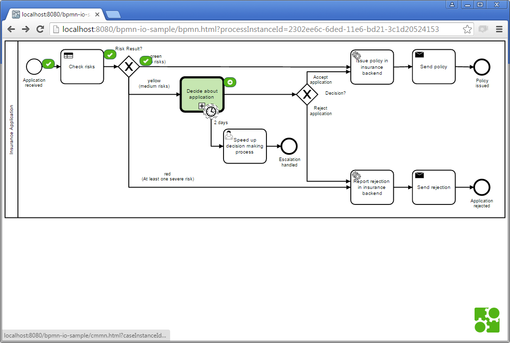
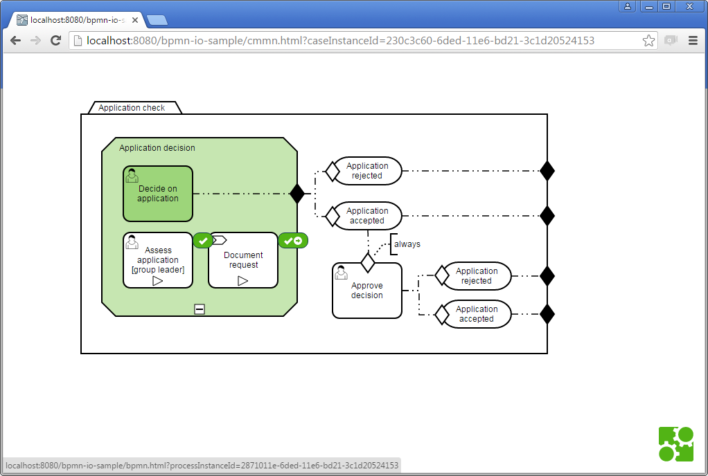

Simple Process Instance Satus View using bpmn.io
=========================

This example consists of a 

* Simple HTML page
* Including bpmn.io libraries and 
* JavaScript code to 
** Load the BPMN or CMMN XML for agiven model instance id via the Camunda BPM REST API
** Visualizes this in the BpmnJS or CmmnJS Viewer
** Loads history information for the instance
** Add Overlays and Markers to the model, to visualize these information
* This example is a self contained [HTML page for BPMN](src/main/webapp/bpmn.html) and [HTML page for CMMN](src/main/webapp/cmmn.html), but Maven and WebJars are used in order to build a WAR which can be deployed on a Java container. So no need to fiddle with JavaScript libraries or to include them into the project sources.

You can also navigate from BPMN to CMMN and vice-versa:

How to use it?
=========================

* Build via Maven and Deploy to your container
* Access it via your browser: [http://localhost:8080/bpmn-io-sample/status.html?processInstanceId=xxx](http://localhost:8080/bpmn-io-sample/status.html?processInstanceId=xxx) - replace xxx with the Process Instance Id of the process instance you want to display

More Use Cases!
=========================

You can use this technology to basically display whatever you like on the process model. You could display e.g. information about all process instances of a given process definition or statistics as well.
