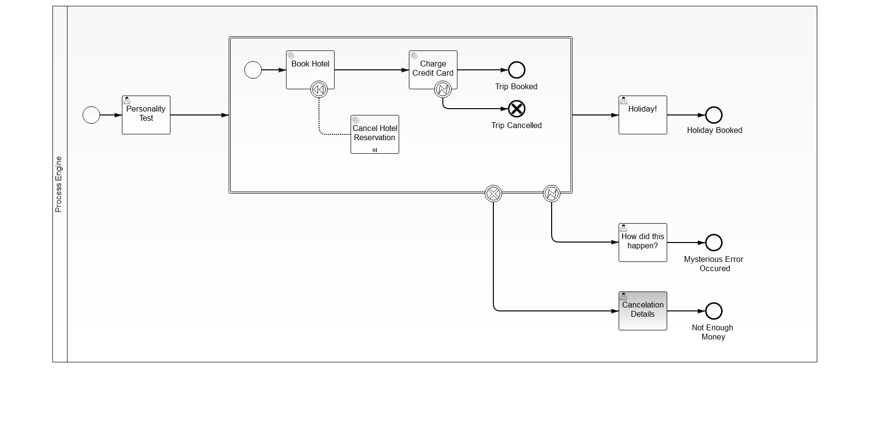

BPMN Transaction
=========================

Working example of the [https://docs.camunda.org/manual/7.5/reference/bpmn20/subprocesses/transaction-subprocess/](BPMN Transaction Subprocess) in action.

The process can fail when charging the credit card to showcase BPMN compensation, therefore set the variable `bookingHotelError` to true.

Built and tested against Camunda BPM version 7.5.0.

Show me the important parts!
----------------------------

How to use it?
--------------

You can either

- Click through it using Camunda web applications
  - Package the project as WAR using Maven
  - Deploy it on one of our distributions: (https://camunda.org/download/)[Download Camunda community edition]
  - Start a new instance using
[Camunda Tasklist](http://docs.camunda.org/latest/guides/user-guide/#tasklist): [http://localhost:8080/camunda/app/tasklist/default/](http://localhost:8080/camunda/app/tasklist/)
  - Inspect it using
[Camunda Cockpit](http://docs.camunda.org/latest/guides/user-guide/#cockpit): [http://localhost:8080/camunda/app/cockpit/default/](http://localhost:8080/camunda/app/cockpit/)
  
- Inspect the [src/test/java/org/camunda/bpm/example/bpmntransaction/bpmntransaction/InMemoryH2Test.java](InMemoryH2Test).
  - You can see the [https://github.com/camunda/camunda-consulting/tree/master/snippets/process-test-coverage](test coverage tool) in action: [docs/process-test-coverage/](docs/process-test-coverage/)

Environment Restrictions
------------------------

Built and tested against Camunda BPM version 7.5.0.

License
-------

[Apache License, Version 2.0](http://www.apache.org/licenses/LICENSE-2.0).
