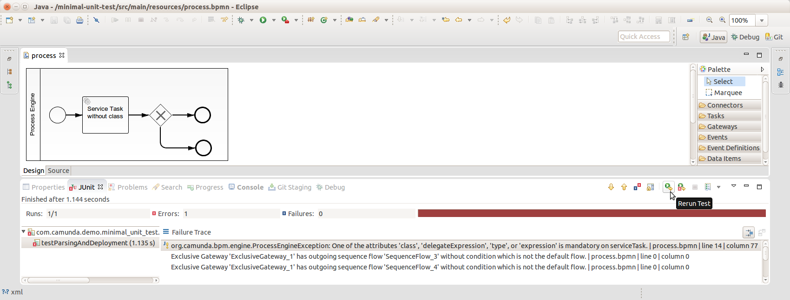

# BPMN Validation with the Parser of the Process Engine

A minimal environment for validating BPMN processes using an in-memory process engine in a JUnit test.

The BPMN parser of the Camunda BPM process engine gives very detailed feedback about a BPMN file during deployment. This feedback can be used to validate the process at design time. Since the real parser of the process engine is used, the validation is much better than standard BPMN syntax checkers or the like. It can especially also validate technical attributes required by the engine.

This project has been generated by the Maven archetype
[camunda-archetype-servlet-war-7.3.1-SNAPSHOT](http://docs.camunda.org/latest/guides/user-guide/#process-applications-maven-project-templates-archetypes).
But then almost everything has been deleted.
In particular the project is no longer a Process Application that can be deployed to a container.
However, the validation capabilities can be integrated into a normal process application as can be seen in the archetype seen above. 

Built and tested against Camunda BPM version 7.3.0.

##Show me the important parts!

### JUnit test executed in Eclipse


### Test class for validation
```java
/**
 * Test case starting an in-memory database-backed Process Engine.
 */
public class InMemoryH2Test {

  @Rule
  public ProcessEngineRule rule = new ProcessEngineRule();

  /**
   * Just tests if the process definition is deployable.
   */
  @Test
  @Deployment(resources = "process.bpmn")
  public void testParsingAndDeployment() {
    // nothing is done here, as we just want to check for exceptions during deployment
  }

}
```

## How does it work?
When the JUnit test is executed, a process engine with an in-memory database is started and the process model is deployed into it in order to get feedback from the real parser of the engine.

## How to use it?
To get started refer to the `InMemoryH2Test`. Try adding a Service Task without any technical configuration, e.g. without a Java class, and run the JUnit test case.

During your BPMN modeling sessions you can regularly hit the 'Rerun Test' button in the JUnit view of Eclipse to check if your latest changes didn't break anything.

## Environment Restrictions
Built and tested against Camunda BPM version 7.3.0.

## Known Limitations
Please, be aware that this style of validation can still not guarantee, that your process will execute without errors.
Especially expressions, scripts and data dependencies cannot be validated by static analysis.
To validate these parts of your process as well, we strongly recommend to also execute your process models via JUnit tests.
This project can serve as a starting point for that as well. See also the [Camunda BPM User Guide](http://docs.camunda.org/latest/guides/user-guide/#testing). 

## Improvements Backlog

## License
[Apache License, Version 2.0](http://www.apache.org/licenses/LICENSE-2.0).
