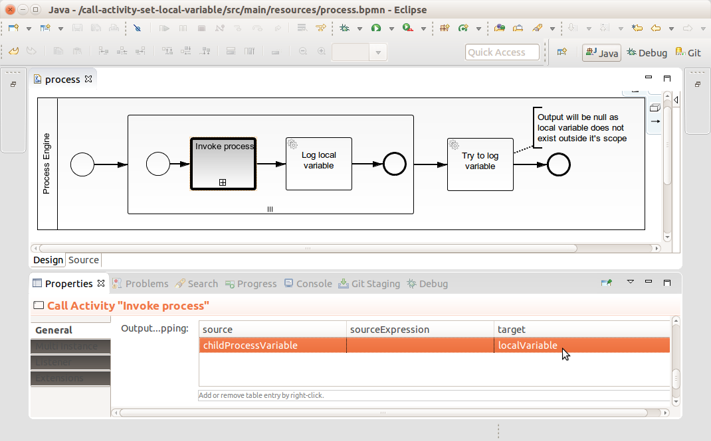

# Call Activity sets local variable
A Process Application for [Camunda BPM](http://docs.camunda.org) that shows how to set a local variable in a parent process based on the variable of a child process invoked by a Call Activity.

Currently, the Call Activity in Camunda BPM always sets global variables. Especially, when using it inside a Parallel Multi-Instance Sub-Process, a local variable might be desired.

This project has been generated by the Maven archetype
[camunda-archetype-servlet-war-7.3.1-SNAPSHOT](http://docs.camunda.org/latest/guides/user-guide/#process-applications-maven-project-templates-archetypes).

## Show me the important parts!

### Parent process


### Child process


## How does it work?

The variable called 'localVariable' is initialized as a local variable by an input mapping on the scope in which should exist – in this case the Multi-Instance Sub-Process.
Thus, every instance of the Sub-Process will have this variable defined.
  


The Call Activity has an output mapping that copies the variable 'childProcessVariable' from the child process into the variable 'localVariable' of the parent process.



The Call Activity scans through the hierarchy of scopes to see if the variable is already defined somewhere.
It starts from the innermost scope, which is the local scope of the Call Activity itself, and continues until the outermost scope, which is the global scope of the process instance.
Since the target variable is already defined in the local scope of the Sub-Process instance,
the scan stops and the variable is updated.
Otherwise, the variable would be created in the global scope.

The same approach can be applied to result variables of Service and Script Tasks as well as variables returned from Connector invocations.

## How to use it?
There is no web interface to access the application.
To get started run the `InMemoryH2Test` and watch the log output.

### Example Output

```
Aug 21, 2015 8:07:03 PM com.camunda.demo.call_activity_set_local_variable.LoggerDelegate execute
INFO: 

  ... LoggerDelegate invoked by processDefinitionId=call-activity-set-local-variable:1:4, activtyId=ServiceTask_2, activtyName='Log local variable', processInstanceId=6, businessKey=null, executionId=21 

  localVariable=0 


Aug 21, 2015 8:07:03 PM com.camunda.demo.call_activity_set_local_variable.LoggerDelegate execute
INFO: 

  ... LoggerDelegate invoked by processDefinitionId=call-activity-set-local-variable:1:4, activtyId=ServiceTask_2, activtyName='Log local variable', processInstanceId=6, businessKey=null, executionId=43 

  localVariable=1 


Aug 21, 2015 8:07:03 PM com.camunda.demo.call_activity_set_local_variable.LoggerDelegate execute
INFO: 

  ... LoggerDelegate invoked by processDefinitionId=call-activity-set-local-variable:1:4, activtyId=ServiceTask_2, activtyName='Log local variable', processInstanceId=6, businessKey=null, executionId=65 

  localVariable=2 


Aug 21, 2015 8:07:03 PM com.camunda.demo.call_activity_set_local_variable.LoggerDelegate execute
INFO: 

  ... LoggerDelegate invoked by processDefinitionId=call-activity-set-local-variable:1:4, activtyId=ServiceTask_3, activtyName='Try to log variable', processInstanceId=6, businessKey=null, executionId=6 

  localVariable=null 


```
### Deployment to server

You can also use `ant` to build and deploy the example to an application server.
For that to work you need to copy the file `build.properties.example` to `build.properties`
and configure the path to your application server inside it.
Alternatively, you can also copy it to `${user.home}/.camunda/build.properties`
to have a central configuration that works with all projects generated by the
[Camunda BPM Maven Archetypes](http://docs.camunda.org/latest/guides/user-guide/#process-applications-maven-project-templates-archetypes).

Once you deployed the application you can run it using
[Camunda Tasklist](http://docs.camunda.org/latest/guides/user-guide/#tasklist)
and inspect it using
[Camunda Cockpit](http://docs.camunda.org/latest/guides/user-guide/#cockpit).

## Environment Restrictions
Built and tested against Camunda BPM version 7.3.0.

## Known Limitations

## Improvements Backlog

## License
[Apache License, Version 2.0](http://www.apache.org/licenses/LICENSE-2.0).
