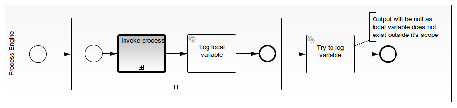
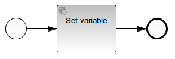

# Call Activity sets local variable
A Process Application for [Camunda BPM](http://docs.camunda.org) that shows how to set a local variable in a parent process based on the variable of a child process invoked by a Call Activity.

Currently, the Call Activity in Camunda BPM always sets global variables. Especially, when using it inside a Parallel Multi-Instance Sub-Process, a local variable might be desired.

This project has been generated by the Maven archetype
[camunda-archetype-servlet-war-7.3.1-SNAPSHOT](http://docs.camunda.org/latest/guides/user-guide/#process-applications-maven-project-templates-archetypes).

## Show me the important parts!



## How does it work?

```java
public class SetLocalVariableExecutionListener implements ExecutionListener {

  @Override
  public void notify(DelegateExecution execution) throws Exception {
    String variableName = "childProcessVariable";
    
    // obtain the value of the global variable set by the Call Activity
    Object variableValue = execution.getVariable(variableName);
    // delete the global variable before it gets written to the database
    execution.removeVariable(variableName);
    // set a local variable in the correct scope
    ((ExecutionEntity) execution).getParent().setVariableLocal(variableName, variableValue);
  }

}
```

The deleted global variable will still appear in the history, but the history has no unique constraint.

## How to use it?
There is no web interface to access the application.
To get started run the `InMemoryH2Test` and watch the log output.

You can also use `ant` to build and deploy the example to an application server.
For that to work you need to copy the file `build.properties.example` to `build.properties`
and configure the path to your application server inside it.
Alternatively, you can also copy it to `${user.home}/.camunda/build.properties`
to have a central configuration that works with all projects generated by the
[Camunda BPM Maven Archetypes](http://docs.camunda.org/latest/guides/user-guide/#process-applications-maven-project-templates-archetypes).

Once you deployed the application you can run it using
[Camunda Tasklist](http://docs.camunda.org/latest/guides/user-guide/#tasklist)
and inspect it using
[Camunda Cockpit](http://docs.camunda.org/latest/guides/user-guide/#cockpit).

## Environment Restrictions
Built and tested against Camunda BPM version 7.3.0.

## Known Limitations

## Improvements Backlog

## License
[Apache License, Version 2.0](http://www.apache.org/licenses/LICENSE-2.0).