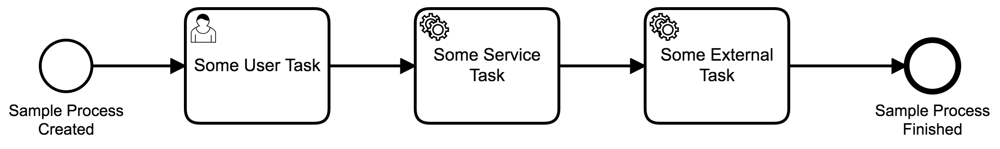

# Camunda Database Size Calculator
A sample application with [Camunda BPM](http://docs.camunda.org) that runs a set of process instances and gives you a report on the database sizing.

## Show me the important parts!
Process used as part of the sample:



## How does it work?
This small application runs a load of instances into Camunda, based in the environment variables PROCESS_KEY and CUSTOM_PROCESS_INSTANCE_AMOUNT.

Then it obtains the size of the database, along with information about the camunda tables (number of rows, size and so on) and writes a report with that information.

The application runs by default using the shown sample process, with a postgresql database. The generated report written in HTML.

You can extend the functionalities by implementing the following interfaces:
* [ProcessInstanceExecutor](src/main/java/com/camunda/consulting/simulator/ProcessInstanceExecutor.java): Responsible for creating instances for your process.
* [DatabaseCalculator](src/main/java/com/camunda/consulting/db/DatabaseCalculator.java): Responsible for calculating the size of the database.
* [Reporter](src/main/java/com/camunda/consulting/report/Reporter.java): Responsible for writing the report based in the database size.

It is important then to create new spring profiles for these new setups:
```
@Component
@Profile({"oracle"})
@RequiredArgsConstructor
public class OracleDatabaseCalculator implements DatabaseCalculator {

/*Your implementation*/

}
```

```
@Component
@Profile({"logger"})
public class LogReportWriter implements Reporter {

/* Your implementation */

}
```  
These profiles can then be passed on as environment variables when you setup the docker container:
```
environment:
  - CUSTOM_PROCESS_INSTANCE_AMOUNT=200
  - SPRING_DATASOURCE_URL=jdbc:oracle:thin:@db:1521:ORCL
  - SPRING_DATASOURCE_USERNAME=camunda
  - SPRING_DATASOURCE_PASSWORD=camunda
  - SPRING_PROFILES_ACTIVE=oracle,logger
```

## How to use it?
You can either execute the "run.sh" or just run:
```
mvn clean package
docker-compose up -d --build
```
This will create two docker images and run the containers for both. You can modifiy the configurations used in the file [docker-compose.yml](docker-compose.yml). 

Depending on the amount of instances the size may vary. To check progress, you can open the logs of the Camunda docker container:

```
docker logs -f camunda-database-size-calculator_camunda_1
```  

You should get the HTML report in a folder "database-report":


You can then clean the images and containers using "clean.sh" or run:

```
docker rm camunda-database-size-calculator_db_1 --force
docker rm camunda-database-size-calculator_camunda_1 --force
docker rmi camunda-database-size-calculator_db
docker rmi camunda-database-size-calculator_camunda
```

## Environment Restrictions

Built and tested against Camunda BPM version 7.11.15-ee and JDK 8.

Postgresql docker image used is [postgres:11](https://github.com/docker-library/postgres/blob/aa4f329a17fd82077536602da12f4264fa195b20/11/Dockerfile).

This project also uses Lombok, so make sure to configure it in your IDE before opening the source.

## Known Limitations

Only supports environments informed above.

## Improvements Backlog

* Add unit testing.
* Add support for other databases, such as Mysql and Oracle.
* Package this as an embedded library.

## License
[Apache License, Version 2.0](http://www.apache.org/licenses/LICENSE-2.0).
