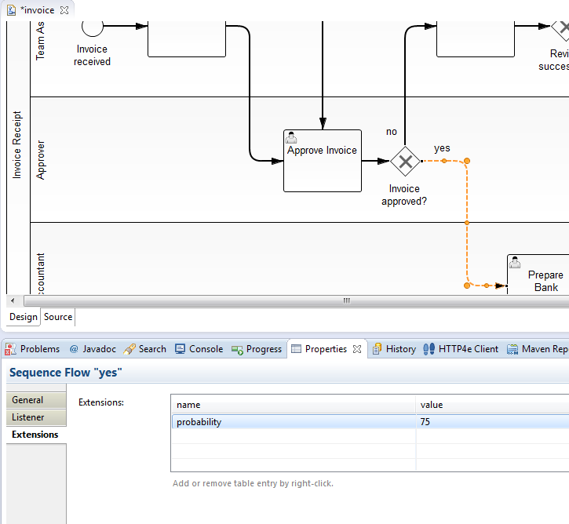
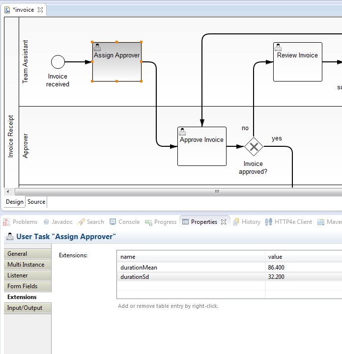
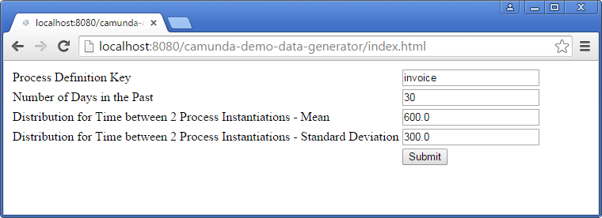
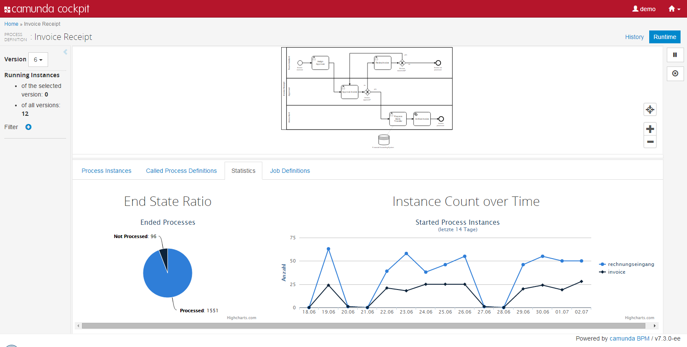

Demo Data Generator
=========================

**UNDER CONSTRUCTION!***

This project can start process instances and walk them through (skipping service tasks and other delegation code) in order to get some meaningful load in the history table - normally used to showcase reporting features.

Check the version n-1 for your generated process instances!

In order to use this you have to 

Instrument your BPMN process
----------------

*Hint:* All times are expressed in *seconds*.

### Add Probabilities to all outgoing Sequence Flows on XOR-Gateways:



### Add Distribution for Duration of User Tasks:




Start the Generation
--------------------

Deploy the camunda-demo-data-generator-webapp.war. 

Now you can start the generation, you have to specify:

* process definition key to start
* How many days in the past you want to have instances
* A Distribution configuring the time between two process instance starts (mean and standard deviation)



This will deploy a new version of the process definition which is tweaked for simulation (e.g. delegation code is removed, listeners steer the decisions, ...). After the simulation the original version is deployed again as newest version.

So you will have instances in the version before the latest version if you look into cockpit:




How to use it?
--------------

Build everything using mvn package. Deploy the camunda-demo-data-gento erator-webapp.war (in subproject camunda-demo-data-generator-webapp). Should work on any container (Tomcat, JBoss, ...).

Once you deployed the application you can run it using
[localhost:8080/camunda-demo-data-generator/generate](localhost:8080/camunda-demo-data-generator-webapp/). You might have to adjust the port.


Use Auto Generation
--------------

If you set up demo systems you might want to automatically generate data during startup. E.g. you could build a system were data is cleared every night and regenerated on startup. Therefor you have to add one dependency to your process application:

```
		<dependency>
			<groupId>com.camunda.demo.environment</groupId>
			<artifactId>camunda-demo-data-generator</artifactId>
			<version>1.0.0</version>
			<type>jar</type>
		</dependency>
```

Instrument your process definition XML for all processes where auto generation should be applied

```
  <process id="rechnungseingang" name="Rechnungseingang" isExecutable="true">
      <extensionElements>
        <camunda:properties>
          <camunda:property value="14" name="simulateNumberOfDaysInPast"/>
          <camunda:property value="1000" name="simulateTimeBetweenStartsBusinessDaysMean"/>
          <camunda:property value="2000" name="simulateTimeBetweenStartsBusinessDaysSd"/>
        </camunda:properties>
      </extensionElements>
```

And add a @PostDeploy hook into your ProcessApplication class:
```
@ProcessApplication
public class InvoiceProcessApplication extends ServletProcessApplication {

  /**
   * In a @PostDeploy Hook you can interact with the process engine and access
   * the processes the application has deployed.
   */
  @PostDeploy
  public void startFirstProcess(ProcessEngine processEngine) {
    DemoDataGenerator.autoGenerateFor(processEngine, "rechnungseingang");
  }
```

That's it. You get automatically instances generated - if not more than 50 instances exist in history yet (to avoid new instances on every startup).

Environment Restrictions
------------------------

Built and tested against Camunda BPM version 7.3.0.


Improvements Backlog
--------------------

Quite long :-) Not yet posted here.

License
-------

[Apache License, Version 2.0](http://www.apache.org/licenses/LICENSE-2.0).
