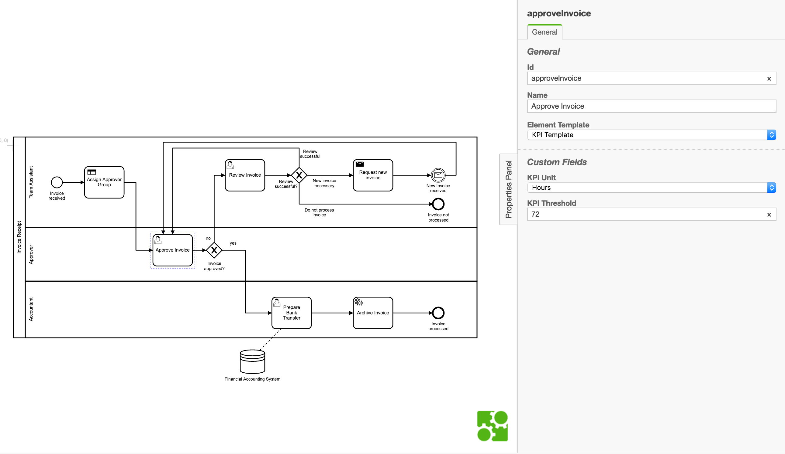
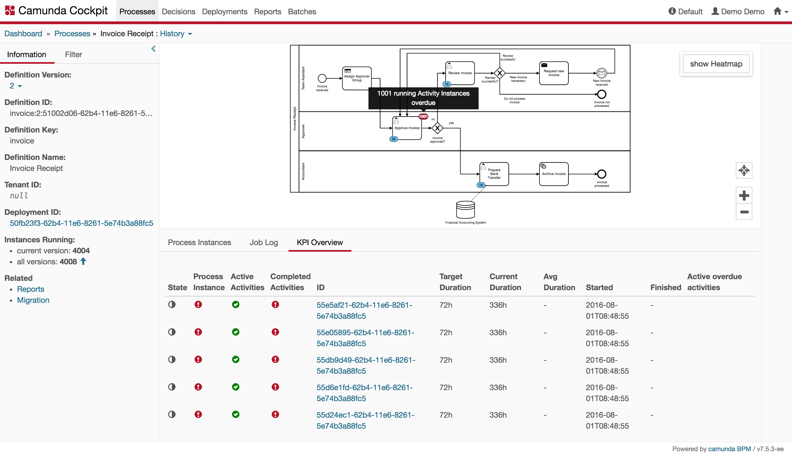
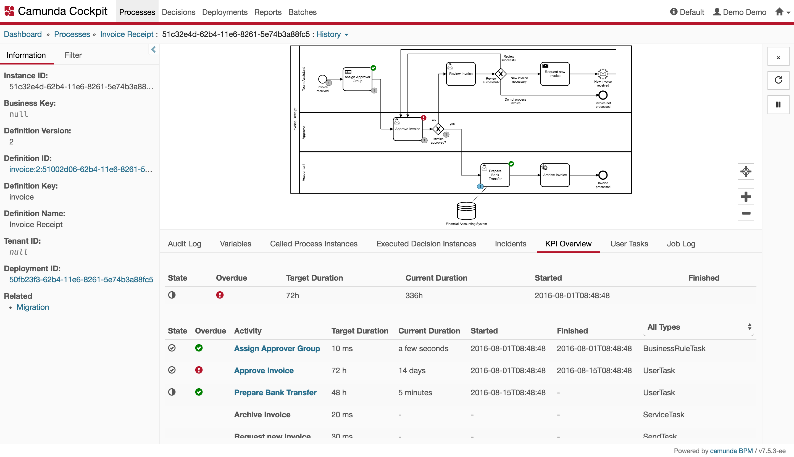

# Camunda KPI Monitoring Demo

## Overview
This project consists of three parts:
1. KPI Element Template for Camunda Modeler
2. KPI Overview Cockpit Plugin
3. Example Process (Invoice Demo) with KPI information

Using these three projects one can see how KPIs can be defined and monitored by making use of Camunda's open architecture.

## How does it work?
1. Clone projects
2. Copy 'kpi.json' into correct Camunda Modeler folder (see [Element-Template Readme](./element-template/README.md))
3. Install Cockpit Plugin using 'ant' on your Camunda WebApp (see [Cockpit Plugin Readme](./plugin/cockpit-kpi-overview-plugin/README.md)).
4. Add Process Application with KPI information to your Camunda Webapp:
    * a) Deploy example invoice process application to your Camunda Webapp.
    - OR
    * b) Add KPI information to your own process application by using Camunda Modeler property panel.
5. Open Camunda Cockpit to see the Plugin working (see where to look for the plugin in [Cockpit Plugin Readme](./plugin/cockpit-kpi-overview-plugin/README.md))

## Screenshots

## License
Use under terms of the [Apache License, Version 2.0](http://www.apache.org/licenses/LICENSE-2.0)
