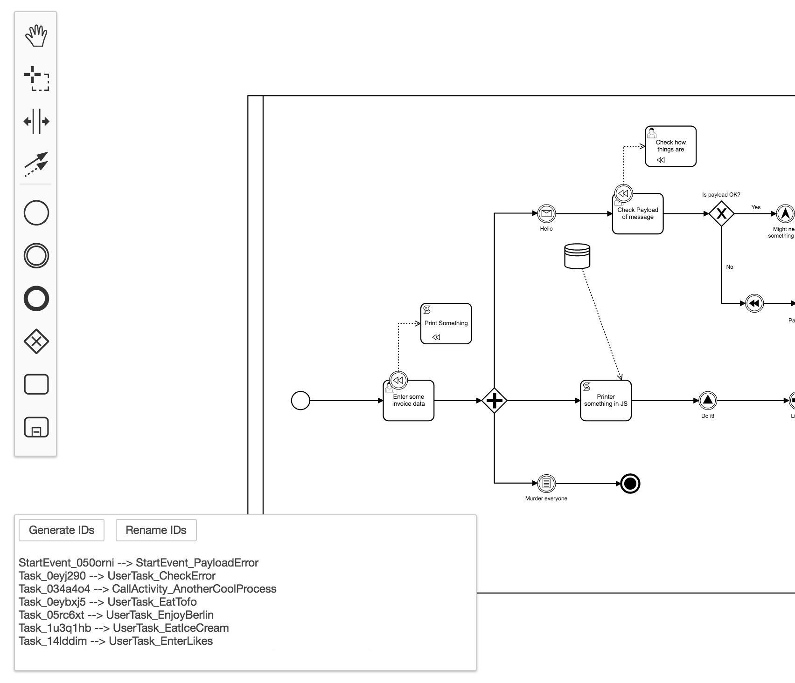

# Camunda Modeler - Rename Technical IDs

*Have a large BPMN process and want to automate it? Are you annoyed about editing all technical IDs manually?*

Then this is the right plugin for you. This plugin helps you to generate and rename technical IDs for all BPMN symbols:

e.g.:
- StartEvent_050orni with name Payload received becomes `PayloadReceivedStartEvent`
- UserTask_0eyj290 with name Process data becomes `ProcessDataTask`
- ...

The generated IDs suite to our best practice.

Usage:
1. generate the technical IDs
2. rename the IDs by clicking the button.
3. IDs that will replace the exisiting ones are highlighted with a yellow background.
4. If the name starts with a number (it is an invalid QName), the ID will start with a `N`: Time event with 10 Days will become `N10DaysEvent`

## Example

Put this directory into the `plugins` directory of the Camunda Modeler and you're ready to go.
First click on the "Generate IDs" button and check if all IDs are fine. Then click on Rename IDs and save your BPMN file.

If you're interested in how to create your own plugins see the [documentation](https://github.com/camunda/camunda-modeler/tree/547-plugins/docs/plugins) and this [example](https://github.com/camunda/camunda-modeler-plugin-example).
