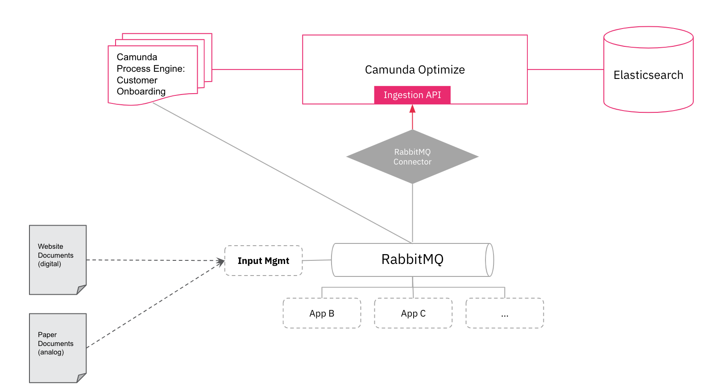
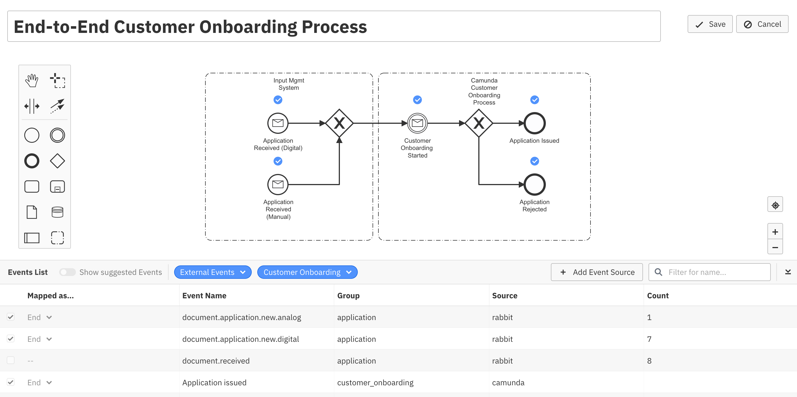

# End-To-End Application Example

This example shows how Optimize Process Events Monitoring can be used for End-To-End Process Monitoring and Reporting if the complete End-To-End Process hasn't been automated with the Camunda Engine. 

The example includes a process in the Camunda Runtime Platform, an example legacy Input Mgmt Application and RabbitMQ for exchanging Messages between the systems.
It also includes an example RabbitConnetor that reads all Messages and ingests them into the Optimize CloudEvents REST API endoint.

## Architecture

## End To End Process in Optimize

## How to run

1. Clone or Download this folder of the Repository
2. Add Optimize and Camunda BPM License in folders `./environment/OptimizeLicense.txt` and `./applicationprocessing/src/main/resources/camunda-license.txt`.
3. Build all Java Applications by running the `build.sh` provided in each folder.
4. Build all images with `docker-compose build`.
5. Run all images with `docker-compose up -d`.
6. Open `localhost:8090` to use Optimize and `localhost:8080` for other Camunda Webapps
7. Use `http://localhost:3000/insurance/application-manual.html` and `http://localhost:3000/insurance/application.html` for sending in applications. 

Note that application-manual.html sends "analog" documents whereas application.html sends digital documents.