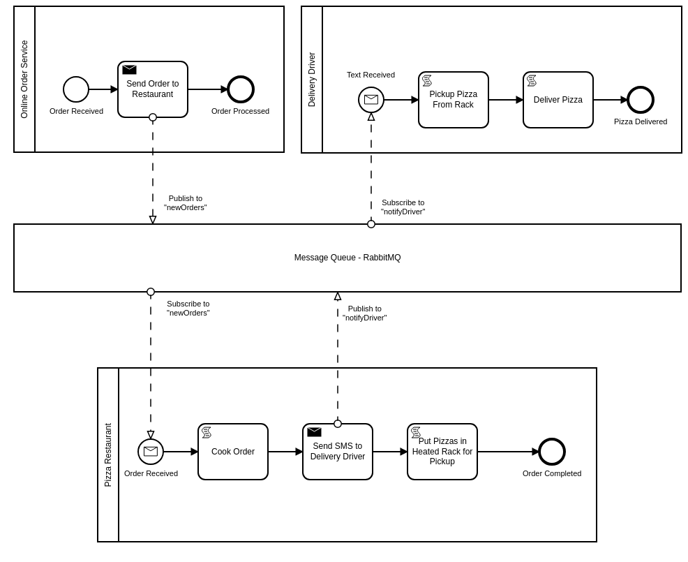

# Camunda Spring Boot Example - Messaging with Spring Cloud Streams and RabbitMQ
Spring Boot Application using [Camunda](http://docs.camunda.org).

This project has been generated by the Maven archetype
[camunda-archetype-spring-boot-7.10.0](https://docs.camunda.org/manual/latest/user-guide/process-applications/maven-archetypes/).

## Show me the important parts!
[BPMN Process](src/main/resources/messageExampleCollaboration.bpmn)



## How does it work?

This Camunda Example shows how one could use RabbitMQ as a message queue in a Camunda BPM environment.  In this case, this is a Spring Boot implementation that utilizes the following Spring packages:

- Spring AMQP (https://spring.io/projects/spring-amqp)
- Spring Cloud Stream (https://spring.io/projects/spring-cloud-stream)

***This particular example requires that you have RabbitMQ running locally, using the default ports.***

### Use Case

1. An Online Order Service exists to process incoming pizza orders.  Orders are published to the message queue.
2. Subscriber Java class listens to the newOrder topic.  When a message is received, it kicks off the Pizza Restaurant process with Camunda BPM message correlation.
3. When the pizza is ready, the restaurant publishes a message to the delivery driver via the queue.
4. Subscriber Java class listens to the notifyDriver topic.  When a message is received, it kicks off the Delivery Driver process with Camunda BPM message correlation.

Throughout the process, script tasks send status updates to the console, so that you can see it work from there.

### Usage

1. run the CamundaApplicaton class.  This will start the Spring Boot application.
2. once Camunda starts up, go to Tasklist, and start the "Online Order Service" process.  Supply any random data for the "Order Info" variable.  Its contents will not end up being utilized in this example, but the process variable will get passed to each process as payload.  Start the process.
3. check your application server console.  You should see that all script status messages have occurred.

### Code Structure

For each message, there will be a source file for the following:

- **Source Interface.**  This defines an output channel for publishing a message to a topic.
- **Sink Interface**.  This defines an input channel for subscribing to a topic to receive messages.
- **Publisher class**.  Implementation of Source interface.
- **Subscriber class**.  Implementation of Sink interface.

Other notable source files:

- **Camunda Delegate classes** that publish messages to the queue.  These classes will inject implementations of the defined Source interfaces, so make them available in the execute() method.
- **application.yaml.**  This will associate topic names to defined channels.
- **messageExampleCollaboration.bpmn**.  The collaboration diagram containing three processes.

## How to use it?

### Running the application
You can also build and run the process application with Spring Boot.

#### Manually
1. Build the application using:
```bash
mvn clean package
```
2. Run the *.jar file from the `target` directory using:
```bash
java -jar target/Camunda Spring Boot Application.jar
```

For a faster 1-click (re-)deployment see the alternatives below.

#### Maven Spring Boot Plugin
1. Build and deploy the process application using:
```bash
mvn clean package spring-boot:run
```

#### Your Java IDE
1. Run the project as a Java application in your IDE using CamundaApplication as the main class.

### Run and Inspect with Tasklist and Cockpit
Once you deployed the application you can run it using
[Camunda Tasklist](http://docs.camunda.org/latest/guides/user-guide/#tasklist)
and inspect it using
[Camunda Cockpit](http://docs.camunda.org/latest/guides/user-guide/#cockpit).

## Environment Restrictions
Built and tested against Camunda BPM version 7.10.0.

## Known Limitations

## License
[Apache License, Version 2.0](http://www.apache.org/licenses/LICENSE-2.0).

<!-- HTML snippet for index page
  <tr>
    <td></td>
    <td><a href="snippets/camunda-sb-messaging-example">Camunda Spring Boot Application</a></td>
    <td>Spring Boot Application using [Camunda](http://docs.camunda.org).</td>
  </tr>
-->
<!-- Tweet
New @Camunda example: Camunda Spring Boot Application - Spring Boot Application using [Camunda](http://docs.camunda.org). https://github.com/camunda-consulting/code/tree/master/snippets/camunda-sb-messaging-example
-->