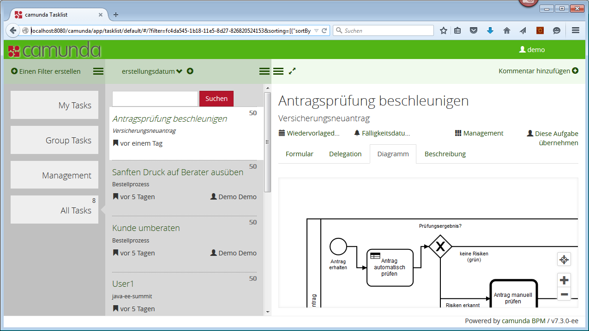

Customize the Camunda Webapp (Tasklist/Cockpit)
=========================

This project shows how to easily customize the Camunda Webapp by using the Maven Overlay mechanism.

It customizes:

* The color schema (see [http://docs.camunda.org/latest/guides/user-guide/#tasklist-customizing-logo-and-header-color](Logo and Header Color))
* The logo (see [http://docs.camunda.org/latest/guides/user-guide/#tasklist-customizing-logo-and-header-color](Logo and Header Color))
* Add German language taken from [https://github.com/camunda/camunda-tasklist-translations/](Community Extension: Tasklist Translations) (see [http://docs.camunda.org/latest/guides/user-guide/#tasklist-customizing-localization](Localization))
* Removes some built in plugins (see [http://docs.camunda.org/latest/guides/user-guide/#cockpit-plugins-plugin-exclusion-client-side](Plugin exclusion)): start-process-action, tasklist.navbar.action:create-task-action, task-detail-form, task-detail-history, task-search
* Adds own Plugins (see [http://docs.camunda.org/latest/guides/user-guide/#tasklist-plugins](Tasklist Plugins) and [http://docs.camunda.org/latest/guides/user-guide/#cockpit-plugins](Cockpit Plugins))

*Important Note:* You have to specify the webapp corresponding to your container (Tomcat, JBoss, WildFly, ...) in the pom.xml. This example builts the webapp for JBoss.

Example Screenshot
----------------------------

How to use it?
--------------

Just run

 mvn install

and copy the resulting camunda-webapp-customized.war to your deploy folder of the container. Make sure you delete the original webapp beforehand.

Environment Restrictions
------------------------

Built and tested against Camunda BPM version 7.3.0 using JBoss Application Server.

Improvements Backlog
--------------------

* Improve demo color schema

License
-------

[Apache License, Version 2.0](http://www.apache.org/licenses/LICENSE-2.0).
