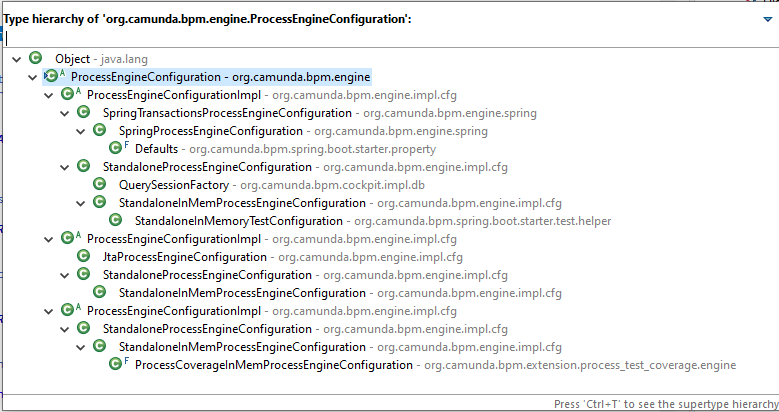

# Embedded Engine for External Tasks on Wildfly

In case you have to run a Camunda Installation on Wildfly or JBoss AS, where you can not change the libraries to install a shared process engine, you have to wrap up the process engine in a war file that gets deployed to the Java EE application server.

There are several ways to get there. All have some pros and cons that will be listed here.

To access the datasource configured in the Wildfly or JBoss configuration files, you should use the `dataSourceJndiName` property of the base class `org.camunda.bpm.engine.ProcessEngineConfiguration`. 

## Embedded Engine with camunda.cfg.xml

This is the most basic way where the developer gets the most possibilities to configure the engine with Java Beans.

All configuration goes into `camunda.cfg.xml`. Here is an [example project](embedded-engine-war/).

The REST API classes needs to be added in the code. You have to add an implementation of the interface `org.camunda.bpm.engine.rest.spi.ProcessEngineProvider` and wire it via the `META-INF/services/org.camunda.bpm.engine.rest.spi.ProcessEngineProvider` file containing the full qualified classname of your implementation.

To enable the REST API provide an extension of the `javax.ws.rs.core.Application` and return the `CamundaRestResources` in `getClasses()`. Have a look at the example for further details.

**Disadvantage**: You have to take care of the deployment by yourself. You can scan the classpath for BPMN files and invoke the deployment service on startup.

## Embedded Engine as Process Application

You can wrap your application as a [process application](https://docs.camunda.org/manual/7.18/user-guide/process-applications/). All configurations is done in the `processes.xml` in the two sections `<processEngine>` and `<processArchive>`. 

You can find an [example with REST API here](embedded-engine-process-application-war/).

Another [example without Rest API is here](../embedded-engine-without-spring/). 

A process application comes with auto deployment.

The REST API has to be added in the same way as for [Embedded Engine with camunda.cfg.xml](#embedded-engine-with-camundacfgxml).

**Disadvantage**: You cannot configure the Job Executor and have to accept the default settings. 

## Embedded Engine configured with Spring

You can use [this official maintained example](https://github.com/camunda/camunda-bpm-examples/tree/master/deployment/embedded-spring-rest) and configure the process engine in the `applicationContext.xml` from the Spring framework. The example contains a good documentation about adding the REST API. 

**Disadvantage**: As it uses the `org.camunda.bpm.engine.spring.SpringProcessEngineConfiguration` it requires a Transaction manager as well. This would not be needed when you have only external service task implementation. A simple datasource without transaction management is sufficient then.

## More Details about Process Engine Configuration

This is the given class structure of the ProcessEngineConfiguration options:

The `org.camunda.bpm.engine.impl.cfg.ProcessEngineConfigurationImpl` contains the most configuration properties. The different subclasses offer several options to interact with the environments.

Have a look at the code of these classes to find more details beyond the well choosen names.

