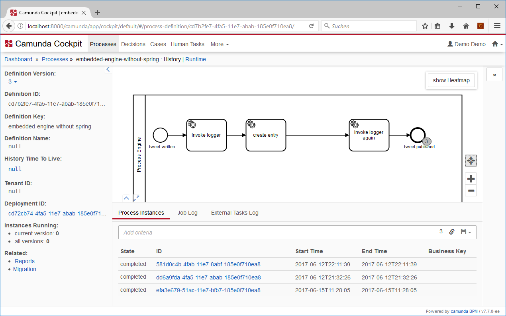
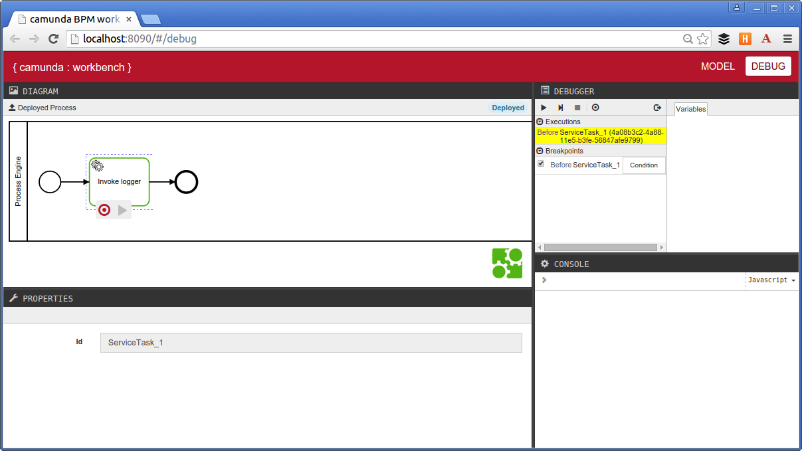

# Embedded Process Engine without Spring
A Process Application containing an embedded process engine that is completely configured in the processes.xml file and therefore does not require the Spring Framework as a dependency.


It runs on the naked JBoss/Wildfly application server using the Transaction Manager and CDI provided by the container.

So you could loosly couple your business logic (creating guest book entries here) to your process.

This project has been generated by the Maven archetype
[camunda-archetype-ejb-war-7.3.1-SNAPSHOT](http://docs.camunda.org/latest/guides/user-guide/#process-applications-maven-project-templates-archetypes).

## Show me the important parts!

### processes.xml
```xml
<?xml version="1.0" encoding="UTF-8"?>
<process-application
  xmlns="http://www.camunda.org/schema/1.0/ProcessApplication"
  xmlns:xsi="http://www.w3.org/2001/XMLSchema-instance">

  <process-engine name="embedded">
    <configuration>org.camunda.bpm.engine.impl.cfg.JtaProcessEngineConfiguration</configuration>
    <datasource>java:jboss/datasources/ProcessEngine</datasource>
    <properties>
        <property name="history">full</property>
        <property name="databaseSchemaUpdate">true</property>
        <property name="authorizationEnabled">true</property>
        <property name="jobExecutorDeploymentAware">true</property>
        <property name="transactionManagerJndiName">java:/TransactionManager</property>
    </properties>
    <plugins>

      <!-- plugin enabling Process Application event listener support -->
      <plugin>
        <class>org.camunda.bpm.application.impl.event.ProcessApplicationEventListenerPlugin</class>
      </plugin>
      
      <!-- plugin enabling integration of camunda Spin -->
      <plugin>
        <class>org.camunda.spin.plugin.impl.SpinProcessEnginePlugin</class>
      </plugin>

      <!-- plugin enabling connect support -->
      <plugin>
        <class>org.camunda.connect.plugin.impl.ConnectProcessEnginePlugin</class>
      </plugin>
      
   </plugins>
  </process-engine>

  <process-archive>
    <process-engine>embedded</process-engine>
    <properties>
      <property name="isDeleteUponUndeploy">false</property>
      <property name="isScanForProcessDefinitions">true</property>
    </properties>
  </process-archive>

</process-application>

```

## How does it work?

### pom.xml
```xml
    <dependency>
      <!-- process engine in compile scope to include it in the war file -->
      <groupId>org.camunda.bpm</groupId>
      <artifactId>camunda-engine</artifactId>
      <scope>compile</scope>
    </dependency>

    <!-- Spin dataformat support, in compile scope to include it in the war file -->
    <dependency>
      <groupId>org.camunda.spin</groupId>
      <artifactId>camunda-spin-dataformat-all</artifactId>
      <scope>compile</scope>
    </dependency>
    <dependency>
      <groupId>org.camunda.bpm</groupId>
      <artifactId>camunda-engine-plugin-spin</artifactId>
      <scope>compile</scope>
    </dependency>

    <!-- Connectors, in compile scope to include it in the war file -->
    <dependency>
      <groupId>org.camunda.connect</groupId>
      <artifactId>camunda-connect-connectors-all</artifactId>
      <scope>compile</scope>
    </dependency>
    <dependency>
      <groupId>org.camunda.bpm</groupId>
      <artifactId>camunda-engine-plugin-connect</artifactId>
      <scope>compile</scope>
    </dependency>

    <dependency>
      <groupId>com.fasterxml.uuid</groupId>
      <artifactId>java-uuid-generator</artifactId>
    </dependency>
```

See also:

 * [Deployment Descriptor Reference: processes.xml](https://docs.camunda.org/manual/7.7/reference/deployment-descriptors/descriptors/processes-xml/)
 * [processes.xml section of the User Guide](https://docs.camunda.org/manual/7.7/user-guide/process-applications/the-processes-xml-deployment-descriptor/)
 * [Configuring process engines in the processes.xml file](https://docs.camunda.org/manual/7.7/user-guide/process-applications/the-processes-xml-deployment-descriptor/#configure-process-engines-in-the-processes-xml-file)
 * [Deployment Descriptor Reference: Process Engine Configuration](https://docs.camunda.org/manual/7.7/reference/deployment-descriptors/tags/process-engine/)

## Camunda Cockpit Integration

To use a Cockpit with the embedded engine, download the
[Standalone Web Application Distribution](http://docs.camunda.org/7.3/guides/user-guide/#introduction-download-standalone-web-application-distribution)
and change the file `WEB_INF/applicationContext.xml` file inside the WAR file to point to the same datasource than the process engine:

```xml
  <bean id="dataSource" class="org.springframework.jndi.JndiObjectFactoryBean">
    <property name="jndiName" value="java:jboss/datasources/ProcessEngine"/>
  </bean>
```

You should also disable the `databaseSchemaUpdate` and you may have to set the history level to match that of your embedded engine:

```xml
  <bean id="processEngineConfiguration" class="org.camunda.bpm.engine.spring.SpringProcessEngineConfiguration">
    ...
    <property name="databaseSchemaUpdate" value="false" />
    <property name="history" value="full" />
    ...
```

Here is an example file: [applicationContext.xml](applicationContext.xml)

After deploying the application, visit [http://localhost:8080/camunda/](http://localhost:8080/camunda/).



## Camunda Worbench Integration

The example is prepared to embed the [Camunda BPM Workbench](https://github.com/camunda/camunda-bpm-workbench). if you enabled it,  visit [http://localhost:8090/#/debug](http://localhost:8090/#/debug) after deploying the web application.



If you want to use this, remove the comments around the Maven dependency in the `pom.xml` and around the plugin from the process engine configuration in the `pocesses.xml`.

## How to use it?
POST http://localhost:8080/embedded-engine-without-spring/resources/process with empty body {} to start a process instance. It writes an entry in the guest book.

The header of the response includes a link to the process instance history via the implemented REST Service.

See the guestbook entries with GET http://localhost:8080/embedded-engine-without-spring/resources/entries/ or add the id to the URL to see a specific entry.

## Environment Restrictions
Built and tested against Camunda BPM version 7.7.0 on a Wildfly 10 with [this configuration](standalone.xml).

## Known Limitations
Currently, it is not possible to configure the parameters of the Job Executor through the processes.xml file.

~~As a workaround, one could put a bpm-platform.xml into the application and do the bootstrap similar to how it is done in the class [TomcatBpmPlatformBootstrap](https://github.com/falko/camunda-bpm-platform/blob/master/engine/src/main/java/org/camunda/bpm/container/impl/tomcat/TomcatBpmPlatformBootstrap.java).~~
~~This bootstrapping approach would also allow for loading the bpm-platform.xml from a different location and thus have a central engine configuration.~~

## License
[Apache License, Version 2.0](http://www.apache.org/licenses/LICENSE-2.0).
