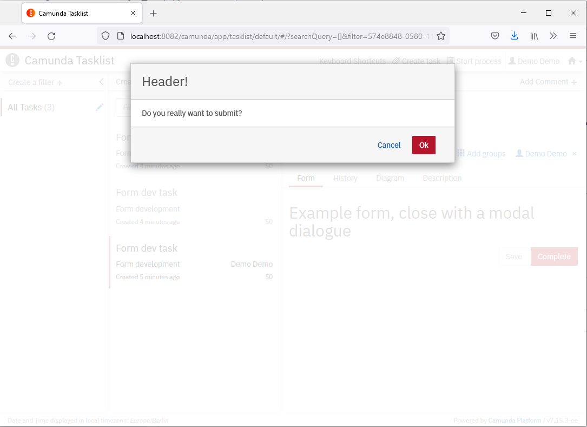

# Develop Embedded Forms for Camunda Tasklist

Developing embedded forms a Camunda with HTML and Javascript can be very time consuming if you use the wrong development environment.

The quickest way for me is use the camunda-spring-boot-starter-webapp in Eclipse. Here you can edit the form directly in the Eclipse editor and reload them in the browser window after saving in the editor. No redeploy or restart of the server is required. You don't need to login to the Tasklist again.

The server starts at [http://localhost:8082](http://localhost:8082). After login with demo/demo, just enter the Tasklist and start a process instance.

## Bonus: Open an AngularJS modal dialogue before submit

Have a look at [src/main/resources/static/modal-dialogue-form.html](src/main/resources/static/modal-dialogue-form.html)