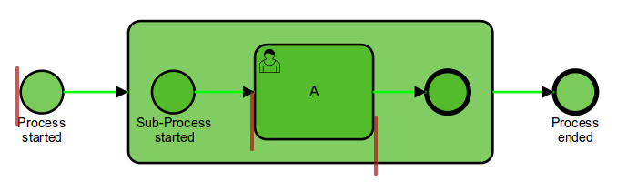

# Engine Plugin: Add Save Points
A plugin for [Camunda BPM](http://docs.camunda.org) that automatically adds save points, i.e. asynchronous continuation or transaction boundaries, to certain BPMN elements.

This project has been generated by the Maven archetype
[camunda-archetype-engine-plugin-7.6.0-SNAPSHOT](https://docs.camunda.org/manual/latest/user-guide/process-applications/maven-archetypes/).

## Show me the important parts!

## How does it work?
The plugin integrates into the BPMN parser and adds a save point before the Start Event(s) of a Process and after each User Task. This way the start of a process instance and the work completed by a user are not rolled back if an exception occurs in the process.

## How to use it?
To get started refer to `InMemoryH2Test` and `camunda.cfg.xml`.
For using it in production you have to [integrate the plugin into your Camunda BPM configuration](https://docs.camunda.org/manual/latest/user-guide/process-engine/process-engine-plugins/).

## Environment Restrictions
Built and tested against Camunda BPM version 7.5.0.

## Known Limitations

## Improvements Backlog

## License
[Apache License, Version 2.0](http://www.apache.org/licenses/LICENSE-2.0).