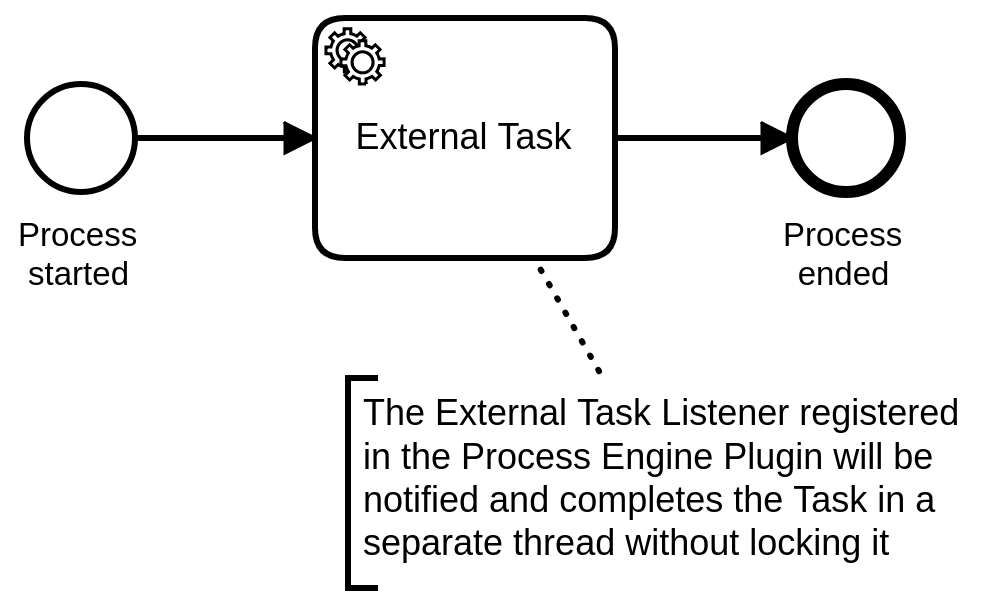

# Camunda External Task Listener Plugin
A Process Engine Plugin for [Camunda BPM](http://docs.camunda.org) that allows listening to newly created External Tasks.
It also provides a way to complete External Tasks without locking them via `ExternalTaskService.fetchAndLock()`.
This could be used to signal an External Task Worker that is running inside the same JVM
and to save the database transaction of `ExternalTaskService.fetchAndLock()`.

This project has been generated by the Maven archetype
[camunda-archetype-engine-plugin-7.11.1](http://docs.camunda.org/latest/guides/user-guide/#process-applications-maven-project-templates-archetypes).

## Show me the important parts!

## How does it work?

## How to use it?
To get started refer to `ProcessUnitTest` and `camunda.cfg.xml`.
For using it in production you have to [integrate the plugin into your Camunda BPM configuration](https://docs.camunda.org/manual/latest/user-guide/process-engine/process-engine-plugins/).

## Environment Restrictions
Built and tested against Camunda BPM version 7.11.0.

## Known Limitations

## Improvements Backlog

## License
[Apache License, Version 2.0](http://www.apache.org/licenses/LICENSE-2.0).