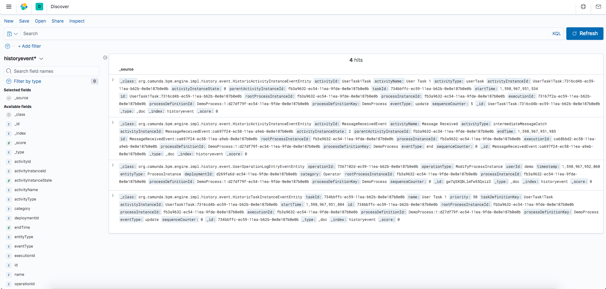

# Engine Plugin - History to Elasticsearch
This project shows how to push the history from Camunda into Elasticsearch.

## Show me the important parts!
[BPMN Process](src/main/resources/process.bpmn)


## How does it work?

This small application demonstrates how to save history from Camunda into Elasticsearch. It uses Camunda Embedded Engine with Spring Boot and Spring Data Elasticsearch.

The class [CustomHistoryEventHandler](src/main/java/com/camunda/consulting/engineplugin/CustomHistoryEventHandler.java) is used to capture the history and save it into Elasticsearch.

```
 @Override
  public void handleEvent(HistoryEvent historyEvent) {
    IndexQuery indexQuery = new IndexQueryBuilder()
            .withId(historyEvent.getId())
            .withObject(historyEvent)
            .build();

    IndexCoordinates indexCoordinates = IndexCoordinates.of("historyevent");

    elasticsearchOperations.index(indexQuery, indexCoordinates);
  }
```

This handler is configured inside the process engine plugin [CustomHistoryEventHandlerPlugin](src/main/java/com/camunda/consulting/engineplugin/CustomHistoryEventHandlerPlugin.java).
```
@Override
	public void postInit(ProcessEngineConfigurationImpl processEngineConfiguration) {
		customHistoryEventHandler = new CustomHistoryEventHandler();
		processEngineConfiguration
				.setHistoryEventHandler(new CompositeDbHistoryEventHandler(customHistoryEventHandler));
	}
```
By using the CompositeDbHistoryEventHandler, we add our custom history handler and keep the DB history.

The configuration of the Elasticsearch client is done in the class [Config](src/main/java/com/camunda/consulting/config/Config.java).

## How to use it?

First, you need to start an Elasticsearch environment. You can use [this docker compose file](docker-elasticsearch/docker-compose.yml) to start two docker containers, one with Elasticsearch and the other with Kibana.

After that, you can start this Camunda application, either from an IDE, or by using the command in the root folder:

mvn clean spring-boot:run

You can then do any sort of action that generates history, like creating a process instance, modifying a variable and so on. The history will be saved in the index "historyevent", and it can be viewed in Kibana (localhost:5601) using the [discovery feature](https://www.elastic.co/guide/en/kibana/current/discover.html). Here is an example:



## Environment Restrictions
Built and tested with:
* Camunda BPM version 7.13.0-ee.
* SpringBoot 2.3.3.RELEASE.
* Java 11.
* Elasticsearch 7.9.0.

## Known Limitations

## References
https://docs.camunda.org/manual/7.13/user-guide/process-engine/history/#provide-a-custom-history-backend
https://www.baeldung.com/spring-data-elasticsearch-tutorial


## License
[Apache License, Version 2.0](http://www.apache.org/licenses/LICENSE-2.0).