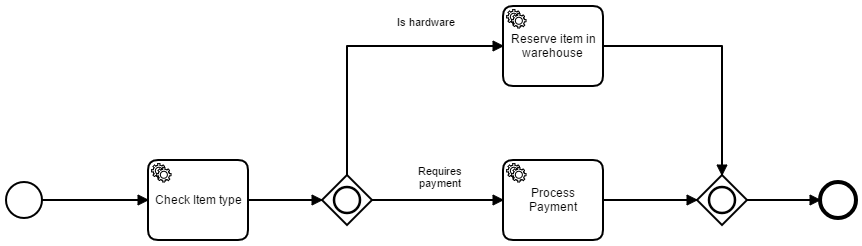
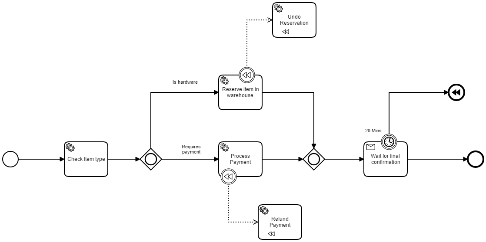

External tasks pattern with JavaScript workers
=========================

There are multiple ways to run Business logic with Camunda. Most commonly it's a java class. But for polyglot or microservice architectures this is not the best option instead it's better to use external tasks. This project uses simple JavaScript "workers" to pick up and complete work that is being orchestration and activated by Camunda.

Show me the important parts!
----------------------------

Let's look at a very simple process, where depending on the results of the "Check Item Type" task we will either run "Reserve item in warehouse" and/or "Process Payment".

Each of theses service tasks is implemented using an external task meaning that the bpmn file can be directly deploy to the engine via  [the rest API](https://docs.camunda.org/manual/7.8/reference/rest/deployment/post-deployment/)

Once deployed it can also be started with a [start process by key rest call](https://docs.camunda.org/manual/7.8/reference/rest/process-definition/post-start-process-instance/)

If you're running camunda locally the call would be:

POST localhost:8080/engine-rest/process-definition/key/CamDelivery/start

once you've started a process you need to kick off the workers who will actually do the work.
There are 3 workers each follow the same pattern. They are pointed at the engine's rest endpoint and they have one or more "Topics" which they're subscribed to.
The workers are based on the [camunda worker node project ](https://github.com/nikku/camunda-worker-node) by nikku. Follow the ReadMe on that that project if you have any issues getting the workers started.

Once started they should start polling for work and completing tasks. You can then deploy the more advanced models to see how Camunda can utilize the symbols of BPMN in order to create some really powerful features. for instance:

In the above model we've implemented a Timer event and compensation events. The timer on the Wait for confirmation task will force the process to stop waiting after a give time has expired and then move the state to a compensation event which will trigger the compensation tasks "Undo Reservation" and/or "Refund Payment" depending on if they've been done or not for that given instance.

Environment Restrictions
------------------------

Built and tested against Camunda BPM version 7.8.0

Known Limitations
-----------------

License
-------

[Apache License, Version 2.0](http://www.apache.org/licenses/LICENSE-2.0).
