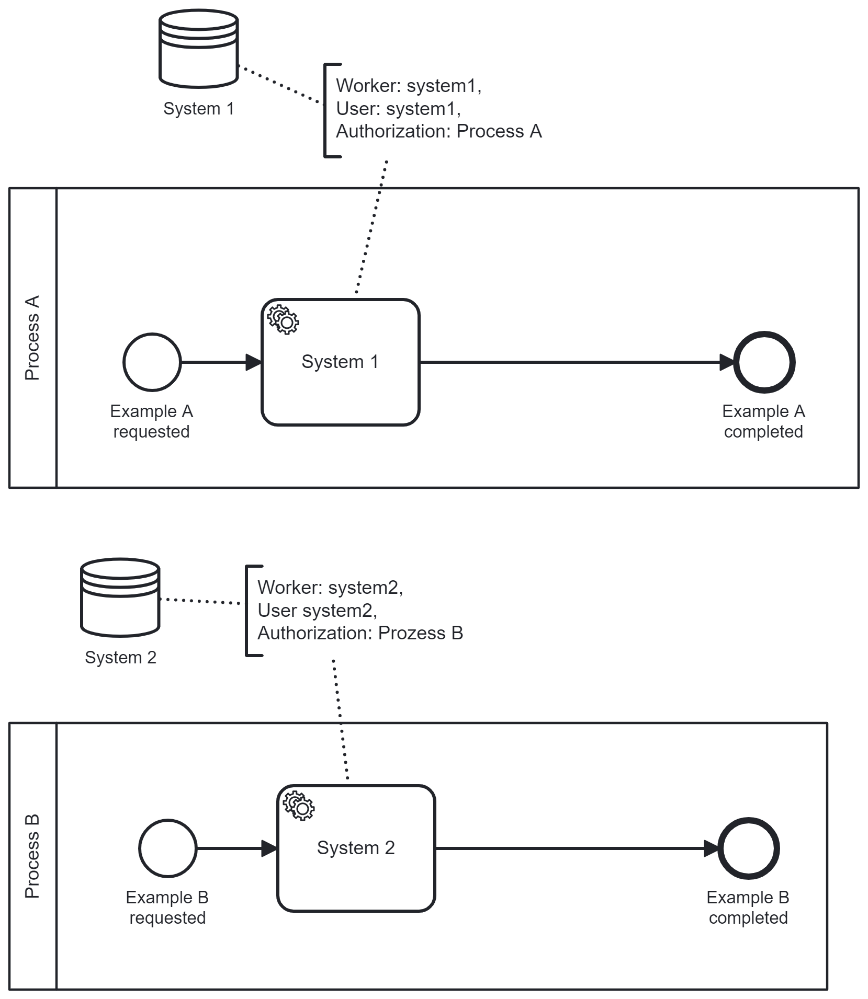
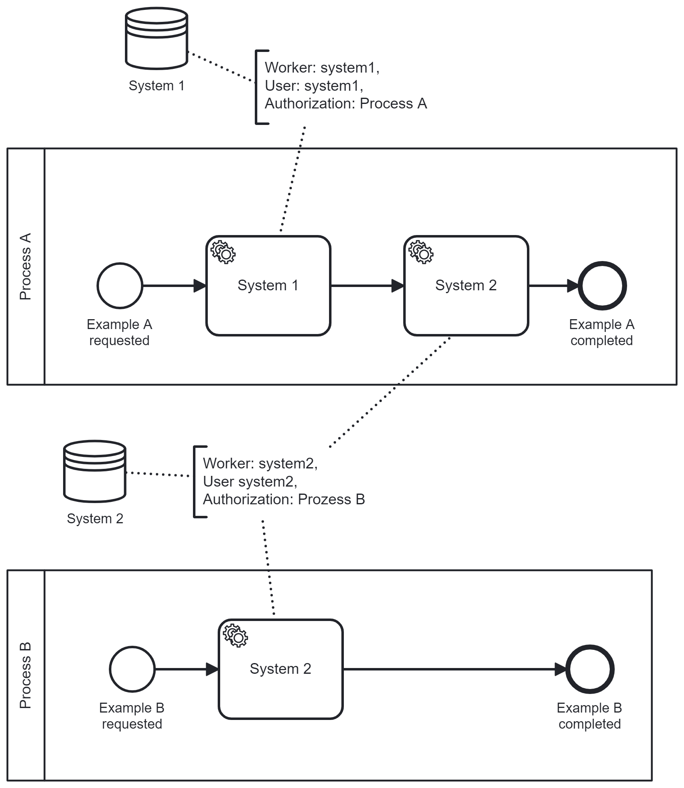
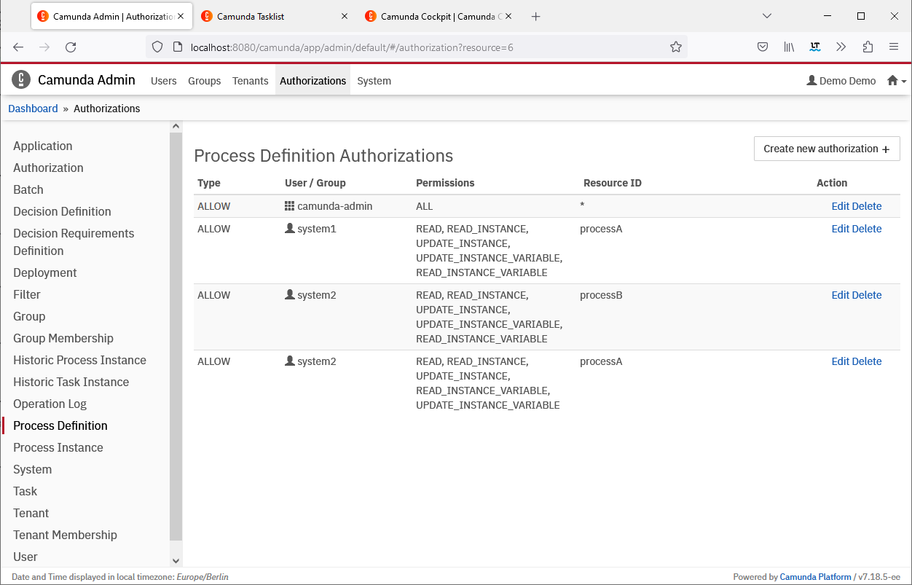

# External Task Workers and Security

With external service tasks it becomes very easy to reuse a service task
implementation in several process models. The only reference in the process
model is the topic name.

Some service task implementation connect to a system, that is restricted and
should not be available to everybody in the whole company that runs their
processes on a company-wide Camunda 7 Platform Run installation. And in some
organizations it could be the case, that Team B reuses a service task from Team
A which they are not allowed to. Authorizations have to be granted to use an
external task worker only in dedicated process models.

## Setup

To simplify the example let's assume that each external task worker accesses a
single secure API of a backend system. The external task worker holds the secret
to access the system.

As a convention, the name of the external task topic is the same as the external
task worker and the system.

We have two systems, _system1_ and _system2_. So we need two workers,
_system1Worker_ and _system2Worker_. As well, we have two topics for service
tasks, _system1_ and _system2_.

In the beginning, we run two process models, _Process A_ and _Process B_.
_Process A_ contains a service task to access _system1_, and _Process B_ should
access _system2_ with a service task of type external.

Here is a diagram with the initial setup:



To suppress that Team B and their _Process B_ can get access to _system1_ just
by adding a service task to their process model with topic name system1, we have
to configure the process definition authorization accordingly.

## Authorization Setup

The process engine REST API has to be configured for basic authorization. If you
use Camunda Run, set `camunda.bpm.run.auth.enabled` to `true` in
`configuration/default.yml`. If you use the
`camunda-bpm-spring-boot-starter-rest` dependency, add the
[RestApiSecurityConfig class](secure-spring-boot-process-engine/src/main/java/com/camunda/consulting/secure_spring_boot_process_engine/RestApiSecurityConfig.java)
to your application.

As we have separated the workers, we can use basic authentication to identify
each worker. Another simplification is to add users with the same name as the
backend system.

Enabling basic authentication in the external task worker is done in the
[application.properties](system-1-external-task-worker/src/main/resources/application.properties)
configuration of the worker.

```
camunda.bpm.client.basic-auth.username=system1
camunda.bpm.client.basic-auth.password=secret
```

For this example with two system, we need two users _system1_ and _system2_.

These users can be set up with the Java API like this:

```
User system1User = identityService.newUser("system1");
system1User.setFirstName("System");
system1User.setLastName("One");
system1User.setPassword("secret");
identityService.saveUser(system1User);
```

To grant the users their authorizations to work only on a single process
definition, this setup is required:

```
Authorization system1ProcessAAuth = authorizationService.createNewAuthorization(Authorization.AUTH_TYPE_GRANT);
system1ProcessAAuth.setUserId(system1User.getId());
system1ProcessAAuth.setResourceId("processA");
system1ProcessAAuth.setResourceType(Resources.PROCESS_DEFINITION.resourceType());
system1ProcessAAuth.addPermission(ProcessDefinitionPermissions.READ);
system1ProcessAAuth.addPermission(ProcessDefinitionPermissions.READ_INSTANCE);
system1ProcessAAuth.addPermission(ProcessDefinitionPermissions.UPDATE_INSTANCE);
system1ProcessAAuth.addPermission(ProcessDefinitionPermissions.READ_INSTANCE_VARIABLE);
system1ProcessAAuth.addPermission(ProcessDefinitionPermissions.UPDATE_INSTANCE_VARIABLE);
authorizationService.saveAuthorization(system1ProcessAAuth);
```

Now, the external worker for _system1_ can fetch-and-lock and complete external
service tasks of _Process A_.

After adding the user _system2_ and authorization for process definition
_Process B_, all processes from the diagram above will work as expected.

## Reusing Service Tasks

If Team A wants to use System 2 as well, they have to ask the admin to grant
authorization for System 2 on Process A as well.


If you just add the new service task with the right topic to Process A, deploy
the new version to the process engine and start new process instances, you can
observe, that the process instance get stuck at the System 2 task. Even if the
worker for System 2 is still running, it can not fetch-and-lock tasks from
Process A as it doesn't have the permission to do it.

You have to add the authorization for System 2 on Process A before the process
instances can be completed.

This picture shows the process definition authorization in Admin:



## Run the example

The code for this example is provided in the three modules
`secure-spring-boot-process-engine`, `system-1-external-task-worker` and
`system-2-external-task-worker`.

To run the example, open three terminal windows and navigate to the three
subfolders.

In each terminal, enter `mvn spring-boot:run` to start the process engine and
the workers.

Open a browser at [http://localhost:8080](http://localhost:8080) and enter
Admin. You can inspect the users and the authorizations for the process
definitions.

In Tasklist, you can start new process instances for each process. Check the
output for the worker in the terminals.

## Add a Service Task to Process A

Enter the Camunda Modeler and open the process model of _Process A_. Add a
service task with implementation external and topic name `system2` after the
first service task.

Save the changed diagram and restart the process engine in the terminal.

Enter Tasklist again and start a new process instance of _Process A_.

Enter Cockpit and check the progress of the new process instance. It should wait
before the new service task.

Enter Admin and add the missing Authorization for user _system2_ on the resource
`processA`. The permissions `READ`, `READ_INSTANCE`, `UPDATE_INSTANCE`,
`READ_INSTANCE_VARIABLE`and `UPDATE_INSTANCE_VARIABLE` are required for the
external task worker.

After saving the authorization, the tasks will be immediately be picked up by
the worker.

## Additional Insights

When you set the logging level for the category `org.apache.http.headers` to
default, you can see the traffic between the external task worker and the
process engine. If you delete the users _system1_ or _system2_ you will see the
http response code 401, which is unauthorized.
