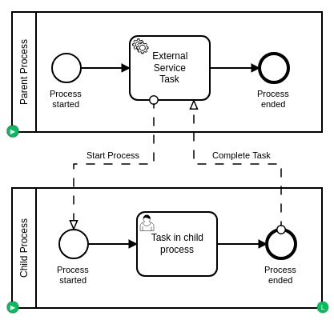

# External Task Worker Process
An example on using a BPMN process as an External Task Worker for [Camunda BPM](http://docs.camunda.org).

This project has been generated by the Maven archetype
[camunda-archetype-servlet-war-7.10.1-SNAPSHOT](https://docs.camunda.org/manual/latest/user-guide/process-applications/maven-archetypes/).

## Show me the important parts!
[BPMN Process](src/main/resources/process.bpmn)



## How does it work?

See [InMemoryH2Test#handleExternalTask](src/test/java/com/camunda/bpm/example/external_task_worker_process/InMemoryH2Test.java)
and [CompleteExternalTaskInParentProcessDelegate](src/main/java/com/camunda/bpm/example/external_task_worker_process/CompleteExternalTaskInParentProcessDelegate.java)

## How to use it?

### Unit Test
You can run the JUnit test [InMemoryH2Test](src/test/java/com/camunda/bpm/example/external_task_worker_process/InMemoryH2Test.java) in your IDE or using:
```bash
mvn clean test
```

### Deployment to an Application Server
You can also build and deploy the process application to an application server.
For an easy start you can download Apache Tomcat with a pre-installed Camunda
from our [Download Page](https://camunda.com/download/).

#### Manually
1. Build the application using:
```bash
mvn clean package
```
2. Copy the *.war file from the `target` directory to the deployment directory
of your application server e.g. `tomcat/webapps` or `wildfly/standalone/deployments`.
For a faster 1-click (re-)deployment see the alternatives below.

#### Apache Tomcat (using Maven AntRun Plugin)
1. First copy the file `build.properties.example` to `build.properties`
2. Edit the `build.properties` file and put the path to your Tomcat into `deploy.tomcat.dir`.
3. Build and deploy the process application using:
```bash
mvn clean package antrun:run
```

Alternatively, you can also copy the `build.properties` file to `${user.home}/.camunda/build.properties`
to have a central configuration that works with all projects generated by the
[Camunda Maven Archetypes](https://docs.camunda.org/manual/latest/user-guide/process-applications/maven-archetypes/) e.g. the [examples provided by the Camunda Consulting Team](https://github.com/camunda-consulting/code).

#### Apache Tomcat (using Tomcat Maven Plugin)
1. Create a user in Tomcat with the role `manager-script`.
2. Add the user's credentials to the `tomcat7-maven-plugin` configuration in the [pom.xml](pom.xml) file.
3. Build and deploy the process application using:
```bash
mvn clean tomcat7:deploy
```

#### Wildfly (using Wildfly Maven Plugin)
1. Build and deploy the process application using:
```bash
mvn clean wildfly:deploy
```

#### JBoss AS7 (using JBoss AS Maven Plugin)
1. Build and deploy the process application using:
```bash
mvn clean jboss-as:deploy
```

#### Ant (and Maven)
1. First copy the file `build.properties.example` to `build.properties`
2. Edit the `build.properties` file and put the path to your application server inside it.
3. Build and deploy the process application using:
```bash
ant deploy.tomcat
```
or
```bash
ant deploy.jboss
```

Alternatively, you can also copy the `build.properties` file to `${user.home}/.camunda/build.properties`
to have a central configuration that works with all projects generated by the
[Camunda Maven Archetypes](https://docs.camunda.org/manual/latest/user-guide/process-applications/maven-archetypes/) e.g. the [examples provided by the Camunda Consulting Team](https://github.com/camunda-consulting/code).

### Run and Inspect with Tasklist and Cockpit
Once you deployed the application you can run it using
[Camunda Tasklist](http://docs.camunda.org/latest/guides/user-guide/#tasklist)
and inspect it using
[Camunda Cockpit](http://docs.camunda.org/latest/guides/user-guide/#cockpit).

## Environment Restrictions
Built and tested against Camunda BPM version 7.11.0.

## Known Limitations

## License
[Apache License, Version 2.0](http://www.apache.org/licenses/LICENSE-2.0).