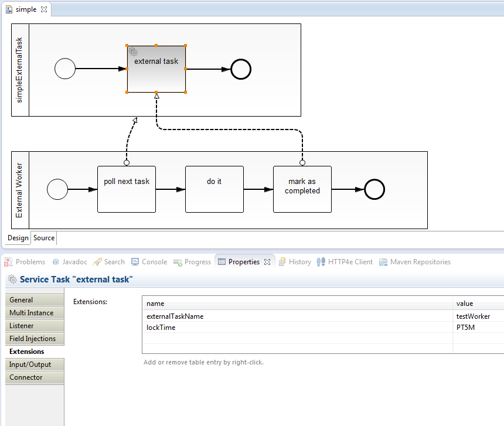

From Push to Pull – External Tasks in BPMN processes
=========================

In some environments it is hard for a process engine to actively call services, e.g. in cloud scenarios, polyglott environments, ... Then we often use a pattern we call "External Task": The process engine "only" controls the process flow and creates work packages for external "workers" executing the real service logic. So the work is pulled instead of pushed. See [From Push to Pull – External Tasks in BPMN processes](http://www.bpm-guide.de/2015/04/10/from-push-to-pull-external-tasks-in-bpmn-processes/) for more background on this.

This can be implemented on a standard Camunda BPM Platform when leveraging User Task behavior - as shown in this working prototype.  

Built and tested against Camunda BPM version 7.2.0.

Show me the important parts!
----------------------------

Let's look at a very simple Service Task, where we added extension elements to configure it as External Task:

But wait - if we wait for the external worker - why a Service Task? We want to have it for Business-IT-Alignment reasons, that the Business Analyst sees that a Service is called here. We consider the External Task/Worker concept as implementation detail of the communication.

We can exchange the behavior of a Service Task easily in camunda BPM by configuring a "behavior" class as "delegate". This behavior extends the normal "UserTaskActivityBehavior" if the engine:

Now we could attach this to the "class" attribute of a Service Task - but in this example we show how to enforce this by using a "BpmnParseListener" which add the behavior if the extension element for "externalTaskWorkerName" is present. This creates a pesudo TaskDefinition and assign the task to the candidate group = worker name.

A third small feature: When one worker claims the task the lock time is calculates, whis is done via a simple "TaskListener":

That's it! After that you can work with the normal Task API to query tasks for specific workers, claim then before starting the work and complete afterwards.

Environment Restrictions
------------------------

Built and tested against Camunda BPM version 7.2.0.

Known Limitations
-----------------

Improvements Backlog
--------------------

* Add monitoring of the lock time
* Provide Sample process with a real example, including a client in another language, e.g. bash or perl.

License
-------

[Apache License, Version 2.0](http://www.apache.org/licenses/LICENSE-2.0).
