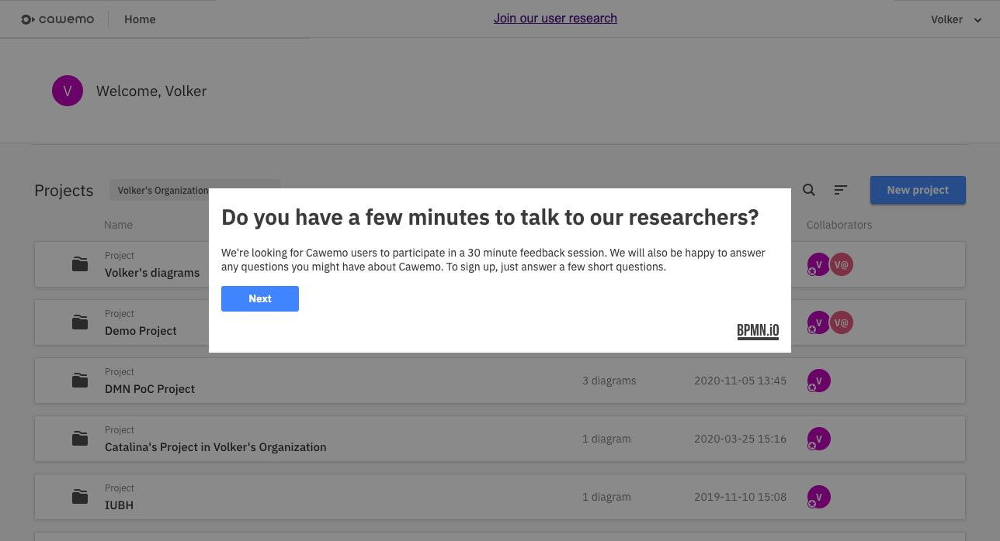

# Camunda Forms Example - Cawemo User Research Recruiting App

This prototype uses a combination of BPMN, DMN, and the new Forms to ask users of Cawemo (but could also be any other product module) to participate in a user research initiative. The user has to answer a few screening questions and depending on the answers is presented with the actual research task (which could be to e.g. schedule a call or provide feedback via asynchronous Usability Testing methods).



## Before you apply this pattern

Screenflows with Camunda Platform do not scale very well and therefore should be used only in low-volume use-cases!

## Automation files (BPMN, DMN, Form)

We use [BPMN](diagrams/screening-and-scheduling.bpmn) to orchestrate the screenflow and execute decisions.

We use [DMN Decision Tables](diagrams/screening-config.dmn) to decide whether recruiting is active right now and to evaluate the screening answers.

We use [Camunda Forms](diagrams) to offer different overlay content with explanatory texts, screening questions, or research questions. There is one .form file per screen.

## How does it work

The prototype consists of a [Koa node.js service](app/app.js) and a [ReactJS frontend](src/index.js).

### Koa node.js service

Files you might find useful:

* [API routes](app/routes/index.js)
* [Application Controller](app/controllers/indexController.js)
* [Camunda REST API Wrapper](app/managers/camunda.js)

Code Snippets:

```
// transform form-js submitted variables to Camunda schema
const variables = Object.fromEntries( Object.keys(data).map( varName => [varName, {value: data[varName] } ] ))
```

```
// transform Camunda Platform variables to form-js schema
const formVariables = Object.fromEntries( Object.keys(variables).map( varName => [varName, variables[varName].value ] ))
```


### ReactJS frontend

Files you might find useful:

* [Main App React component](src/components/App.js)
* [React wrapper for form-js viewer](src/components/CamundaForm.js)
  * This component uses a custom build of the form-js viewer such that newer features can be used in the forms. This version will be released in July 2021 for public usage.
* [Communication layer to the node.js service](src/helper/Communication.js)

Please note: the Calendly widget was never implemented and as such would lead to issues when actually trying to load the "Show Calendly Widget" user task in the process model.

## How to use it

### Requirements

Spin up a Camunda Platform standalone with REST API enabled. [Current configuration](app/managers/camunda.js) expects it to be reachable at `localhost:8080`.

This app was tested with node version `14.17.0`.

### Installation

```
npm install
```

### Running the prototype

Deploy all files in [diagrams](diagrams) *in the same deployment* to your Camunda Platform.

```
npm start
```

You should see `listening` in the console output when the server is running.

Open [http://localhost:1234/static/index.html](http://localhost:1234/static/index.html#) in your browser.

The port `1234` is configured in the [Koa app.js](app/app.js).

### Adjusting the models

In order to change the `.form` files, you will need to have a custom build of Camunda Modeler that includes the not yet released version of form-js editor. Starting with Camunda Modeler version 4.9 (or later) you should also be able to edit those files.

## License
