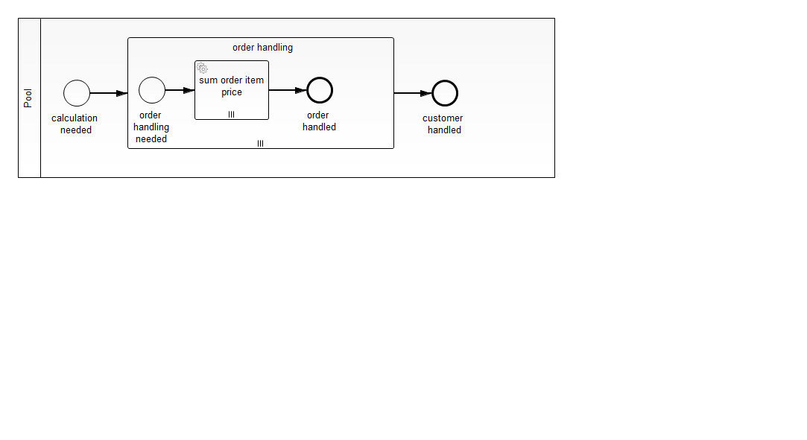

Handle nested list-objects
=========================

If you have lists in your business objects that you handle in your process, you can map the lists into (nested) multi instance activities.

I chose a typical example with a customer who has a list of orders, each order consists of a list of order items. 

A service task calculates the price of an orderitem as quantity * price and sums it up for all order items in the completePrice. 

A simple approach
----------------------------
To access only the first element you can use this process
 

The expression in the service task is

    ${orderCalculators.evaluate(customer.orders[0].items[0], completePrice)}
 
The complete lists
-------------------
To handle the complete lists, you can use this process

The expression in the service task is here

    ${orderCalculators.evaluate(item, completePrice)}

All items from the order will be picked by 

    <bpmn2:multiInstanceLoopCharacteristics camunda:collection="${order.items}" camunda:elementVariable="item"/>
    
and all orders of a customer are mapped by

    <bpmn2:multiInstanceLoopCharacteristics camunda:collection="${customer.orders}" camunda:elementVariable="order"/>
 
It is important to access the attibutes in a JUEL expression.

How does it work?
-----------------

The service task calls a Spring bean. The dependency is in the pom.xml.

The test is the `SpringProcessTest`, it reads the configuration from the `SpringProcessTest-context.xml`.

How to use it?
--------------

There is no web interface to access the application.
To get started refer to the `SpringProcessTest`.

Built and tested against Camunda BPM version 7.2.0.

