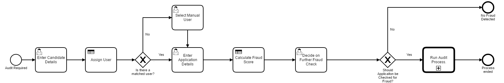
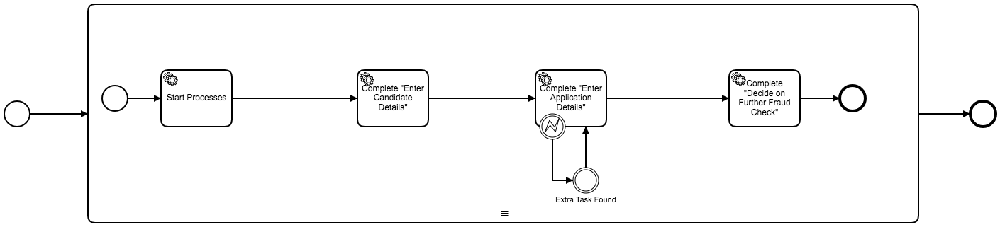
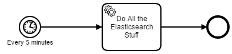

# Ban Mad Inc.
A Process Application for [Camunda BPM](http://docs.camunda.org).
This project was created in two days by Niall Deehan and Ben Hoffmann for Camunda's 2016 hackdays.

The project's name comes from an anagram of the main focal points of the application "Kibana + DMN".

## Show me the important parts!
**Audit check process**

**Generate demo data for the audit check process**

**Load data to elasticsearch (so that it can be viewed in Kibana)**

**Play around with the data and create your own visualizations**

## How does it work?
What we want to do is to get all the process data out of Camunda and into Kibana so that we could better visualize the data from each process instance.

The process in question is simply a method of determining the likelihood of fraud based on data entered by users and rules written up as DMN tables.

The second process can be started to generate demo data based on random data generators. We needed a lot of data and so created process which can generate lots of interesting pseudo-random data for the purpose of having the reports in Kibana make more sense.

The third process is used to run every 20 minutes and pick up the process instance data transform it into a JSON format that elasticsearch is happy with and then send it along to elasticsearch.

## How to use it?

You'll need a few different bits and pieces running.

1) [Elasticsearch (tested with 2.3.4)](https://www.elastic.co/downloads/elasticsearch)

2) [Kibana (tested with 4.5.3)](https://www.elastic.co/downloads/kibana)

3) [Camunda (tested with 7.5.4) ](https://camunda.org/download/)

Once all 3 are running you can use maven to build and deploy the process application to the Camunda application server.

Next up you'll need to generate some data so open [Tasklist](http://localhost:8080/camunda/app/tasklist/) and start the Generate Test Data process. Select the number of instances you'd like to create. About 600 is a good number to start with, we also tested up to 20.000.

Eventually the load data process will kick off and pick up the data (or you could run it manually in [Tasklist](http://localhost:8080/camunda/app/tasklist/))

Once you deployed the application you can run it using
[Camunda Tasklist](http://docs.camunda.org/latest/guides/user-guide/#tasklist)
and inspect it using
[Camunda Cockpit](http://docs.camunda.org/latest/guides/user-guide/#cockpit).

Once you loaded all the data in Elasticsearch, you can start discovering it with [Kibana](http://localhost:5601). Create an index pattern `camunda` with the Time-field name `dateOfClaim`. You can now play around with the data and create visualizations or import the [examples](src/main/resources/Kibana/).

## Environment Restrictions
Built and tested against Camunda BPM version 7.5.4.

## Known Limitations

## Improvements Backlog

## License
[Apache License, Version 2.0](http://www.apache.org/licenses/LICENSE-2.0).

<!-- HTML snippet for index page
  <tr>
    <td></td>
    <td><a href="snippets/BanMadInkProcesses">Camunda BPM Process Application</a></td>
    <td>A Process Application for [Camunda BPM](http://docs.camunda.org).</td>
  </tr>
-->
<!-- Tweet
New @CamundaBPM example: Camunda BPM Process Application - A Process Application for [Camunda BPM](http://docs.camunda.org). https://github.com/camunda/camunda-consulting/tree/master/snippets/BanMadInkProcesses
-->
