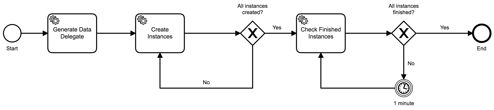

# Multi Instance with Delegate
A sample Camunda process that creates multiple instances of another process, simulating a batch behaviour.

## Show me the important parts!


## How does it work?

This small project demonstrates an efficient way of creating a multiple instances of another child process, avoiding the current existing inefficiencies of the parallel multi-instance with high volumes (> 1000). A [parent process](src/main/resources/process.bpmn) instance starts multiple instances of a [child process](src/main/resources/child-process.bpmn).

The parent process execution goes as follows:

1. [Generate Data Delegate](src/main/java/com/example/workflow/delegates/GenerateDataDelegate.java): A list of strings called "records" is generated based on a variable called "randomDataSize" (which should be supplied in the process start).
2. [Create Instances](src/main/java/com/example/workflow/delegates/CreateInstancesDelegate.java): Instances are generated based on the list of strings called "records" from within a loop. Each instance is created in a different transaction, which is committed before the delegate is finished. Additionally, a variable called "createdInstancesCount" controls how many instances have been created and is also updated within the same transaction used to create the child instance. This variable is used to allow fault-tolerance to the delegate, since it's used as the starting point for the records collection loop. Instances are created in chunks, which are defined by the use of a property called "batch.config.blockSize". This task can executed N times, depending on how many items the collection has, and the batch size (eg: 2500 records in a batch size of 1000 will result in 3 executions of this task). Preferably this task should be "async before", to allow a rollback point and retries, and the child process should be async, to allow parallel execution by the job executor.
3. [Check Finished Instances](src/main/java/com/example/workflow/delegates/CheckFinishedInstances.java): The process checks whether all the child instances are completed or not, by querying the runtime data. If child instances are still running, then the process waits for one minute to check again. This pooling mechanism is favored over other approaches (such as the child processes updating a variable in the parent process) to avoid OLEs.

Additionally, a small customization in the [history handling](src/main/java/com/example/workflow/history/CustomHistoryEventHandler.java) was made to avoid creating history records for the variable "createdInstancesCount". This solves the issue of having thousands of history variable detail records for this variable. This example can be made generic, by creating a list of variables that shouldn't be saved in history.

This process can be made generic and wrapped into a call activity, to allow reusability.

## How to use it?
Simply run the application by using the following maven command:
```
mvn spring-boot:run
```

You can start a process by creating an instance of "ParentProcess", with a variable "randomDataSize" (which will determine how many items the "records" variable will have).

## Environment Restrictions
This project uses Camunda 7.14.0-ee with Spring Boot.

Should be tested with the user's environment, in a setup similar to production in order to verify it's true efficiency.

## Known Limitations
