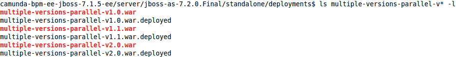
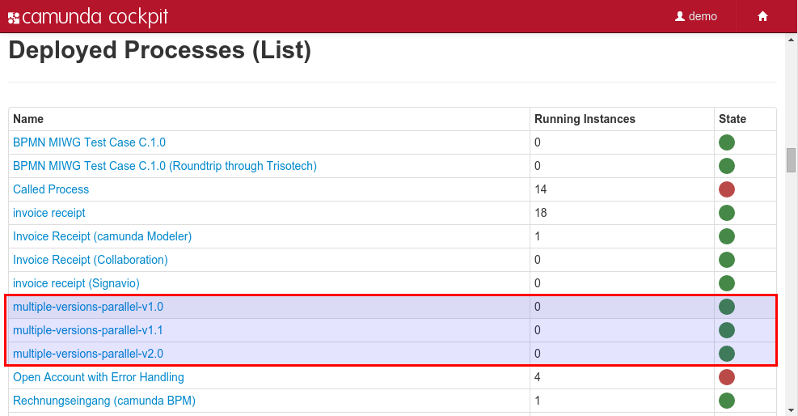

Introduction
============
This example shows how use Maven to build different versions of a process application that can be deployed and executed in parallel.





In order to achieve this, the final name of the resulting war file and the process definition key contain the major and minor version number. Thus, application server and process engine will isolate the classes and processes.

pom.xml
-------
```xml
  ...
  <build>
    <plugins>
      <plugin>
        <groupId>org.codehaus.mojo</groupId>
        <artifactId>build-helper-maven-plugin</artifactId>
        <version>1.8</version>
        <executions>
          <execution>
            <phase>initialize</phase>
            <id>parse-version</id>
            <goals>
              <goal>parse-version</goal>
            </goals>
          </execution>
        </executions>
      </plugin>
      ...
    </plugins>
  
    <finalName>${project.artifactId}-v${parsedVersion.majorVersion}.${parsedVersion.minorVersion}</finalName>
    <resources>
      <resource>
        <directory>src/main/resources</directory>
        <filtering>true</filtering>
      </resource>
    </resources>
    ...
```

process.bpmn
------------
```xml
<bpmn2:process id="multiple-versions-parallel-v${parsedVersion.majorVersion}.${parsedVersion.minorVersion}" ... >
```

Remarks to run this application
===============================
Just increase the Maven version number from 1.0.x to 1.1.x or 2.0.x  and compare the resulting war files.

You can also use `ant` to build and deploy the example.
For that to work you need to copy the file `build.properties.example` to `build.properties`
and configure the path to your application server inside it.
Alternatively, you can also copy it to `${user.home}/.camunda/build.properties`
to have a central configuration that works with all camunda BPM projects.