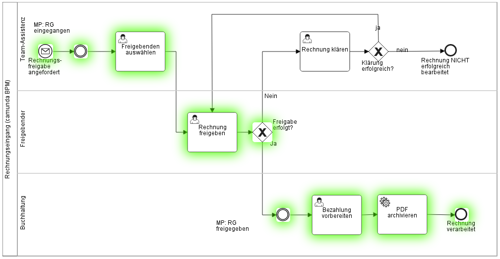

# Introduction
This tool supports in analyzing and visualizing the process test coverage of a BPMN process.

The tool creates test coverages for:
* Test cases: The process coverage is visualized by marking those tasks and events with a green color which have be traversed by the test case.
* Test suites: The process coverage is visualized by marking those tasks and events with a green color which have be traversed by any of the test suite's test cases.

# Environment Restrictions
Current browsers generally restrict access when sharing resources across domains due to security reasons. The BPMN resource can only be loaded if cross-origin resource sharing is enabled.

Cross-origin resource sharing may generally enabled (and security disabled!) by:
* Chrome: Start Chrome with the parameter "--allow-file-access-from-files"
* Firefox: about:config -> security.fileuri.strict_origin_policy -> false

# Remarks to run this application
1. mvn clean test
2. Open html files which are created in the directory target/process-test-coverage/

# Known Issues

# Improvements Backlog
