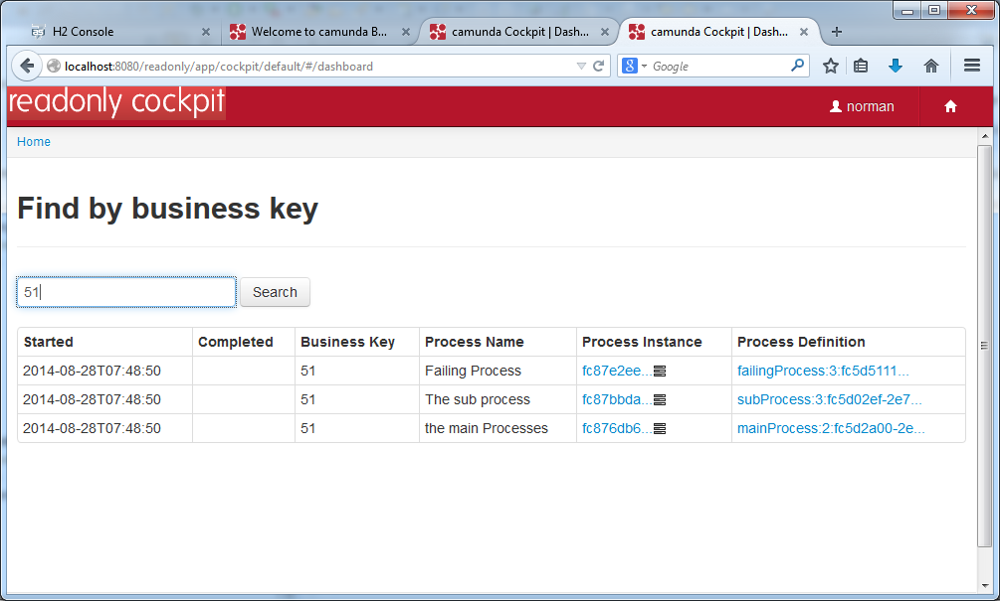

## Readonly Cockpit

This is an example for a complete cockpit web application excluding all actions that may change data.

In the deployment-descriptors for jboss and webLogicServer the context-root is /readonly. You can deploy this cockpit on the same server as the camunda cockpit and play around with the authorizations. 

This application shades camunda-webapp and includes only the files that has to be changed to hide all actions that might change data.   

Some html-tables are copied from the camunda-webapp into this project and the buttons for changing variables or restarting incidents has been cut out.

The dashboard has only a business key search.

It is rebranded with a new logo.

 