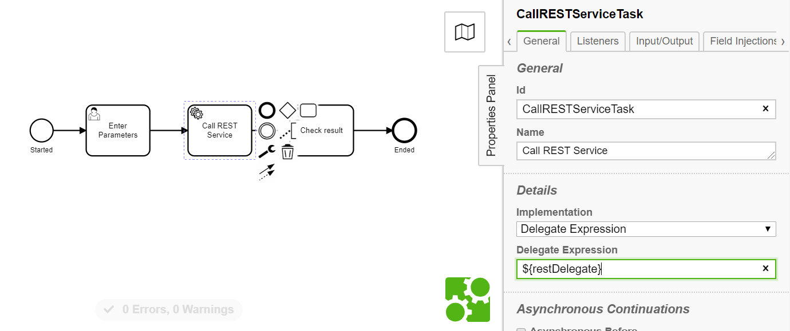

# Service Task using Spring Bean Delegate to invoke a REST service  

This example illustrates the invocation of a REST service from a service task in a Camunda BPM [Spring Boot deployment](https://docs.camunda.org/manual/latest/user-guide/spring-boot-integration/). 
It uses a (synchronous) service task, a little Java code for data mapping and [Spring Boot's RestTemplate](https://docs.spring.io/spring-boot/docs/current/reference/html/spring-boot-features.html#boot-features-resttemplate).
The service invoked by the example is hosted at [reqres.in](https://reqres.in/). Many thanks to Ben Howdle for providing this developer playground.

Besides the main objective this example also illustrates how to 
- exchange data between a Camunda process and an external service using a [JavaDelegate](https://docs.camunda.org/manual/latest/user-guide/process-engine/delegation-code/) implementation
- transparently deserialize the REST service's response into Java objects
- serialize a Java object into JSON and store it as a JSON-typed ObjectValue in Camunda using [Camunda Spin](https://docs.camunda.org/manual/latest/reference/spin/)
- [test a process in a Spring environment](https://docs.camunda.org/manual/latest/user-guide/spring-boot-integration/testing/) using 
[Camunda BPM Assert](https://docs.camunda.org/manual/latest/user-guide/testing/#camunda-assertions) and 
 [SpringBootTest](https://docs.spring.io/spring-boot/docs/current/reference/html/spring-boot-features.html#boot-features-testing-spring-boot-applications)

In a non-Spring / JEE environment standard [JAX-RS (JSR-370)](https://docs.oracle.com/javaee/7/tutorial/jaxrs-client.htm) API and implementations such as [Jersey](https://eclipse-ee4j.github.io/jersey/)
or frameworks such as [RESTEasy](https://resteasy.github.io) can be used instead of Spring.

If you prefer an asynchronous approach, stronger decoupling, or to work with another language, please consider using a [script task](https://docs.camunda.org/manual/latest/user-guide/process-engine/scripting/) or the [external task pattern](https://docs.camunda.org/manual/latest/user-guide/process-engine/external-tasks/).
Example implementations exist in various languages, such as: [Java](https://github.com/camunda/camunda-external-task-client-java), [Python externla task worker](https://github.com/camunda-consulting/code/tree/master/snippets/python-external-worker), 
[C#](https://github.com/camunda-consulting/code/tree/master/snippets/csharp-simple-external-worker), [JavaScript](https://github.com/camunda-consulting/code/tree/master/snippets/external-task-pattern-with-js-workers)


## The important parts
[BPMN Process](src/main/resources/RestCallExampleProcess.bpmn)



[Java Delegate implementation](src/main/java/org/camunda/example/service/RestDelegate)
```java
    public void execute(DelegateExecution execution) throws Exception {

        //access process variable
        String userId = execution.getVariable("userId").toString();

        //call REST service to lookup account
        Response response = (restTemplate.getForObject("https://reqres.in/api/users/" + userId, Response.class));

        //access object in Java, store a new process variable
        execution.setVariable("email", response.getData().getEmail());

        //serialize a java object into JSON and stored it in this way so Camunda knows it is JSON
        ObjectValue adJson = Variables
                .objectValue(response.getAd())
                .serializationDataFormat(Variables.SerializationDataFormats.JSON)
                .create();
        //add json object value as process variable
        execution.setVariable("Ad", adJson);
    }
```

### Unit Test
Run the JUnit [SpringBootTest](src/test/java/org/camunda/test/RestCallExampleTest) in your IDE or using:
```
mvn clean test
```

### Step through the process manually 
You can start the server using your IDE or 
```
mvn spring-boot:run
```
and step through the process manually. After the server has started you can access the Camunda tasklist via http://localhost:8080/app/tasklist.
Use the credentials *demo / demo* to login.


### Run and inspect with Tasklist and Cockpit
Use tasklist and cockpit as described in the product documentation for
- [Camunda Tasklist](https://docs.camunda.org/manual/latest/webapps/tasklist)
- [Camunda Cockpit](https://docs.camunda.org/manual/latest/webapps/cockpit)


## License
[Apache License, Version 2.0](http://www.apache.org/licenses/LICENSE-2.0).