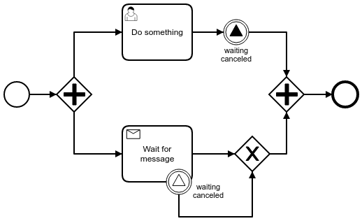

# BPMN Signal Events between Parallel Branches
This example shows how to interrupt a Task in a parallel flow within the same process instance by using a BPMN Signal Event.

This is useful for situations in, which a Parallel Gateway is not enough for synchronization, because the parallel branch is not only waiting for the other branch to reach a certain state, but also actively doing something, i.e. waiting for a message. However, the activity in the other branch could make this current task irrelevant and should therefore interrupt it instead of waiting for it's unnecessary completion.   

This project has been generated by the Maven archetype
[camunda-archetype-servlet-war-7.5.0-SNAPSHOT](http://docs.camunda.org/latest/guides/user-guide/#process-applications-maven-project-templates-archetypes).

## Show me the important parts!

## How does it work?

    public class SendSignalToParallelBranchExecutionLister implements ExecutionListener {
    
      @Override
      public void notify(DelegateExecution execution) throws Exception {
        String signalName = null;
    
        Collection<CamundaProperty> properties = ((CamundaProperties) execution
          .getBpmnModelElementInstance()
          .getExtensionElements()
          .getUniqueChildElementByType(CamundaProperties.class))
          .getCamundaProperties();
        for (CamundaProperty property : properties) {
          if ("signalName".equals(property.getCamundaName())) { 
            signalName = property.getCamundaValue();
          }
        }
        
        if (signalName == null || signalName.isEmpty()) {
          throw new RuntimeException("You have to set a Camunda Extension Property named 'signalName' to use this listener!");
        }
        
        RuntimeService runtimeService = execution.getProcessEngineServices()
          .getRuntimeService();
        Execution parallelBranch =
          runtimeService.createExecutionQuery()
          .processInstanceId(execution.getProcessInstanceId())
          .signalEventSubscriptionName(signalName)
          .singleResult();
        
        runtimeService.signalEventReceived(signalName, parallelBranch.getId());
      }
    
    }

## How to use it?
There is no web interface to access the application.
To get started refer to the `InMemoryH2Test`.

## Environment Restrictions
Built and tested against Camunda BPM version 7.5.0.

## Known Limitations

## Improvements Backlog
* This example would be unnecessary if the engine supported an expression as a signal name.

## License
[Apache License, Version 2.0](http://www.apache.org/licenses/LICENSE-2.0).