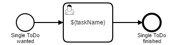

# Dynamic process with a dynamic single task 

A process application to show how you can use all features of the task list with dynamically configured content.

## Show me the important parts!

## How does it work?

You have to pass process variables for 
- task name: `taskName`
- assignee: `assignee`
- candidateGroups: `candidateGroups`
- due date: `dueDate`
- follow up date: `followUpDate`
- priority: `priority`
- task form key: `formKey`
- task description: `description`

when starting the process instance.

All these variables have to be passed, otherwise you will get this error:

    org.camunda.bpm.engine.ProcessEngineException: Unknown property used in expression: ${dueDate}. Cause: Cannot resolve identifier 'dueDate'
    ...
    Caused by: org.camunda.bpm.engine.impl.javax.el.PropertyNotFoundException: Cannot resolve identifier 'dueDate'

To start a process instance by rest call may look like this:

    POST /engine-rest/process-definition/key/single-task-process/start HTTP/1.1
    Host: localhost:8080
    Content-Type: application/json
    Cache-Control: no-cache
    {
      "variables" : {
        "taskName" : { "value" : "My task" },
        "assignee" : { "value" : "john" },
        "candidateGroups" : { "value" : "management" },
        "dueDate" : { "value" : "2016-09-23" },
        "followUpDate" : { "value" : null },
        "priority" : { "value" : 15 },
        "formKey" : { "value": "embedded:app:forms/task-form.html" },
        "description" : { "value" : null}
      }
    }

If you like to get a readable name in the process diagram, you can set the name in a `TaskListener`. 

## How to use it?
There is no web interface to access the application.
To get started refer to the `InMemoryH2Test`.

To deploy it, you can use the maven plugin and run `mvn clean tomcat7:[|re|un]deploy` for tomcat or
`mvn clean [jboss-as|wildfly]:[un]deploy` for the application servers.

Once you deployed the application you can run it using
[Camunda Tasklist](http://docs.camunda.org/latest/guides/user-guide/#tasklist)
and inspect it using
[Camunda Cockpit](http://docs.camunda.org/latest/guides/user-guide/#cockpit).

## Environment Restrictions
Built and tested against Camunda BPM version 7.13.0.

## License
[Apache License, Version 2.0](http://www.apache.org/licenses/LICENSE-2.0).

## Built for

A Process Application for [Camunda BPM](http://docs.camunda.org).

This project has been generated by the Maven archetype
[camunda-archetype-servlet-war-7.5.0](https://docs.camunda.org/manual/latest/user-guide/process-applications/maven-archetypes/).

<!-- HTML snippet for index page
  <tr>
    <td></td>
    <td><a href="snippets/single-task-process">Dynamic single task process</a></td>
    <td>A highly configurable process to get toDo items into your task list</td>
  </tr>
-->
<!-- Tweet
New @CamundaBPM example: Camunda BPM Process Application - A Process Application for [Camunda BPM](http://docs.camunda.org). https://github.com/camunda/camunda-consulting/tree/master/snippets/single-task-process
-->