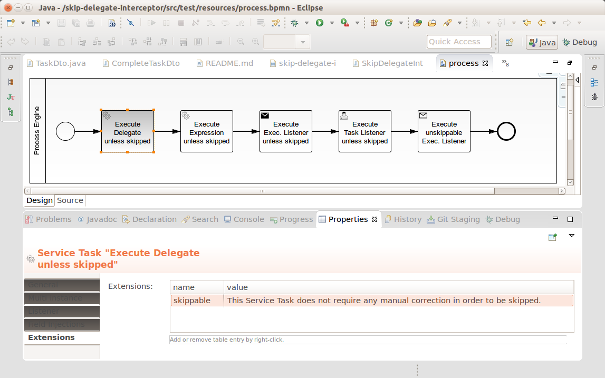

Skip User Code of Service Tasks based on a Variable
===================================================

This example shows how to skip the execution of user code on Service Tasks
based on a process variable and an extension attribute.

This is especially useful, if the Service Tasks are asynchronous:
If the first execution succeded to invoke a backend service with a non-transactional side-effect,
but then failed to commit, you can retry the Asynchronous Continuation Job
while skipping the re-invocation of the backend service. 

This project has been generated by the Maven archetype
[camunda-archetype-ejb-war-7.1.4-SNAPSHOT](http://docs.camunda.org/latest/guides/user-guide/#process-applications-maven-project-templates-archetypes).


Show me the important parts!
----------------------------

A Service Task (or any other element that can have user code attached to it)
can be marked as skippable by setting the extenstion attribute `skippable` on it.
The value of the attribute can be used for instructions on manual operations
that need to be carried out before skipping the task. These instructions can be
retrieved using the BPMN Model API and displayed in a user interface.



If the variable `skip` is set in the execution, all user code of the upcoming
task will not be executed, but only if the task is marked as skippable.
In any way the variable will be removed after the task has been completed.

A second possibility is to set a variable called `skip_` followed by a task id.
This will skip user code of the according task regardless of whether it is the
next task in the execution or a later one.

```java
    Map<String, Object> variables = new HashMap<String, Object>();
    variables.put("skip", true); // skips the next task 
    variables.put("skip_ServiceTask_2", true); // skips task with id 'ServiceTask_2'
    
    ProcessInstance processInstance = runtimeService().startProcessInstanceByKey(PROCESS_DEFINITION_KEY, variables);
```


How does it work?
-----------------

A DelegateInterceptor checks the variables and the extension attribute.

```java
public class SkipDelegateInterceptor extends DefaultDelegateInterceptor {

  private static final String SKIP_VARIABLE_NAME = "skip";
  private static final Logger LOG = Logger.getLogger(SkipDelegateInterceptor.class.getName());

  @Override
  public void handleInvocation(DelegateInvocation invocation) throws Exception {
    if (!isSkipped(invocation)) {
      super.handleInvocation(invocation);
    }
  }

  private boolean isSkipped(DelegateInvocation invocation) {
    InterpretableExecution execution = getExecution(invocation);
    if (isSkipRequested(execution)) {  
      if (isSkippable(execution)) {
        LOG.info("Skipping user code (" + invocation.getClass().getSimpleName() + ") of Activity '" + execution.getCurrentActivityName() + "' (" + execution.getCurrentActivityId() + ")");
        return true;
      } else {
        LOG.warning("Variable 'skip' was true but Activity id not skippable. Not skipping user code (" + invocation.getClass().getSimpleName() + ") of Activity '" + execution.getCurrentActivityName() + "' (" + execution.getCurrentActivityId() + ")");
      }
    }
    return false;
  }

  private boolean isSkipRequested(InterpretableExecution execution) {
    if (execution != null) { 
      String skipVariableNameForActivity = SKIP_VARIABLE_NAME + "_" + execution.getCurrentActivityId();
      if (Boolean.TRUE.equals(execution.getVariable(SKIP_VARIABLE_NAME))) {
        execution.removeVariable(SKIP_VARIABLE_NAME);
        execution.setVariableLocal(skipVariableNameForActivity, true);
        return true;
      } else if (Boolean.TRUE.equals(execution.getVariable(skipVariableNameForActivity))) {
        return true;
      }
    }
    return false;
  }

  private boolean isSkippable(InterpretableExecution execution) {
    return elementHasCamundaProperty(execution.getBpmnModelElementInstance(), "skippable");
  }

  private InterpretableExecution getExecution(DelegateInvocation invocation) {
    InterpretableExecution execution = invocation.getContextExecution();
    if (execution == null) {
      ExecutionContext executionContext = Context.getExecutionContext();
      if (executionContext != null) {
        execution = executionContext.getExecution();
      }
    }
    return execution;
  }

  private boolean elementHasCamundaProperty(FlowElement flowElement, String propertyName) {
    ExtensionElements extensionElements = flowElement.getExtensionElements();
    List<CamundaProperties> propertyContainers = extensionElements.getElementsQuery()
      .filterByType(CamundaProperties.class)
      .list();
    for (CamundaProperties propertyContainer : propertyContainers) {
      for (CamundaProperty property : propertyContainer.getCamundaProperties()) {
        if (propertyName.equals(property.getAttributeValue("name"))) { // in 7.2 one can use: property.getCamundaName()
          return true;
        }
      }
    }
    return false;
  }

}
```


How to use it?
--------------

There is no web interface to access the application.
To get started refer to the `InMemoryH2Test`.

There is also an `ArquillianTest`, which by default connects to a
Camunda BPM platform running locally on a JBoss AS 7.
You can download a Camunda BPM distribution for JBoss from the
[Camunda BPM download page](http://camunda.org/download/).


Environment Restrictions
------------------------

Built and tested against Camunda BPM version 7.1.0-Final.


Known Limitations
-----------------

- does not work with delegate expressions because they need to produce a JavaDelegate as return value
- does not work with ActivityBehaviors because they are responsible for leaving the task


Improvements Backlog
--------------------


License
-------

[Apache License, Version 2.0](http://www.apache.org/licenses/LICENSE-2.0).