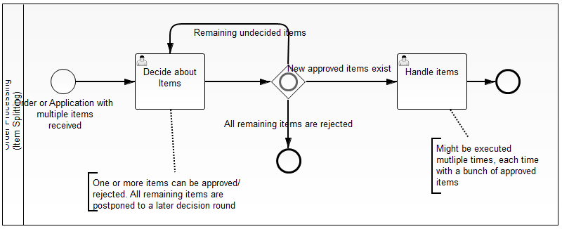
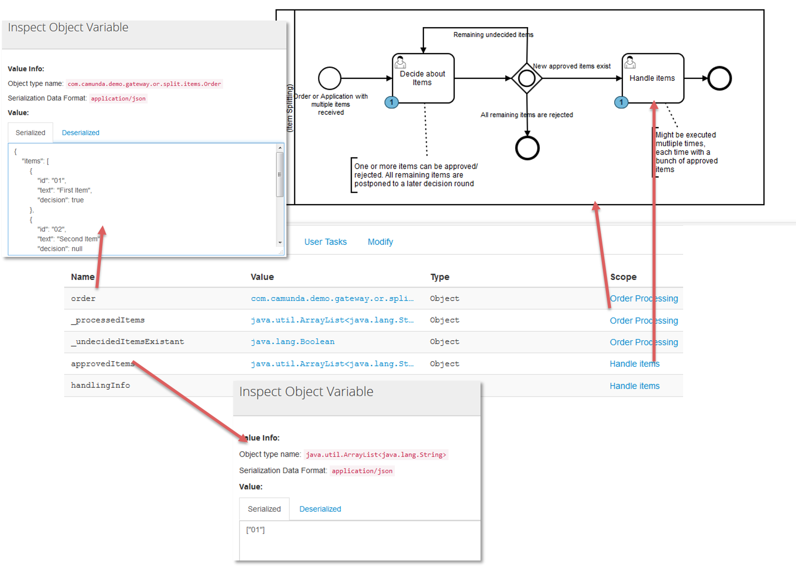

Split Order Item Handling via OR Gateway
=========================

Imagine the following situation:

- You get an order / a credit application / ...
- With items / credits / ...
- You need decide for every item / credit / ... seperately, which happens in a board meeting
- Maybe not all items / credits / ... are decided in the same meeting, some items / credits / ... might be postponed
- Every approved item / credit should be immediately handled
- You want to keep this in one process model

You can model this in BPMN like this:

But now you have to keep an eye on data handling:

- Gather all new approved items / credits / ... right before the OR-Gateway and send a token to the handling task containing these items
- Check if there are undecided items / credits / ... left to see if you have to loop
- Write a [Local Variable](xxx) containing the list of items, the local variable will be different for every token you send out this path of the OR-Gateway

So lets assume you approved exactly one item / credit / ... the situation will be like shown in the following image:

How does it work?
-----------------

See the following listeners where the magic happens:
- [Listener before the OR Gateway]()
- [Listener after the OR Gateway in the Handling Path]()

How to use it?
--------------

Build it via Maven and deploy the WAR to your Camunda Installation.

Once you deployed the application one process instance always gets automatically started during deployment when no instance is currently running.

Use [Camunda Tasklist](http://docs.camunda.org/latest/guides/user-guide/#tasklist) to complete tasks
and inspect it using
[Camunda Cockpit](http://docs.camunda.org/latest/guides/user-guide/#cockpit). In cockpit you can also adjust the data structures in order to simulate 
new decisions.

Environment Restrictions
------------------------

Built and tested against Camunda BPM version 7.3.0.

License
-------

[Apache License, Version 2.0](http://www.apache.org/licenses/LICENSE-2.0).
