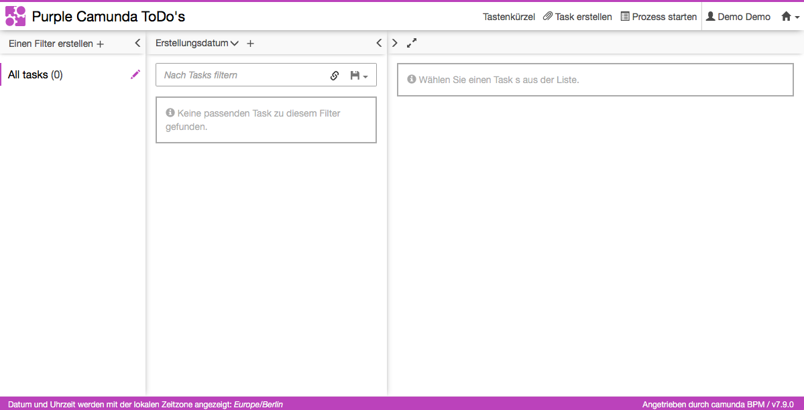

# Customize the Camunda Webapps


This project shows how to customize the Camunda Webapps when using spring-boot.
It works by unpacking the original webjar archive and replace interesting parts.
In the project that uses the newly created webjar, you have to make sure that the original webjar is not included anymore.

It customizes:

* The color scheme (see [Logo and Header Color](https://docs.camunda.org/manual/latest/webapps/tasklist/configuration/#logo-and-header-color))
* The logo (see [Logo and Header Color](https://docs.camunda.org/manual/latest/webapps/tasklist/configuration/#logo-and-header-color))
* Add custom language taken from [Community Extension: Tasklist Translations](https://github.com/camunda/camunda-tasklist-translations/) (see [Localization](https://docs.camunda.org/manual/latest/webapps/tasklist/configuration/#localization))



## How to use it?

### Customize

* Replace the files in ```springboot-customized-webapp-webjar/artwork``` with your files
* Adjust the properties in the top section of ```springboot-customized-webapp-webjar/pom.xml```
* Possibly addionally adjust the contents of ```springboot-customized-webapp-webjar/src/main/resources/META-INF/resources/webjars/camunda/app/{tasklist|cockpit|admin}/{styles|scripts}/```
* Run 
```bash
 cd springboot-customized-webapp-webjar
 mvn clean install
```

### Test
Run

```bash
 cd springboot-customized-webapp-example
 mvn clean spring-boot:run
```

Now browse to http://localhost:8080/app/tasklist/default/ and see the customizes tasklist.


Improvements Backlog
--------------------

* Include welcome app
* Multiple custom languages
* Add plugins

License
-------

[Apache License, Version 2.0](http://www.apache.org/licenses/LICENSE-2.0).
